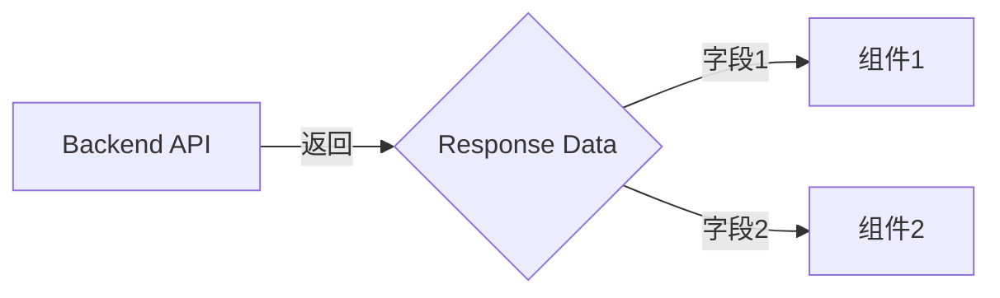

# Handoff Document for Agent B (Blake)
## TAD v3.1 - Evidence-Based Development

**From:** Alex (Agent A - Solution Lead)
**To:** Blake (Agent B - Execution Master)
**Date:** [Current Date]
**Project:** [Project Name]
**Task ID:** TASK-[YYYYMMDD]-[###]
**Handoff Version:** 3.1.0

---

## 📋 Handoff Checklist (Blake必读)

Blake在开始实现前，请确认：
- [ ] 阅读了所有章节
- [ ] 所有"强制问题回答（MQ）"都有证据
- [ ] 理解了真正意图（不只是字面需求）
- [ ] 每个Phase的交付物和证据要求都清楚
- [ ] 确认可以独立使用本文档完成实现

❌ 如果任何部分不清楚，**立即返回Alex要求澄清**，不要开始实现。

---

## 1. Task Overview

### 1.1 What We're Building
[清晰、简洁的描述]

### 1.2 Why We're Building It
**业务价值**：[...]
**用户受益**：[...]
**成功的样子**：[当用户能够...时，这个功能就成功了]

### 1.3 🆕 Intent Statement（意图声明）

**真正要解决的问题**：[...]

**不是要做的（避免误解）**：
- ❌ 不是[常见误解1]
- ❌ 不是[常见误解2]

**Blake请确认理解**：
```
在开始实现前，请用你自己的话回答：
1. 这个功能解决什么问题？
2. 用户会如何使用？
3. 成功的标准是什么？

只有Human确认你的理解正确后，才能开始实现。
```

---

## 2. Background Context

### 2.1 Previous Work
[已有代码或模式]

### 2.2 Current State
[现状 vs 目标]

### 2.3 Dependencies
[外部依赖]

---

## 3. Requirements

### 3.1 Functional Requirements
- FR1: [...]
- FR2: [...]

### 3.2 Non-Functional Requirements
- NFR1: [性能、可用性等]
- NFR2: [...]

---

## 4. Technical Design

### 4.1 Architecture Overview
[架构描述]

### 4.2 Component Specifications
[组件规格]

### 4.3 Data Models
[数据结构]

### 4.4 API Specifications
[API设计]

### 4.5 User Interface Requirements
[UI需求]

---

## 5. 🆕 强制问题回答（Evidence Required）

**重要**：这些问题必须回答，并提供证据。Human会验证。

### MQ1: 历史代码搜索

**问题**：用户是否提到"之前的"、"原来的"、"我们的方案"？

**回答**：
- [ ] 是 → 继续填写下面
- [ ] 否 → 跳过此问题

**如果是，提供证据**：

#### 搜索证据
```bash
# 搜索命令
[实际执行的搜索命令]

# 搜索结果
[搜索输出或截图]
```

#### 决策说明
- **找到了什么**：[...]
- **位置**：[文件:行号]
- **决定**：✅ 复用 / ❌ 创建新的
- **原因**：[...]

**Human验证点**：能看到搜索确实执行了吗？决策理由合理吗？

---

### MQ2: 函数存在性验证

**问题**：设计中调用了哪些函数？它们都存在吗？

**回答**：

#### 函数清单（🆕 必填表格）

| 函数名 | 文件位置 | 行号 | 代码片段 | 验证 |
|--------|---------|------|---------|------|
| [函数1] | [位置] | [行号] | `[代码]` | [✅/❌] |
| [函数2] | [位置] | [行号] | `[代码]` | [✅/❌] |

**Human验证点**：每个函数都有"✅存在"和具体位置吗？

---

### MQ3: 数据流完整性

**问题**：后端计算/返回了哪些字段？前端都显示了吗？

**回答**：

#### 数据流对照表（🆕 必填表格）

| 后端字段 | 用途说明 | 前端组件 | 是否显示 | 不显示原因 |
|---------|---------|---------|---------|-----------|
| [字段1] | [用途] | [组件] | ✅/❌ | [...] |
| [字段2] | [用途] | [组件] | ✅/❌ | [...] |

#### 数据流图（🆕 必填）



**Human验证点**：
- 后端每个字段都有对应的前端组件吗？
- "❌不显示"的字段有合理原因吗？

---

### MQ4: 视觉层级

**问题**：功能有不同状态/类型吗？用户如何区分？

**回答**：
- [ ] 有不同状态 → 继续填写
- [ ] 无不同状态 → 跳过

**如果有，提供UI对比**：

#### 状态视觉设计（🆕 必填）

| 状态 | 视觉表现 | 颜色 | 图标 | 文字 |
|------|---------|------|------|------|
| [状态1] | [描述] | [颜色] | [图标] | [文字] |
| [状态2] | [描述] | [颜色] | [图标] | [文字] |

#### UI Mockup（🆕 建议提供）
[截图或手绘UI草图]

**Human验证点**：不同状态是否视觉上能明显区分？

---

### MQ5: 状态同步

**问题**：数据存在几个地方？什么时候同步？

**回答**：

#### 状态存储位置（🆕 必填）

| 数据 | 存储位置1 | 存储位置2 | 同步时机 | 同步方向 |
|------|----------|----------|---------|---------|
| [数据] | [位置1] | [位置2] | [时机] | [方向] |

#### 状态流图（🆕 必填）

```
[用户输入] → state.data (主状态，Source of Truth)
              ↓ 同步时机：[触发条件]
           backup.data (备份状态)
```

**或单一状态**：
```
[用户输入] → state.data (唯一存储)
✅ 只有一个状态，无需同步
```

**Human验证点**：
- 清楚标注哪个是主状态了吗？
- 同步时机明确吗？
- 是否可能出现不同步？

---

## 6. Implementation Steps（分Phase）

**🆕 Phase划分原则**：
- 每个Phase：2-4小时
- Phase之间有清晰的里程碑
- 每个Phase完成后，Blake提供证据给Human审查

### Phase 1: [名称]（预计X小时）

#### 交付物
- [ ] [具体交付1]
- [ ] [具体交付2]

#### 实施步骤
1. [步骤1]
2. [步骤2]

#### 验证方法
- 运行[测试命令]应该看到[预期结果]
- 浏览器访问[URL]应该显示[预期UI]

#### 🆕 Phase 1 完成证据（Blake必须提供）
提交以下证据给Human：
- [ ] **代码截图**：关键函数[XXX]的实现
- [ ] **测试结果**：`npm test`的输出（✓ 42 tests passing）
- [ ] **UI截图**（如有UI）：浏览器显示效果

**Human审查问题**：
- 方向正确吗？
- 测试通过了吗？
- 需要调整吗？

**Human决策**：✅ 继续Phase 2 / ⚠️ 调整本Phase

---

### Phase 2: [名称]（预计X小时）
[同上结构]

---

## 7. File Structure

### 7.1 Files to Create
```
path/to/new-file.ts  # Purpose
```

### 7.2 Files to Modify
```
path/to/existing.ts  # Changes
```

---

## 8. Testing Requirements

### 8.1 Unit Tests
- Test [Component]: [Expected behavior]

### 8.2 Integration Tests
- Test [Flow]: [Expected outcome]

### 8.3 Edge Cases
- [Edge case 1]: [How to handle]

### 8.4 🆕 Test Evidence Required
Blake必须提供：
- [ ] 测试运行截图（所有测试通过）
- [ ] 覆盖率报告（目标：>80%）
- [ ] Edge case测试日志

---

## 9. Acceptance Criteria

Blake的实现被认为完成，当且仅当：
- [ ] 所有FR实现并验证
- [ ] 所有Phase完成并提供证据
- [ ] 所有测试通过（有截图证明）
- [ ] UI符合设计（有截图证明）
- [ ] Human验证"这是我期望的"

---

## 10. Important Notes

### 10.1 Critical Warnings
- ⚠️ [警告1]
- ⚠️ [警告2]

### 10.2 Known Constraints
- [约束1]
- [约束2]

### 10.3 🆕 Sub-Agent使用建议

Blake应该考虑使用：
- [ ] **parallel-coordinator** - 如果有3个以上独立组件
- [ ] **bug-hunter** - 如果遇到错误或测试失败
- [ ] **test-runner** - 完成每个Phase后
- [ ] **refactor-specialist** - 如果代码复杂度高

完成后在"Sub-Agent使用记录"中说明使用情况。

---

## 11. 🆕 Learning Content（可选）

### 11.1 Decision Rationale: [决策主题]

**选择的方案**：[...]

**考虑的替代方案**：

| 方案 | 优点 | 缺点 | 为什么没选 |
|------|------|------|-----------|
| 方案A（选中）| [...] | [...] | ✅ 选中 |
| 方案B | [...] | [...] | [...] |

**权衡分析**：
核心权衡：[维度1] vs [维度2]
当前优先级：[...]

**💡 Human学习点**：
[提炼的通用原则]

---

## 12. 🆕 Sub-Agent使用记录

Blake完成后填写：

| Sub-Agent | 是否调用 | 调用时机 | 输出摘要 | 证据链接 |
|-----------|---------|---------|---------|---------|
| parallel-coordinator | ✅/❌ | [...] | [...] | [...] |
| bug-hunter | ✅/❌ | [...] | [...] | [...] |
| test-runner | ✅/❌ | [...] | [...] | [...] |

**Human验证点**：应该调用的都调用了吗？

---

**Handoff Created By**: Alex (Agent A)
**Date**: [Date]
**Version**: 3.1.0
