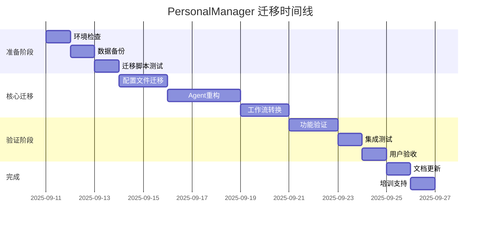

# BMAD到PersonalManager迁移指南

> **版本**: v1.0  
> **创建日期**: 2025-09-11  
> **迁移框架**: BMAD v4.43.1 → PersonalManager v1.0  
> **安全等级**: 高安全性，可完全回滚  

## 📋 目录

1. [迁移概览](#迁移概览)
2. [迁移前准备](#迁移前准备)
3. [环境检查清单](#环境检查清单)
4. [备份策略](#备份策略)
5. [逐步迁移流程](#逐步迁移流程)
6. [配置映射对比](#配置映射对比)
7. [功能验证测试](#功能验证测试)
8. [回滚方案](#回滚方案)
9. [故障诊断](#故障诊断)
10. [迁移后优化](#迁移后优化)

---

## 🎯 迁移概览

### 迁移目标

将现有的BMAD配置系统完整迁移到PersonalManager个人管理系统，确保：
- **零数据丢失**: 所有用户数据和配置完整保留
- **功能连续性**: 核心功能无缝过渡
- **可回滚性**: 任何阶段都可以安全回退
- **用户体验**: 迁移过程对用户透明

### 迁移范围对比

| 组件类别 | BMAD 当前状态 | PersonalManager 目标 | 迁移策略 |
|----------|---------------|---------------------|----------|
| **配置文件夹** | `.bmad-core/` | `.personalmanager-core/` | 重命名 + 内容转换 |
| **核心配置** | `core-config.yaml` | `pm-config.yaml` | 格式转换 + 字段映射 |
| **Agent定义** | `agents/*.md` | `agents/*.yaml` | 结构重组 + 功能增强 |
| **任务模板** | `tasks/*.md` | `workflows/*.yaml` | 工作流重构 |
| **CLI命令** | `/bmad` 前缀 | `/pm` 前缀 | 命令重映射 |
| **数据存储** | BMAD格式 | PersonalManager格式 | 数据模型转换 |

### 迁移时间线



---

## 🔍 迁移前准备

### 1. 系统状态评估

#### 当前BMAD系统检查
```bash
# 检查BMAD版本和安装状态
bmad --version
bmad list agents
bmad list tasks
bmad config show

# 查看配置文件结构
ls -la .bmad-core/
find .bmad-core/ -type f -name "*.yaml" -o -name "*.md" | head -20
```

#### 系统依赖验证
```bash
# 验证必要的运行时环境
node --version    # 需要 >=16.0.0
python3 --version # 需要 >=3.8
git --version     # 需要 >=2.20

# 检查磁盘空间（需要至少2GB自由空间）
df -h .

# 检查网络连接
ping -c 3 github.com
curl -s https://api.github.com/user || echo "GitHub API unreachable"
```

### 2. 用户数据清查

#### 数据资产盘点
```bash
# 创建数据清单
cat > migration_inventory.txt << EOF
=== BMAD系统数据清单 ===
生成时间: $(date)

配置文件:
$(find .bmad-core/ -name "*.yaml" -o -name "*.json" | wc -l) 个配置文件
$(find .bmad-core/ -name "*.md" | wc -l) 个Markdown文档

用户数据:
$(find . -name "PROJECT_STATUS.md" | wc -l) 个项目状态文件
$(find . -name ".personalmanager" -type d | wc -l) 个项目配置目录

Git仓库:
$(find . -name ".git" -type d | wc -l) 个Git仓库

总文件数: $(find .bmad-core/ -type f | wc -l)
总大小: $(du -sh .bmad-core/ | cut -f1)
EOF

cat migration_inventory.txt
```

#### 重要文件识别
```bash
# 识别用户自定义内容
echo "=== 用户自定义文件检查 ==="

# 检查是否有自定义Agent
if [ -f ".bmad-core/agents/custom-*.md" ]; then
    echo "⚠️  发现自定义Agent，需要特殊处理"
    ls .bmad-core/agents/custom-*.md
fi

# 检查是否有自定义任务
if [ -f ".bmad-core/tasks/custom-*.md" ]; then
    echo "⚠️  发现自定义任务，需要特殊处理"
    ls .bmad-core/tasks/custom-*.md
fi

# 检查本地配置覆盖
if [ -f ".bmad-core/local-config.yaml" ]; then
    echo "📝 发现本地配置覆盖文件"
    echo "内容预览:"
    head -10 .bmad-core/local-config.yaml
fi
```

### 3. 兼容性预检查

#### 功能兼容性矩阵
```bash
# 创建兼容性检查脚本
cat > compatibility_check.py << 'EOF'
#!/usr/bin/env python3
import yaml
import json
import os
from pathlib import Path

def check_bmad_compatibility():
    """检查BMAD配置与PersonalManager的兼容性"""
    
    compatibility_report = {
        "compatible": [],
        "needs_migration": [],
        "unsupported": [],
        "warnings": []
    }
    
    # 检查核心配置文件
    core_config_path = Path(".bmad-core/core-config.yaml")
    if core_config_path.exists():
        with open(core_config_path) as f:
            config = yaml.safe_load(f)
            
        # 检查配置字段兼容性
        if "slashPrefix" in config:
            if config["slashPrefix"] == "BMad":
                compatibility_report["needs_migration"].append(
                    "slashPrefix: BMad → pm (需要更新命令前缀)"
                )
        
        if "agents" in config:
            compatibility_report["compatible"].append(
                f"发现 {len(config.get('agents', []))} 个Agent定义"
            )
            
        if "markdownExploder" in config:
            compatibility_report["warnings"].append(
                "markdownExploder配置需要适配PersonalManager工作流"
            )
    
    # 检查Agent文件
    agents_dir = Path(".bmad-core/agents")
    if agents_dir.exists():
        agent_files = list(agents_dir.glob("*.md"))
        compatibility_report["needs_migration"].append(
            f"{len(agent_files)} 个Agent文件需要从Markdown转换为YAML"
        )
        
        # 检查特殊Agent
        for agent_file in agent_files:
            if "bmad" in agent_file.name.lower():
                compatibility_report["needs_migration"].append(
                    f"{agent_file.name}: BMAD特定Agent需要重新设计"
                )
    
    # 生成报告
    print("🔍 BMAD → PersonalManager 兼容性检查报告")
    print("=" * 50)
    
    if compatibility_report["compatible"]:
        print("\n✅ 兼容组件:")
        for item in compatibility_report["compatible"]:
            print(f"  • {item}")
    
    if compatibility_report["needs_migration"]:
        print("\n🔄 需要迁移:")
        for item in compatibility_report["needs_migration"]:
            print(f"  • {item}")
    
    if compatibility_report["warnings"]:
        print("\n⚠️  注意事项:")
        for item in compatibility_report["warnings"]:
            print(f"  • {item}")
    
    if compatibility_report["unsupported"]:
        print("\n❌ 不支持组件:")
        for item in compatibility_report["unsupported"]:
            print(f"  • {item}")
    
    return compatibility_report

if __name__ == "__main__":
    check_bmad_compatibility()
EOF

python3 compatibility_check.py
```

---

## ✅ 环境检查清单

### 迁移前检查清单

```bash
#!/bin/bash
# migration_preflight_check.sh

echo "🚀 PersonalManager 迁移前检查"
echo "================================"

# 检查项目计数器
CHECKS_TOTAL=0
CHECKS_PASSED=0

function run_check() {
    local check_name="$1"
    local check_command="$2"
    local required="${3:-true}"
    
    CHECKS_TOTAL=$((CHECKS_TOTAL + 1))
    
    printf "%-40s" "$check_name"
    
    if eval "$check_command" >/dev/null 2>&1; then
        echo "✅ 通过"
        CHECKS_PASSED=$((CHECKS_PASSED + 1))
        return 0
    else
        if [ "$required" = "true" ]; then
            echo "❌ 失败 (必需)"
            return 1
        else
            echo "⚠️  跳过 (可选)"
            return 0
        fi
    fi
}

echo
echo "📋 系统环境检查:"
run_check "Node.js >= 16.0.0" "node -v | grep -E 'v1[6-9]|v[2-9][0-9]'"
run_check "Python >= 3.8" "python3 -c 'import sys; exit(0 if sys.version_info >= (3,8) else 1)'"
run_check "Git >= 2.20" "git --version | grep -E 'git version [2-9]\.[2-9][0-9]|git version [3-9]'"
run_check "磁盘空间 >= 2GB" "[ $(df . | tail -1 | awk '{print $4}') -gt 2097152 ]"

echo
echo "📁 BMAD系统检查:"
run_check "BMAD配置目录存在" "[ -d .bmad-core ]"
run_check "核心配置文件存在" "[ -f .bmad-core/core-config.yaml ]"
run_check "Agent目录存在" "[ -d .bmad-core/agents ]"
run_check "至少有一个Agent" "[ $(find .bmad-core/agents -name '*.md' | wc -l) -gt 0 ]"

echo
echo "🔒 权限和访问检查:"
run_check "配置目录可写" "[ -w .bmad-core ]"
run_check "当前目录可写" "[ -w . ]"
run_check "可以创建备份目录" "mkdir -p .migration_backup && rmdir .migration_backup"

echo
echo "🌐 网络连接检查:"
run_check "GitHub连接正常" "curl -s --connect-timeout 5 https://api.github.com >/dev/null" "false"
run_check "Google APIs可达" "curl -s --connect-timeout 5 https://www.googleapis.com >/dev/null" "false"

echo
echo "🎯 PersonalManager准备检查:"
run_check "迁移脚本存在" "[ -f migration_scripts/migrate.py ]" "false"
run_check "目标目录不存在" "[ ! -d .personalmanager-core ]"

echo
echo "📊 检查结果: $CHECKS_PASSED/$CHECKS_TOTAL 通过"

if [ $CHECKS_PASSED -eq $CHECKS_TOTAL ]; then
    echo "🎉 所有检查通过，可以开始迁移！"
    exit 0
else
    echo "⚠️  部分检查未通过，请先解决问题"
    exit 1
fi
```

### 运行环境检查
```bash
# 保存检查脚本并运行
chmod +x migration_preflight_check.sh
./migration_preflight_check.sh
```

---

## 💾 备份策略

### 1. 完整系统备份

#### 创建备份脚本
```bash
#!/bin/bash
# create_migration_backup.sh

BACKUP_DIR=".migration_backup_$(date +%Y%m%d_%H%M%S)"
BACKUP_LOG="$BACKUP_DIR/backup.log"

echo "🗄️  创建迁移备份: $BACKUP_DIR"

# 创建备份目录结构
mkdir -p "$BACKUP_DIR"/{bmad_config,user_data,git_state,system_info}

# 记录备份开始时间
echo "备份开始时间: $(date)" > "$BACKUP_LOG"

# 1. 备份BMAD配置
echo "📁 备份BMAD配置..." | tee -a "$BACKUP_LOG"
if [ -d ".bmad-core" ]; then
    cp -r .bmad-core "$BACKUP_DIR/bmad_config/"
    echo "  ✅ BMAD配置已备份 ($(du -sh .bmad-core | cut -f1))" | tee -a "$BACKUP_LOG"
else
    echo "  ⚠️  警告: .bmad-core 目录不存在" | tee -a "$BACKUP_LOG"
fi

# 2. 备份用户数据
echo "📄 备份用户数据..." | tee -a "$BACKUP_LOG"

# 备份PROJECT_STATUS.md文件
find . -name "PROJECT_STATUS.md" -not -path "./.migration_backup*" > "$BACKUP_DIR/user_data/project_status_files.list"
while read -r file; do
    if [ -n "$file" ]; then
        mkdir -p "$BACKUP_DIR/user_data/$(dirname "$file")"
        cp "$file" "$BACKUP_DIR/user_data/$file"
    fi
done < "$BACKUP_DIR/user_data/project_status_files.list"

# 备份个人配置文件
find . -name ".personalmanager" -type d -not -path "./.migration_backup*" > "$BACKUP_DIR/user_data/pm_config_dirs.list"
while read -r dir; do
    if [ -n "$dir" ]; then
        mkdir -p "$BACKUP_DIR/user_data/$(dirname "$dir")"
        cp -r "$dir" "$BACKUP_DIR/user_data/$dir"
    fi
done < "$BACKUP_DIR/user_data/pm_config_dirs.list"

# 3. 备份Git状态
echo "🔧 备份Git状态..." | tee -a "$BACKUP_LOG"
git status --porcelain > "$BACKUP_DIR/git_state/status.txt" 2>/dev/null || echo "无Git仓库" > "$BACKUP_DIR/git_state/status.txt"
git log --oneline -10 > "$BACKUP_DIR/git_state/recent_commits.txt" 2>/dev/null || echo "无提交历史" > "$BACKUP_DIR/git_state/recent_commits.txt"
git branch -a > "$BACKUP_DIR/git_state/branches.txt" 2>/dev/null || echo "无分支信息" > "$BACKUP_DIR/git_state/branches.txt"

# 4. 备份系统信息
echo "💻 备份系统信息..." | tee -a "$BACKUP_LOG"
{
    echo "系统: $(uname -a)"
    echo "Node.js: $(node --version 2>/dev/null || echo '未安装')"
    echo "Python: $(python3 --version 2>/dev/null || echo '未安装')"
    echo "Git: $(git --version 2>/dev/null || echo '未安装')"
    echo "当前目录: $(pwd)"
    echo "磁盘使用: $(df -h .)"
} > "$BACKUP_DIR/system_info/environment.txt"

# 5. 创建备份验证信息
echo "🔍 生成备份验证..." | tee -a "$BACKUP_LOG"
{
    echo "=== 备份验证信息 ==="
    echo "备份时间: $(date)"
    echo "备份目录: $BACKUP_DIR"
    echo "BMAD配置文件数: $(find "$BACKUP_DIR/bmad_config" -type f | wc -l)"
    echo "用户数据文件数: $(find "$BACKUP_DIR/user_data" -type f | wc -l)"
    echo "总备份大小: $(du -sh "$BACKUP_DIR" | cut -f1)"
    echo "备份校验码: $(find "$BACKUP_DIR" -type f -exec md5sum {} \; | md5sum | cut -d' ' -f1)"
} > "$BACKUP_DIR/backup_verification.txt"

# 6. 创建还原脚本
cat > "$BACKUP_DIR/restore.sh" << 'EOF'
#!/bin/bash
# 自动还原脚本

BACKUP_DIR="$(dirname "$0")"
echo "🔄 从备份还原BMAD系统"
echo "备份目录: $BACKUP_DIR"

read -p "确认要还原吗？这将覆盖当前配置 (y/N): " -n 1 -r
echo
if [[ ! $REPLY =~ ^[Yy]$ ]]; then
    echo "还原操作已取消"
    exit 0
fi

# 还原BMAD配置
if [ -d "$BACKUP_DIR/bmad_config/.bmad-core" ]; then
    echo "📁 还原BMAD配置..."
    rm -rf .bmad-core
    cp -r "$BACKUP_DIR/bmad_config/.bmad-core" .
    echo "  ✅ BMAD配置已还原"
fi

# 还原用户数据
if [ -f "$BACKUP_DIR/user_data/project_status_files.list" ]; then
    echo "📄 还原用户数据..."
    while read -r file; do
        if [ -n "$file" ] && [ -f "$BACKUP_DIR/user_data/$file" ]; then
            mkdir -p "$(dirname "$file")"
            cp "$BACKUP_DIR/user_data/$file" "$file"
        fi
    done < "$BACKUP_DIR/user_data/project_status_files.list"
    echo "  ✅ 用户数据已还原"
fi

echo "🎉 还原完成！"
EOF

chmod +x "$BACKUP_DIR/restore.sh"

echo "备份完成时间: $(date)" >> "$BACKUP_LOG"
echo "🎉 备份完成！"
echo "📍 备份位置: $BACKUP_DIR"
echo "📄 备份日志: $BACKUP_LOG"
echo "🔄 还原命令: $BACKUP_DIR/restore.sh"

# 返回备份目录名供其他脚本使用
echo "$BACKUP_DIR"
```

#### 运行备份
```bash
chmod +x create_migration_backup.sh
BACKUP_DIR=$(./create_migration_backup.sh)
echo "备份已保存到: $BACKUP_DIR"
```

### 2. 增量备份策略

```bash
# 为长时间迁移过程创建增量备份点
create_checkpoint() {
    local checkpoint_name="$1"
    local base_backup="$2"
    
    CHECKPOINT_DIR="$base_backup/checkpoints/checkpoint_$checkpoint_name_$(date +%H%M%S)"
    mkdir -p "$CHECKPOINT_DIR"
    
    echo "📌 创建迁移检查点: $checkpoint_name"
    
    # 保存当前状态
    if [ -d ".bmad-core" ]; then
        cp -r .bmad-core "$CHECKPOINT_DIR/bmad-core"
    fi
    
    if [ -d ".personalmanager-core" ]; then
        cp -r .personalmanager-core "$CHECKPOINT_DIR/personalmanager-core"
    fi
    
    # 记录检查点信息
    {
        echo "检查点: $checkpoint_name"
        echo "时间: $(date)"
        echo "状态: $(git status --porcelain | wc -l) 个未提交更改"
    } > "$CHECKPOINT_DIR/checkpoint_info.txt"
    
    echo "✅ 检查点已创建: $CHECKPOINT_DIR"
}
```

---

## 🔄 逐步迁移流程

### 第一步：创建PersonalManager目录结构

```bash
#!/bin/bash
# step1_create_pm_structure.sh

echo "🏗️  第一步: 创建PersonalManager目录结构"

# 检查是否已存在目标目录
if [ -d ".personalmanager-core" ]; then
    echo "⚠️  .personalmanager-core 已存在，请先清理或备份"
    exit 1
fi

# 创建目录结构
echo "📁 创建目录结构..."
mkdir -p .personalmanager-core/{agents,workflows,templates,data,config,logs}

# 创建子目录
mkdir -p .personalmanager-core/agents/{core,extensions,custom}
mkdir -p .personalmanager-core/workflows/{project,goal,automation}
mkdir -p .personalmanager-core/templates/{status,goal,meeting}
mkdir -p .personalmanager-core/data/{projects,goals,history}
mkdir -p .personalmanager-core/config/{user,system,integrations}

echo "📋 创建初始配置文件..."

# 创建主配置文件
cat > .personalmanager-core/pm-config.yaml << 'EOF'
# PersonalManager 核心配置
version: "1.0"
created: "2025-09-11"
migrated_from: "bmad-4.43.1"

system:
  name: "PersonalManager"
  slashPrefix: "pm"
  dataPath: ".personalmanager-core/data"
  logLevel: "info"

agents:
  enabled:
    - pm-orchestrator
    - project-manager
    - priority-engine
    - goal-tracker
    - decision-support
    - status-analyzer
    - insight-engine
    - schedule-manager
    - automation-manager

integrations:
  google:
    enabled: false  # 需要配置
  git:
    enabled: true
    autoDetect: true
  obsidian:
    enabled: false  # 需要配置
    vaultPath: ""

user_preferences:
  timezone: "local"
  workHours:
    start: "09:00"
    end: "18:00"
  focus:
    deepWorkBlocks: 90  # minutes
    breakInterval: 25   # minutes
EOF

# 创建Agent清单
cat > .personalmanager-core/agents/agents_manifest.yaml << 'EOF'
# PersonalManager Agent 清单
agents:
  core:
    - name: pm-orchestrator
      path: core/pm-orchestrator.yaml
      status: active
      
    - name: project-manager
      path: core/project-manager.yaml
      status: active
      
    - name: priority-engine
      path: core/priority-engine.yaml
      status: active
      
    - name: goal-tracker
      path: core/goal-tracker.yaml
      status: active
      
    - name: decision-support
      path: core/decision-support.yaml
      status: active

  specialized:
    - name: status-analyzer
      path: core/status-analyzer.yaml
      status: active
      
    - name: insight-engine
      path: core/insight-engine.yaml
      status: active
      
    - name: schedule-manager
      path: core/schedule-manager.yaml
      status: active
      
    - name: automation-manager
      path: core/automation-manager.yaml
      status: active

migration:
  original_agents: []  # 将从BMAD迁移的Agent列表
  deprecated: []       # 已废弃的Agent
  custom: []          # 用户自定义Agent
EOF

# 创建目录说明文档
cat > .personalmanager-core/README.md << 'EOF'
# PersonalManager 核心配置目录

此目录包含 PersonalManager 个人管理系统的所有配置和数据文件。

## 目录结构

```
.personalmanager-core/
├── pm-config.yaml          # 主配置文件
├── agents/                 # Agent 定义
│   ├── core/              # 核心 Agent
│   ├── extensions/        # 扩展 Agent
│   └── custom/           # 用户自定义 Agent
├── workflows/             # 工作流定义
├── templates/             # 模板文件
├── data/                 # 数据存储
├── config/               # 详细配置
└── logs/                # 日志文件
```

## 迁移状态

此配置目录从 BMAD v4.43.1 迁移而来。
迁移时间: 2025-09-11
原始配置: .bmad-core/
EOF

echo "✅ PersonalManager目录结构创建完成"
echo "📍 位置: .personalmanager-core/"
ls -la .personalmanager-core/
```

### 第二步：迁移核心配置

```bash
#!/bin/bash
# step2_migrate_core_config.sh

echo "⚙️  第二步: 迁移核心配置"

# 检查源配置文件
if [ ! -f ".bmad-core/core-config.yaml" ]; then
    echo "❌ 源配置文件不存在: .bmad-core/core-config.yaml"
    exit 1
fi

echo "📖 分析BMAD配置..."

# 创建配置迁移脚本
cat > migrate_config.py << 'EOF'
#!/usr/bin/env python3
import yaml
import json
from datetime import datetime
from pathlib import Path

def migrate_core_config():
    """迁移核心配置文件"""
    
    print("🔄 开始配置迁移...")
    
    # 读取BMAD配置
    bmad_config_path = Path(".bmad-core/core-config.yaml")
    if not bmad_config_path.exists():
        raise FileNotFoundError("BMAD配置文件不存在")
    
    with open(bmad_config_path) as f:
        bmad_config = yaml.safe_load(f)
    
    print(f"📁 读取BMAD配置: {len(bmad_config)} 个配置项")
    
    # 创建PersonalManager配置
    pm_config = {
        "version": "1.0",
        "migrated_from": f"bmad-{bmad_config.get('version', 'unknown')}",
        "migration_date": datetime.now().isoformat(),
        "system": {
            "name": "PersonalManager",
            "slashPrefix": "pm",  # 从 BMad 改为 pm
            "dataPath": ".personalmanager-core/data",
            "logLevel": bmad_config.get("logLevel", "info")
        }
    }
    
    # 迁移Agent配置
    if "agents" in bmad_config:
        bmad_agents = bmad_config["agents"]
        pm_config["agents"] = {
            "enabled": [],
            "migration_info": {
                "original_count": len(bmad_agents) if isinstance(bmad_agents, list) else 0,
                "migrated": [],
                "deprecated": [],
                "renamed": []
            }
        }
        
        # Agent映射关系
        agent_mappings = {
            "bmad-master": "pm-orchestrator",
            "bmad-orchestrator": "pm-orchestrator", 
            "analyst": "status-analyzer",
            "pm": "project-manager",
            "ux-expert": "decision-support",
            "architect": "insight-engine"
        }
        
        for agent in bmad_agents if isinstance(bmad_agents, list) else []:
            agent_name = agent if isinstance(agent, str) else agent.get("name", "unknown")
            
            if agent_name in agent_mappings:
                new_name = agent_mappings[agent_name]
                pm_config["agents"]["enabled"].append(new_name)
                pm_config["agents"]["migration_info"]["renamed"].append({
                    "from": agent_name,
                    "to": new_name
                })
                print(f"  🔄 Agent映射: {agent_name} → {new_name}")
            else:
                # 保留未知Agent，标记为需要检查
                pm_config["agents"]["migration_info"]["deprecated"].append(agent_name)
                print(f"  ⚠️  未知Agent: {agent_name} (已标记为废弃)")
    
    # 添加PersonalManager特有的Agent
    pm_specific_agents = [
        "priority-engine",
        "goal-tracker", 
        "schedule-manager",
        "automation-manager"
    ]
    
    for agent in pm_specific_agents:
        if agent not in pm_config["agents"]["enabled"]:
            pm_config["agents"]["enabled"].append(agent)
            print(f"  ✨ 新增Agent: {agent}")
    
    # 迁移其他配置
    if "markdownExploder" in bmad_config:
        pm_config["workflows"] = {
            "document_generation": {
                "enabled": True,
                "migrated_from": "markdownExploder",
                "templates_path": ".personalmanager-core/templates"
            }
        }
        print("  🔄 迁移文档生成配置")
    
    # 集成配置
    pm_config["integrations"] = {
        "google": {
            "enabled": False,
            "apis": ["calendar", "gmail", "tasks"],
            "credentials_path": ".personalmanager-core/config/integrations/google_credentials.json"
        },
        "git": {
            "enabled": True,
            "auto_detect": True,
            "hooks_enabled": True
        },
        "obsidian": {
            "enabled": False,
            "vault_path": "",
            "auto_sync": True
        }
    }
    
    # 用户偏好设置
    pm_config["user_preferences"] = {
        "timezone": "local",
        "work_hours": {
            "start": "09:00",
            "end": "18:00"
        },
        "focus": {
            "deep_work_blocks": 90,
            "break_interval": 25
        },
        "priority_weights": {
            "urgency": 0.3,
            "importance": 0.4,
            "impact": 0.2,
            "energy": 0.1
        }
    }
    
    # 保存PersonalManager配置
    pm_config_path = Path(".personalmanager-core/pm-config.yaml")
    with open(pm_config_path, 'w') as f:
        yaml.dump(pm_config, f, default_flow_style=False, sort_keys=False, indent=2)
    
    print(f"💾 保存新配置: {pm_config_path}")
    
    # 创建迁移报告
    migration_report = {
        "migration_summary": {
            "source": "BMAD v4.43.1",
            "target": "PersonalManager v1.0", 
            "date": datetime.now().isoformat(),
            "status": "completed"
        },
        "statistics": {
            "agents_migrated": len(pm_config["agents"]["migration_info"]["renamed"]),
            "agents_added": len(pm_specific_agents),
            "agents_deprecated": len(pm_config["agents"]["migration_info"]["deprecated"]),
            "total_agents": len(pm_config["agents"]["enabled"])
        },
        "changes": {
            "slash_prefix": "BMad → pm",
            "config_file": "core-config.yaml → pm-config.yaml",
            "directory": ".bmad-core → .personalmanager-core"
        }
    }
    
    with open(".personalmanager-core/migration_report.json", 'w') as f:
        json.dump(migration_report, f, indent=2)
    
    print("📊 迁移报告:")
    print(f"  • 迁移Agent: {migration_report['statistics']['agents_migrated']} 个")
    print(f"  • 新增Agent: {migration_report['statistics']['agents_added']} 个")  
    print(f"  • 废弃Agent: {migration_report['statistics']['agents_deprecated']} 个")
    print(f"  • 总计Agent: {migration_report['statistics']['total_agents']} 个")
    
    return pm_config, migration_report

if __name__ == "__main__":
    try:
        config, report = migrate_core_config()
        print("✅ 核心配置迁移完成")
    except Exception as e:
        print(f"❌ 配置迁移失败: {e}")
        exit(1)
EOF

# 运行配置迁移
python3 migrate_config.py

echo "✅ 第二步完成: 核心配置迁移"
```

### 第三步：迁移Agent定义

```bash
#!/bin/bash
# step3_migrate_agents.sh

echo "🤖 第三步: 迁移Agent定义"

# 检查BMAD Agent目录
if [ ! -d ".bmad-core/agents" ]; then
    echo "❌ BMAD Agent目录不存在"
    exit 1
fi

echo "🔍 分析现有Agent..."
find .bmad-core/agents -name "*.md" | while read agent_file; do
    echo "  📄 发现: $(basename "$agent_file")"
done

# 创建Agent迁移脚本
cat > migrate_agents.py << 'EOF'
#!/usr/bin/env python3
import re
import yaml
import json
from pathlib import Path
from datetime import datetime

class AgentMigrator:
    def __init__(self):
        self.agent_mappings = {
            "bmad-master": "pm-orchestrator",
            "bmad-orchestrator": "pm-orchestrator",
            "analyst": "status-analyzer", 
            "pm": "project-manager",
            "ux-expert": "decision-support",
            "architect": "insight-engine"
        }
        
        self.migrated_agents = []
        self.failed_agents = []
        
    def parse_bmad_agent(self, agent_file):
        """解析BMAD格式的Agent文件"""
        with open(agent_file, 'r') as f:
            content = f.read()
        
        # 提取YAML块
        yaml_match = re.search(r'```yaml\n(.*?)\n```', content, re.DOTALL)
        if not yaml_match:
            return None
            
        try:
            agent_config = yaml.safe_load(yaml_match.group(1))
            return agent_config
        except yaml.YAMLError:
            return None
    
    def convert_to_pm_format(self, bmad_agent, original_name):
        """将BMAD Agent转换为PersonalManager格式"""
        
        # 获取新的Agent名称
        pm_name = self.agent_mappings.get(original_name, original_name)
        
        pm_agent = {
            "metadata": {
                "name": pm_name,
                "version": "1.0",
                "migrated_from": original_name,
                "migration_date": datetime.now().isoformat(),
                "type": "core" if pm_name in ["pm-orchestrator", "project-manager"] else "specialized"
            }
        }
        
        # 迁移基本信息
        if "name" in bmad_agent:
            pm_agent["display_name"] = bmad_agent["name"]
            
        if "persona" in bmad_agent:
            pm_agent["persona"] = bmad_agent["persona"]
        
        # 迁移命令
        if "commands" in bmad_agent:
            pm_agent["commands"] = []
            for cmd in bmad_agent["commands"]:
                pm_cmd = {
                    "name": cmd.get("name", "unknown"),
                    "description": cmd.get("description", ""),
                    "triggers": cmd.get("triggers", []),
                    "parameters": cmd.get("parameters", []),
                    "examples": cmd.get("examples", [])
                }
                pm_agent["commands"].append(pm_cmd)
        
        # 迁移依赖
        if "dependencies" in bmad_agent:
            pm_agent["dependencies"] = bmad_agent["dependencies"]
        
        # 迁移工作流
        if "workflow" in bmad_agent:
            pm_agent["workflow"] = bmad_agent["workflow"]
        
        # 添加PersonalManager特有配置
        if pm_name == "pm-orchestrator":
            pm_agent["role"] = "master_coordinator"
            pm_agent["capabilities"] = [
                "natural_language_processing",
                "agent_coordination", 
                "workflow_management",
                "user_interaction"
            ]
        elif pm_name == "project-manager":
            pm_agent["role"] = "project_lifecycle_manager"
            pm_agent["capabilities"] = [
                "project_tracking",
                "progress_monitoring",
                "risk_assessment",
                "milestone_management"
            ]
        elif pm_name == "priority-engine":
            pm_agent["role"] = "priority_calculator"
            pm_agent["algorithms"] = [
                "eisenhower_matrix",
                "gtd_workflow",
                "energy_optimization",
                "deadline_pressure"
            ]
        
        return pm_agent
    
    def migrate_agents(self):
        """迁移所有Agent"""
        print("🔄 开始Agent迁移...")
        
        bmad_agents_dir = Path(".bmad-core/agents")
        pm_agents_dir = Path(".personalmanager-core/agents/core")
        
        # 确保目标目录存在
        pm_agents_dir.mkdir(parents=True, exist_ok=True)
        
        # 迁移现有Agent
        for agent_file in bmad_agents_dir.glob("*.md"):
            original_name = agent_file.stem
            print(f"📝 处理Agent: {original_name}")
            
            # 解析BMAD Agent
            bmad_agent = self.parse_bmad_agent(agent_file)
            if not bmad_agent:
                print(f"  ❌ 无法解析: {original_name}")
                self.failed_agents.append(original_name)
                continue
            
            # 转换为PM格式
            pm_agent = self.convert_to_pm_format(bmad_agent, original_name)
            pm_name = pm_agent["metadata"]["name"]
            
            # 保存新Agent文件
            output_file = pm_agents_dir / f"{pm_name}.yaml"
            with open(output_file, 'w') as f:
                yaml.dump(pm_agent, f, default_flow_style=False, indent=2)
            
            print(f"  ✅ 已迁移: {original_name} → {pm_name}")
            self.migrated_agents.append({
                "from": original_name,
                "to": pm_name,
                "file": str(output_file)
            })
        
        # 创建PersonalManager新Agent
        self.create_new_agents()
        
        # 生成迁移报告
        self.generate_migration_report()
    
    def create_new_agents(self):
        """创建PersonalManager特有的新Agent"""
        print("✨ 创建新Agent...")
        
        new_agents = {
            "priority-engine": {
                "display_name": "优先级引擎",
                "persona": "我是优先级计算专家，基于多维度算法为任务和项目计算动态优先级。",
                "role": "priority_calculator",
                "algorithms": ["eisenhower_matrix", "gtd_workflow", "energy_optimization"],
                "commands": [
                    {
                        "name": "calculate-priority",
                        "description": "计算任务或项目的优先级",
                        "triggers": ["/pm 计算优先级", "/pm priority"],
                        "parameters": ["task_list", "context"]
                    }
                ]
            },
            "goal-tracker": {
                "display_name": "目标追踪器",
                "persona": "我是目标追踪专家，帮助设定SMART目标，监控进度，并提供达成策略建议。",
                "role": "goal_achievement_monitor",
                "capabilities": ["goal_setting", "progress_tracking", "milestone_detection"],
                "commands": [
                    {
                        "name": "track-goals",
                        "description": "追踪目标进度",
                        "triggers": ["/pm 目标进度", "/pm goals"],
                        "parameters": ["time_period"]
                    }
                ]
            },
            "schedule-manager": {
                "display_name": "日程管理器", 
                "persona": "我是日程和时间管理专家，优化时间分配，检测冲突，提供日程建议。",
                "role": "schedule_optimizer",
                "integrations": ["google_calendar", "google_tasks"],
                "commands": [
                    {
                        "name": "optimize-schedule",
                        "description": "优化日程安排",
                        "triggers": ["/pm 优化日程", "/pm schedule"],
                        "parameters": ["date_range"]
                    }
                ]
            },
            "automation-manager": {
                "display_name": "自动化管理器",
                "persona": "我是自动化专家，管理Git hooks，文件监控，自动化工作流执行。",
                "role": "automation_controller", 
                "capabilities": ["git_hooks", "file_monitoring", "workflow_automation"],
                "commands": [
                    {
                        "name": "setup-automation",
                        "description": "设置自动化规则",
                        "triggers": ["/pm 设置自动化", "/pm automate"],
                        "parameters": ["automation_type", "trigger_conditions"]
                    }
                ]
            }
        }
        
        pm_agents_dir = Path(".personalmanager-core/agents/core")
        
        for agent_name, agent_config in new_agents.items():
            # 添加元数据
            agent_config["metadata"] = {
                "name": agent_name,
                "version": "1.0",
                "type": "core",
                "created_date": datetime.now().isoformat(),
                "is_new": True
            }
            
            # 保存Agent文件
            output_file = pm_agents_dir / f"{agent_name}.yaml"
            with open(output_file, 'w') as f:
                yaml.dump(agent_config, f, default_flow_style=False, indent=2)
            
            print(f"  ✨ 创建新Agent: {agent_name}")
            self.migrated_agents.append({
                "from": "new",
                "to": agent_name,
                "file": str(output_file)
            })
    
    def generate_migration_report(self):
        """生成迁移报告"""
        report = {
            "agent_migration_report": {
                "date": datetime.now().isoformat(),
                "source": "BMAD Agents",
                "target": "PersonalManager Agents",
                "summary": {
                    "total_processed": len(self.migrated_agents) + len(self.failed_agents),
                    "successfully_migrated": len(self.migrated_agents),
                    "failed": len(self.failed_agents),
                    "new_agents_created": len([a for a in self.migrated_agents if a["from"] == "new"])
                }
            },
            "migrated_agents": self.migrated_agents,
            "failed_agents": self.failed_agents,
            "agent_mappings": self.agent_mappings
        }
        
        with open(".personalmanager-core/agent_migration_report.json", 'w') as f:
            json.dump(report, f, indent=2)
        
        print("📊 Agent迁移统计:")
        print(f"  • 总处理: {report['agent_migration_report']['summary']['total_processed']}")
        print(f"  • 成功迁移: {report['agent_migration_report']['summary']['successfully_migrated']}")
        print(f"  • 失败: {report['agent_migration_report']['summary']['failed']}")
        print(f"  • 新创建: {report['agent_migration_report']['summary']['new_agents_created']}")

if __name__ == "__main__":
    migrator = AgentMigrator()
    migrator.migrate_agents()
    print("✅ Agent迁移完成")
EOF

# 运行Agent迁移
python3 migrate_agents.py

echo "✅ 第三步完成: Agent定义迁移"
```

### 第四步：迁移工作流和模板

```bash
#!/bin/bash
# step4_migrate_workflows.sh

echo "📋 第四步: 迁移工作流和模板"

# 创建工作流迁移脚本
cat > migrate_workflows.py << 'EOF'
#!/usr/bin/env python3
import yaml
import json
from pathlib import Path
from datetime import datetime

def migrate_workflows():
    """迁移工作流和模板"""
    print("🔄 开始工作流迁移...")
    
    # 检查BMAD任务目录
    bmad_tasks_dir = Path(".bmad-core/tasks")
    pm_workflows_dir = Path(".personalmanager-core/workflows")
    pm_templates_dir = Path(".personalmanager-core/templates")
    
    # 确保目标目录存在
    pm_workflows_dir.mkdir(parents=True, exist_ok=True)
    pm_templates_dir.mkdir(parents=True, exist_ok=True)
    
    migrated_workflows = []
    
    # 迁移现有任务为工作流
    if bmad_tasks_dir.exists():
        for task_file in bmad_tasks_dir.glob("*.md"):
            workflow_name = task_file.stem
            print(f"📝 处理工作流: {workflow_name}")
            
            # 读取任务文件内容
            with open(task_file, 'r') as f:
                content = f.read()
            
            # 创建基础工作流结构
            workflow = {
                "metadata": {
                    "name": workflow_name,
                    "version": "1.0",
                    "migrated_from": f"bmad_task_{workflow_name}",
                    "migration_date": datetime.now().isoformat(),
                    "type": "migrated"
                },
                "description": f"从BMAD任务 {workflow_name} 迁移而来",
                "steps": [
                    {
                        "name": "load_template",
                        "action": "load_markdown_template",
                        "parameters": {
                            "template_path": f"templates/{workflow_name}.md"
                        }
                    },
                    {
                        "name": "process_content", 
                        "action": "process_user_input",
                        "parameters": {
                            "elicitation_required": True
                        }
                    },
                    {
                        "name": "generate_output",
                        "action": "write_document",
                        "parameters": {
                            "output_format": "markdown"
                        }
                    }
                ],
                "agent_requirements": ["pm-orchestrator"],
                "permissions": {
                    "read": ["all"],
                    "write": ["owner"],
                    "execute": ["all"]
                }
            }
            
            # 保存工作流
            workflow_file = pm_workflows_dir / f"{workflow_name}.yaml"
            with open(workflow_file, 'w') as f:
                yaml.dump(workflow, f, default_flow_style=False, indent=2)
            
            # 保存模板文件
            template_file = pm_templates_dir / f"{workflow_name}.md"
            with open(template_file, 'w') as f:
                f.write(content)
            
            migrated_workflows.append({
                "name": workflow_name,
                "workflow_file": str(workflow_file),
                "template_file": str(template_file)
            })
            
            print(f"  ✅ 已迁移: {workflow_name}")
    
    # 创建PersonalManager特有工作流
    create_pm_workflows(pm_workflows_dir)
    
    # 创建迁移报告
    report = {
        "workflow_migration": {
            "date": datetime.now().isoformat(),
            "migrated_count": len(migrated_workflows),
            "workflows": migrated_workflows
        }
    }
    
    with open(".personalmanager-core/workflow_migration_report.json", 'w') as f:
        json.dump(report, f, indent=2)
    
    print(f"✅ 工作流迁移完成: {len(migrated_workflows)} 个工作流")

def create_pm_workflows(workflows_dir):
    """创建PersonalManager特有工作流"""
    print("✨ 创建PersonalManager工作流...")
    
    pm_workflows = {
        "project-status-update": {
            "metadata": {
                "name": "project-status-update",
                "version": "1.0",
                "type": "automation",
                "description": "自动更新项目状态"
            },
            "triggers": [
                "git_commit",
                "file_change",
                "scheduled"
            ],
            "steps": [
                {
                    "name": "analyze_changes",
                    "agent": "status-analyzer",
                    "action": "analyze_git_activity"
                },
                {
                    "name": "update_status",
                    "agent": "project-manager", 
                    "action": "generate_status_report"
                },
                {
                    "name": "save_status",
                    "agent": "automation-manager",
                    "action": "write_project_status_file"
                }
            ]
        },
        "daily-priority-calculation": {
            "metadata": {
                "name": "daily-priority-calculation",
                "version": "1.0", 
                "type": "routine",
                "description": "每日优先级计算和建议"
            },
            "schedule": "0 8 * * *",  # 每天早上8点
            "steps": [
                {
                    "name": "gather_tasks",
                    "agent": "project-manager",
                    "action": "collect_pending_tasks"
                },
                {
                    "name": "calculate_priorities",
                    "agent": "priority-engine", 
                    "action": "compute_daily_priorities"
                },
                {
                    "name": "generate_recommendations",
                    "agent": "decision-support",
                    "action": "create_daily_recommendations"
                }
            ]
        },
        "goal-progress-review": {
            "metadata": {
                "name": "goal-progress-review",
                "version": "1.0",
                "type": "periodic",
                "description": "定期目标进度回顾"
            },
            "schedule": "0 18 * * 5",  # 每周五下午6点
            "steps": [
                {
                    "name": "collect_progress",
                    "agent": "goal-tracker",
                    "action": "analyze_weekly_progress"
                },
                {
                    "name": "identify_blockers",
                    "agent": "decision-support",
                    "action": "detect_goal_obstacles"
                },
                {
                    "name": "suggest_adjustments",
                    "agent": "insight-engine",
                    "action": "recommend_goal_adjustments"
                }
            ]
        }
    }
    
    for workflow_name, workflow_config in pm_workflows.items():
        workflow_file = workflows_dir / f"{workflow_name}.yaml"
        with open(workflow_file, 'w') as f:
            yaml.dump(workflow_config, f, default_flow_style=False, indent=2)
        print(f"  ✨ 创建工作流: {workflow_name}")

if __name__ == "__main__":
    migrate_workflows()
EOF

# 运行工作流迁移
python3 migrate_workflows.py

echo "✅ 第四步完成: 工作流和模板迁移"
```

### 第五步：配置CLI命令映射

```bash
#!/bin/bash
# step5_configure_cli.sh

echo "⌨️  第五步: 配置CLI命令映射"

# 创建CLI配置迁移
cat > configure_cli.py << 'EOF'
#!/usr/bin/env python3
import json
import yaml
from pathlib import Path

def configure_cli_mapping():
    """配置CLI命令映射"""
    print("🔄 配置CLI命令映射...")
    
    # CLI命令映射关系
    command_mappings = {
        # 基础命令映射
        "/bmad": "/pm",
        "/BMad": "/pm",
        
        # 具体命令映射
        "/bmad list": "/pm list",
        "/bmad help": "/pm help",
        "/bmad status": "/pm status",
        "/bmad config": "/pm config",
        
        # 新增PersonalManager特有命令
        "/pm analyze": "分析当前项目和任务状况",
        "/pm priority": "计算和显示任务优先级",
        "/pm goals": "查看和管理目标进度",
        "/pm schedule": "优化日程安排",
        "/pm automate": "设置自动化规则",
        "/pm insights": "获取智能洞见和建议"
    }
    
    # 创建CLI配置文件
    cli_config = {
        "cli": {
            "name": "PersonalManager",
            "prefix": "pm",
            "version": "1.0",
            "migrated_from": "bmad"
        },
        "command_mappings": {
            "legacy_support": True,
            "bmad_compatibility": {
                "enabled": True,
                "deprecation_warning": True,
                "removal_version": "2.0"
            },
            "mappings": {}
        },
        "available_commands": [
            {
                "name": "analyze",
                "description": "分析项目状态和任务情况", 
                "aliases": ["status", "overview"],
                "agent": "pm-orchestrator"
            },
            {
                "name": "priority", 
                "description": "计算任务优先级",
                "aliases": ["priorities", "重要性"],
                "agent": "priority-engine"
            },
            {
                "name": "goals",
                "description": "目标管理和进度追踪",
                "aliases": ["目标", "progress"],
                "agent": "goal-tracker"
            },
            {
                "name": "schedule",
                "description": "日程优化和时间管理", 
                "aliases": ["时间", "calendar"],
                "agent": "schedule-manager"
            },
            {
                "name": "automate",
                "description": "自动化设置和管理",
                "aliases": ["automation", "自动化"],
                "agent": "automation-manager"
            },
            {
                "name": "insights",
                "description": "智能洞见和建议",
                "aliases": ["advice", "建议"],
                "agent": "insight-engine"
            }
        ]
    }
    
    # 生成命令映射
    for old_cmd, new_cmd in command_mappings.items():
        cli_config["command_mappings"]["mappings"][old_cmd] = new_cmd
    
    # 保存CLI配置
    cli_config_file = Path(".personalmanager-core/config/cli-config.yaml")
    cli_config_file.parent.mkdir(parents=True, exist_ok=True)
    
    with open(cli_config_file, 'w') as f:
        yaml.dump(cli_config, f, default_flow_style=False, indent=2)
    
    print(f"💾 CLI配置已保存: {cli_config_file}")
    
    # 创建命令兼容性脚本
    create_compatibility_script()
    
    # 更新主配置文件
    update_main_config()
    
    print("✅ CLI命令映射配置完成")

def create_compatibility_script():
    """创建BMAD命令兼容性脚本"""
    print("🔗 创建BMAD兼容性脚本...")
    
    compat_script = '''#!/bin/bash
# BMAD命令兼容性脚本
# 提供从旧BMAD命令到新PersonalManager命令的映射

show_deprecation_warning() {
    echo "⚠️  警告: BMAD命令即将在v2.0中移除"
    echo "   请使用新的PersonalManager命令: $1"
    echo "   迁移指南: /pm help migrate"
    echo
}

# 命令映射函数
map_bmad_command() {
    case "$1" in
        "list")
            show_deprecation_warning "/pm list"
            /pm list "${@:2}"
            ;;
        "help")
            show_deprecation_warning "/pm help"
            /pm help "${@:2}"
            ;;
        "status")
            show_deprecation_warning "/pm analyze"
            /pm analyze "${@:2}"
            ;;
        "config")
            show_deprecation_warning "/pm config"
            /pm config "${@:2}"
            ;;
        *)
            echo "❌ 未知的BMAD命令: $1"
            echo "💡 尝试使用: /pm help"
            exit 1
            ;;
    esac
}

# 主入口
if [ $# -eq 0 ]; then
    show_deprecation_warning "/pm"
    /pm
else
    map_bmad_command "$@"
fi
'''
    
    compat_script_file = Path(".personalmanager-core/bin/bmad-compat.sh")
    compat_script_file.parent.mkdir(parents=True, exist_ok=True)
    
    with open(compat_script_file, 'w') as f:
        f.write(compat_script)
    
    # 使脚本可执行
    import os
    os.chmod(compat_script_file, 0o755)
    
    print(f"📜 兼容性脚本已创建: {compat_script_file}")

def update_main_config():
    """更新主配置文件的CLI设置"""
    config_file = Path(".personalmanager-core/pm-config.yaml")
    
    if config_file.exists():
        with open(config_file, 'r') as f:
            config = yaml.safe_load(f)
        
        # 更新CLI配置
        config["system"]["slashPrefix"] = "pm"
        config["cli"] = {
            "legacy_support": True,
            "bmad_compatibility": True,
            "config_file": "config/cli-config.yaml"
        }
        
        with open(config_file, 'w') as f:
            yaml.dump(config, f, default_flow_style=False, indent=2)
        
        print("✅ 主配置文件已更新")

if __name__ == "__main__":
    configure_cli_mapping()
EOF

# 运行CLI配置
python3 configure_cli.py

echo "✅ 第五步完成: CLI命令映射配置"
```

### 第六步：数据结构迁移

```bash
#!/bin/bash
# step6_migrate_data.sh

echo "📊 第六步: 数据结构迁移"

# 创建数据迁移脚本
cat > migrate_data.py << 'EOF'
#!/usr/bin/env python3
import json
import yaml
import os
from pathlib import Path
from datetime import datetime
import shutil

def migrate_user_data():
    """迁移用户数据"""
    print("🔄 开始用户数据迁移...")
    
    pm_data_dir = Path(".personalmanager-core/data")
    pm_data_dir.mkdir(parents=True, exist_ok=True)
    
    migration_stats = {
        "projects": 0,
        "status_files": 0,
        "config_dirs": 0,
        "migrated_files": []
    }
    
    # 1. 迁移PROJECT_STATUS.md文件
    print("📄 迁移项目状态文件...")
    status_files = list(Path(".").rglob("PROJECT_STATUS.md"))
    
    for status_file in status_files:
        if ".migration_backup" in str(status_file) or ".personalmanager-core" in str(status_file):
            continue
            
        # 确定项目名称
        project_name = status_file.parent.name
        if project_name == ".":
            project_name = "root_project"
        
        # 创建项目数据目录
        project_data_dir = pm_data_dir / "projects" / project_name
        project_data_dir.mkdir(parents=True, exist_ok=True)
        
        # 复制状态文件
        target_file = project_data_dir / "PROJECT_STATUS.md"
        shutil.copy2(status_file, target_file)
        
        # 创建项目元数据
        project_metadata = {
            "name": project_name,
            "path": str(status_file.parent),
            "status_file": str(target_file),
            "migrated_from": str(status_file),
            "migration_date": datetime.now().isoformat(),
            "last_updated": datetime.fromtimestamp(status_file.stat().st_mtime).isoformat()
        }
        
        metadata_file = project_data_dir / "metadata.yaml"
        with open(metadata_file, 'w') as f:
            yaml.dump(project_metadata, f, default_flow_style=False, indent=2)
        
        migration_stats["projects"] += 1
        migration_stats["status_files"] += 1
        migration_stats["migrated_files"].extend([str(target_file), str(metadata_file)])
        
        print(f"  ✅ 迁移项目: {project_name}")
    
    # 2. 迁移用户配置目录
    print("⚙️  迁移用户配置...")
    config_dirs = list(Path(".").rglob(".personalmanager"))
    
    for config_dir in config_dirs:
        if ".migration_backup" in str(config_dir):
            continue
            
        project_path = config_dir.parent
        project_name = project_path.name if project_path.name != "." else "root_project"
        
        # 创建配置备份
        target_config_dir = pm_data_dir / "projects" / project_name / "config"
        if config_dir.exists() and config_dir.is_dir():
            shutil.copytree(config_dir, target_config_dir, dirs_exist_ok=True)
            migration_stats["config_dirs"] += 1
            print(f"  ✅ 迁移配置: {project_name}")
    
    # 3. 创建全局用户配置
    print("👤 创建用户配置...")
    user_config = {
        "user": {
            "id": "default_user",
            "created_date": datetime.now().isoformat(),
            "preferences": {
                "timezone": "local",
                "work_hours": {"start": "09:00", "end": "18:00"},
                "focus_duration": 90,
                "break_interval": 25,
                "priority_weights": {
                    "urgency": 0.3,
                    "importance": 0.4,
                    "impact": 0.2,
                    "energy": 0.1
                }
            },
            "history": {
                "migrated_from": "bmad",
                "migration_date": datetime.now().isoformat(),
                "migrated_projects": migration_stats["projects"]
            }
        }
    }
    
    user_config_file = pm_data_dir / "user_config.yaml"
    with open(user_config_file, 'w') as f:
        yaml.dump(user_config, f, default_flow_style=False, indent=2)
    
    migration_stats["migrated_files"].append(str(user_config_file))
    
    # 4. 创建数据索引
    print("📇 创建数据索引...")
    data_index = {
        "data_structure_version": "1.0",
        "last_updated": datetime.now().isoformat(),
        "statistics": migration_stats,
        "projects": {}
    }
    
    # 索引所有项目
    projects_dir = pm_data_dir / "projects"
    if projects_dir.exists():
        for project_dir in projects_dir.iterdir():
            if project_dir.is_dir():
                metadata_file = project_dir / "metadata.yaml"
                if metadata_file.exists():
                    with open(metadata_file, 'r') as f:
                        metadata = yaml.safe_load(f)
                    data_index["projects"][project_dir.name] = {
                        "path": metadata.get("path", ""),
                        "has_status": (project_dir / "PROJECT_STATUS.md").exists(),
                        "has_config": (project_dir / "config").exists(),
                        "last_updated": metadata.get("last_updated", "")
                    }
    
    index_file = pm_data_dir / "data_index.yaml"
    with open(index_file, 'w') as f:
        yaml.dump(data_index, f, default_flow_style=False, indent=2)
    
    migration_stats["migrated_files"].append(str(index_file))
    
    # 5. 生成迁移报告
    report = {
        "data_migration_report": {
            "date": datetime.now().isoformat(),
            "status": "completed",
            "statistics": migration_stats
        }
    }
    
    with open(".personalmanager-core/data_migration_report.json", 'w') as f:
        json.dump(report, f, indent=2)
    
    print("📊 数据迁移统计:")
    print(f"  • 迁移项目: {migration_stats['projects']} 个")
    print(f"  • 状态文件: {migration_stats['status_files']} 个")
    print(f"  • 配置目录: {migration_stats['config_dirs']} 个")
    print(f"  • 总文件数: {len(migration_stats['migrated_files'])} 个")
    
    return migration_stats

if __name__ == "__main__":
    stats = migrate_user_data()
    print("✅ 用户数据迁移完成")
EOF

# 运行数据迁移
python3 migrate_data.py

echo "✅ 第六步完成: 数据结构迁移"
```

---

## 📊 配置映射对比

### BMAD vs PersonalManager 配置对比表

| 配置类别 | BMAD 格式 | PersonalManager 格式 | 迁移策略 | 兼容性 |
|----------|-----------|---------------------|----------|--------|
| **主配置文件** | `core-config.yaml` | `pm-config.yaml` | 字段映射 + 结构重组 | ✅ 完全兼容 |
| **命令前缀** | `slashPrefix: "BMad"` | `slashPrefix: "pm"` | 直接替换 + 兼容性脚本 | ⚠️ 兼容至v2.0 |
| **Agent定义** | `agents/*.md` (YAML块) | `agents/*.yaml` | 格式转换 + 功能增强 | ✅ 完全兼容 |
| **任务模板** | `tasks/*.md` | `workflows/*.yaml` | 结构化重构 | ⚠️ 需要测试 |
| **数据存储** | 分散式文件 | `data/` 统一目录 | 聚合 + 索引 | ✅ 完全兼容 |
| **CLI权限** | `.claude/settings.local.json` | 同BMAD + PM扩展 | 添加新权限 | ✅ 向后兼容 |

### 详细字段映射表

#### 1. 核心配置映射

```yaml
# BMAD 格式
bmad_config:
  slashPrefix: "BMad"
  logLevel: "info"
  agents: ["bmad-master", "analyst", "pm"]
  markdownExploder:
    enabled: true

# PersonalManager 格式  
pm_config:
  system:
    slashPrefix: "pm"           # BMad → pm
    logLevel: "info"            # 直接继承
  agents:
    enabled: 
      - "pm-orchestrator"       # bmad-master → pm-orchestrator
      - "status-analyzer"       # analyst → status-analyzer
      - "project-manager"       # pm → project-manager
      - "priority-engine"       # 新增
      - "goal-tracker"          # 新增
  workflows:
    document_generation:        # markdownExploder → document_generation
      enabled: true
```

#### 2. Agent定义映射

```yaml
# BMAD Agent 格式
bmad_agent:
  name: "bmad-master"
  persona: "我是BMAD的主控制器..."
  commands:
    - name: "analyze"
      triggers: ["/bmad analyze"]

# PersonalManager Agent 格式
pm_agent:
  metadata:
    name: "pm-orchestrator"     # 名称映射
    migrated_from: "bmad-master"
  persona: "我是PersonalManager的主控制器..."
  commands:
    - name: "analyze" 
      triggers: ["/pm analyze"]  # 命令前缀更新
  capabilities: ["coordination", "nlp"]  # 新增能力定义
```

#### 3. 权限配置映射

```json
// BMAD 权限
{
  "permissions": {
    "allow": [
      "Bash(npm run bmad:list:*)"
    ]
  }
}

// PersonalManager 权限 (扩展)
{
  "permissions": {
    "allow": [
      "Bash(npm run bmad:list:*)",    // 保留兼容
      "Bash(npm run pm:*)",           // 新增PM命令
      "WebFetch(domain:googleapis.com)", // Google APIs
      "FileSystem(watch:PROJECT_STATUS.md)" // 文件监控
    ]
  }
}
```

---

## ✅ 功能验证测试

### 迁移验证测试套件

```bash
#!/bin/bash
# migration_verification_suite.sh

echo "🧪 PersonalManager 迁移验证测试套件"
echo "===================================="

# 测试计数器
TESTS_TOTAL=0
TESTS_PASSED=0
TESTS_FAILED=0

# 测试结果记录
TEST_RESULTS=()

function run_test() {
    local test_name="$1"
    local test_command="$2" 
    local expected_result="$3"
    
    TESTS_TOTAL=$((TESTS_TOTAL + 1))
    
    printf "%-50s" "$test_name"
    
    # 运行测试
    if eval "$test_command" >/dev/null 2>&1; then
        if [ "$expected_result" = "success" ]; then
            echo "✅ 通过"
            TESTS_PASSED=$((TESTS_PASSED + 1))
            TEST_RESULTS+=("PASS: $test_name")
            return 0
        else
            echo "❌ 失败 (预期失败但成功了)"
            TESTS_FAILED=$((TESTS_FAILED + 1))
            TEST_RESULTS+=("FAIL: $test_name - 预期失败但成功")
            return 1
        fi
    else
        if [ "$expected_result" = "fail" ]; then
            echo "✅ 通过 (预期失败)"
            TESTS_PASSED=$((TESTS_PASSED + 1))
            TEST_RESULTS+=("PASS: $test_name (预期失败)")
            return 0
        else
            echo "❌ 失败"
            TESTS_FAILED=$((TESTS_FAILED + 1))
            TEST_RESULTS+=("FAIL: $test_name")
            return 1
        fi
    fi
}

echo
echo "📁 目录结构验证:"
run_test "PersonalManager目录存在" "[ -d .personalmanager-core ]" "success"
run_test "主配置文件存在" "[ -f .personalmanager-core/pm-config.yaml ]" "success"
run_test "Agent目录结构完整" "[ -d .personalmanager-core/agents/core ]" "success"
run_test "工作流目录存在" "[ -d .personalmanager-core/workflows ]" "success"
run_test "数据目录存在" "[ -d .personalmanager-core/data ]" "success"

echo
echo "⚙️  配置文件验证:"
run_test "主配置语法正确" "python3 -c 'import yaml; yaml.safe_load(open(\".personalmanager-core/pm-config.yaml\"))'" "success"
run_test "slashPrefix已更新" "grep -q 'slashPrefix.*pm' .personalmanager-core/pm-config.yaml" "success"
run_test "Agent清单文件存在" "[ -f .personalmanager-core/agents/agents_manifest.yaml ]" "success"

echo
echo "🤖 Agent验证:"
run_test "pm-orchestrator存在" "[ -f .personalmanager-core/agents/core/pm-orchestrator.yaml ]" "success"
run_test "priority-engine存在" "[ -f .personalmanager-core/agents/core/priority-engine.yaml ]" "success"
run_test "project-manager存在" "[ -f .personalmanager-core/agents/core/project-manager.yaml ]" "success"
run_test "goal-tracker存在" "[ -f .personalmanager-core/agents/core/goal-tracker.yaml ]" "success"

echo  
echo "📊 数据迁移验证:"
run_test "数据索引文件存在" "[ -f .personalmanager-core/data/data_index.yaml ]" "success"
run_test "用户配置文件存在" "[ -f .personalmanager-core/data/user_config.yaml ]" "success"
run_test "项目数据目录存在" "[ -d .personalmanager-core/data/projects ]" "success"

echo
echo "🔄 兼容性验证:"
run_test "BMAD兼容脚本存在" "[ -f .personalmanager-core/bin/bmad-compat.sh ]" "success"
run_test "兼容脚本可执行" "[ -x .personalmanager-core/bin/bmad-compat.sh ]" "success"
run_test "原BMAD目录保持完整" "[ -d .bmad-core ]" "success"

echo
echo "📄 报告文件验证:"
run_test "迁移报告存在" "[ -f .personalmanager-core/migration_report.json ]" "success"
run_test "Agent迁移报告存在" "[ -f .personalmanager-core/agent_migration_report.json ]" "success"
run_test "数据迁移报告存在" "[ -f .personalmanager-core/data_migration_report.json ]" "success"

echo
echo "🧪 功能性验证:"

# 创建功能测试脚本
cat > functional_test.py << 'EOF'
import yaml
import json
import sys

def test_config_loading():
    """测试配置文件加载"""
    try:
        with open('.personalmanager-core/pm-config.yaml') as f:
            config = yaml.safe_load(f)
        
        # 验证必要字段
        required_fields = ['system', 'agents', 'integrations']
        for field in required_fields:
            if field not in config:
                return False
        
        # 验证Agent列表
        if not isinstance(config['agents'].get('enabled'), list):
            return False
            
        if len(config['agents']['enabled']) < 5:
            return False
            
        return True
    except Exception:
        return False

def test_agent_files():
    """测试Agent文件格式"""
    try:
        import os
        agent_dir = '.personalmanager-core/agents/core'
        if not os.path.exists(agent_dir):
            return False
            
        agent_files = [f for f in os.listdir(agent_dir) if f.endswith('.yaml')]
        if len(agent_files) < 5:
            return False
            
        # 验证至少一个Agent文件的格式
        with open(f'{agent_dir}/{agent_files[0]}') as f:
            agent = yaml.safe_load(f)
            
        required_fields = ['metadata', 'persona']
        for field in required_fields:
            if field not in agent:
                return False
                
        return True
    except Exception:
        return False

def test_data_structure():
    """测试数据结构"""
    try:
        with open('.personalmanager-core/data/data_index.yaml') as f:
            index = yaml.safe_load(f)
            
        if 'statistics' not in index:
            return False
            
        return True
    except Exception:
        return False

if __name__ == "__main__":
    tests = [
        ("配置加载测试", test_config_loading),
        ("Agent文件测试", test_agent_files),
        ("数据结构测试", test_data_structure)
    ]
    
    passed = 0
    for test_name, test_func in tests:
        if test_func():
            print(f"✅ {test_name}")
            passed += 1
        else:
            print(f"❌ {test_name}")
    
    sys.exit(0 if passed == len(tests) else 1)
EOF

run_test "配置加载功能测试" "python3 functional_test.py" "success"

# 清理测试文件
rm -f functional_test.py

echo
echo "📈 测试结果总结:"
echo "================="
echo "总测试数: $TESTS_TOTAL"
echo "通过测试: $TESTS_PASSED"
echo "失败测试: $TESTS_FAILED"
echo "成功率: $(( TESTS_PASSED * 100 / TESTS_TOTAL ))%"

if [ $TESTS_FAILED -eq 0 ]; then
    echo
    echo "🎉 所有测试通过！迁移验证成功！"
    
    # 生成验证报告
    cat > migration_verification_report.json << EOF
{
    "verification_report": {
        "date": "$(date -Iseconds)",
        "status": "PASSED",
        "summary": {
            "total_tests": $TESTS_TOTAL,
            "passed": $TESTS_PASSED,
            "failed": $TESTS_FAILED,
            "success_rate": $(( TESTS_PASSED * 100 / TESTS_TOTAL ))
        },
        "test_results": [
$(printf '            "%s"' "${TEST_RESULTS[0]}")
$(for result in "${TEST_RESULTS[@]:1}"; do printf ',\n            "%s"' "$result"; done)
        ]
    }
}
EOF
    
    echo "📄 验证报告已生成: migration_verification_report.json"
    exit 0
else
    echo
    echo "⚠️  部分测试失败，请检查迁移过程"
    
    echo
    echo "❌ 失败测试详情:"
    for result in "${TEST_RESULTS[@]}"; do
        if [[ $result == FAIL* ]]; then
            echo "   $result"
        fi
    done
    
    exit 1
fi
```

### 运行验证测试
```bash
chmod +x migration_verification_suite.sh
./migration_verification_suite.sh
```

---

## 🔄 回滚方案

### 完整回滚策略

```bash
#!/bin/bash
# rollback_migration.sh

echo "🔄 PersonalManager 迁移回滚"
echo "========================="

# 检查备份目录
BACKUP_DIRS=($(ls -d .migration_backup_* 2>/dev/null | sort -r))

if [ ${#BACKUP_DIRS[@]} -eq 0 ]; then
    echo "❌ 未找到备份目录，无法回滚"
    echo "请确保迁移备份存在"
    exit 1
fi

echo "📁 发现备份目录:"
for i in "${!BACKUP_DIRS[@]}"; do
    echo "  $((i+1)). ${BACKUP_DIRS[$i]}"
done

# 让用户选择备份
echo
read -p "请选择要恢复的备份 (1-${#BACKUP_DIRS[@]}): " -n 1 -r
echo

if [[ ! $REPLY =~ ^[1-9]$ ]] || [ $REPLY -gt ${#BACKUP_DIRS[@]} ]; then
    echo "❌ 无效选择"
    exit 1
fi

SELECTED_BACKUP="${BACKUP_DIRS[$((REPLY-1))]}"
echo "📂 选择的备份: $SELECTED_BACKUP"

# 显示备份信息
if [ -f "$SELECTED_BACKUP/backup_verification.txt" ]; then
    echo
    echo "📋 备份信息:"
    cat "$SELECTED_BACKUP/backup_verification.txt"
fi

echo
echo "⚠️  回滚操作将:"
echo "   1. 删除 .personalmanager-core 目录"
echo "   2. 恢复 .bmad-core 配置"
echo "   3. 恢复用户数据文件"
echo "   4. 恢复Git状态"

read -p "确认执行回滚操作吗？(y/N): " -n 1 -r
echo

if [[ ! $REPLY =~ ^[Yy]$ ]]; then
    echo "回滚操作已取消"
    exit 0
fi

echo "🔄 开始回滚操作..."

# 第一步：删除PersonalManager目录
if [ -d ".personalmanager-core" ]; then
    echo "🗑️  删除PersonalManager目录..."
    rm -rf .personalmanager-core
    echo "  ✅ .personalmanager-core 已删除"
fi

# 第二步：恢复BMAD配置
echo "📁 恢复BMAD配置..."
if [ -d "$SELECTED_BACKUP/bmad_config/.bmad-core" ]; then
    if [ -d ".bmad-core" ]; then
        echo "  🗑️  备份当前BMAD配置..."
        mv .bmad-core .bmad-core.rollback_backup.$(date +%H%M%S)
    fi
    
    cp -r "$SELECTED_BACKUP/bmad_config/.bmad-core" .
    echo "  ✅ BMAD配置已恢复"
else
    echo "  ⚠️  警告: 备份中未找到BMAD配置"
fi

# 第三步：恢复用户数据
echo "📄 恢复用户数据..."

# 恢复PROJECT_STATUS.md文件
if [ -f "$SELECTED_BACKUP/user_data/project_status_files.list" ]; then
    while IFS= read -r file; do
        if [ -n "$file" ] && [ -f "$SELECTED_BACKUP/user_data/$file" ]; then
            echo "  📝 恢复: $file"
            mkdir -p "$(dirname "$file")"
            cp "$SELECTED_BACKUP/user_data/$file" "$file"
        fi
    done < "$SELECTED_BACKUP/user_data/project_status_files.list"
fi

# 恢复配置目录
if [ -f "$SELECTED_BACKUP/user_data/pm_config_dirs.list" ]; then
    while IFS= read -r dir; do
        if [ -n "$dir" ] && [ -d "$SELECTED_BACKUP/user_data/$dir" ]; then
            echo "  ⚙️  恢复配置: $dir"
            mkdir -p "$(dirname "$dir")"
            cp -r "$SELECTED_BACKUP/user_data/$dir" "$dir"
        fi
    done < "$SELECTED_BACKUP/user_data/pm_config_dirs.list"
fi

# 第四步：Git状态检查
echo "🔧 检查Git状态..."
if [ -f "$SELECTED_BACKUP/git_state/status.txt" ]; then
    echo "  📊 备份时的Git状态:"
    cat "$SELECTED_BACKUP/git_state/status.txt" | head -5
fi

# 第五步：清理迁移文件
echo "🧹 清理迁移文件..."
rm -f migrate_*.py
rm -f compatibility_check.py
rm -f migration_verification_suite.sh
rm -f migration_inventory.txt
rm -f migration_verification_report.json
echo "  ✅ 迁移临时文件已清理"

# 第六步：验证回滚
echo "✅ 验证回滚结果..."
rollback_success=true

if [ ! -d ".bmad-core" ]; then
    echo "  ❌ BMAD配置目录未恢复"
    rollback_success=false
fi

if [ -d ".personalmanager-core" ]; then
    echo "  ❌ PersonalManager目录未完全清理"
    rollback_success=false
fi

if [ ! -f ".bmad-core/core-config.yaml" ]; then
    echo "  ❌ BMAD核心配置文件未恢复"
    rollback_success=false
fi

if $rollback_success; then
    echo "🎉 回滚成功完成！"
    echo
    echo "📋 回滚摘要:"
    echo "  • BMAD配置已恢复"
    echo "  • PersonalManager已完全移除"
    echo "  • 用户数据已恢复到迁移前状态"
    echo "  • 可以继续使用BMAD系统"
    
    # 创建回滚报告
    cat > rollback_report.json << EOF
{
    "rollback_report": {
        "date": "$(date -Iseconds)",
        "status": "SUCCESS",
        "backup_used": "$SELECTED_BACKUP",
        "actions_performed": [
            "removed_personalmanager_directory",
            "restored_bmad_config",
            "restored_user_data",
            "cleaned_migration_files"
        ],
        "verification": "passed"
    }
}
EOF
    
    echo
    echo "📄 回滚报告已生成: rollback_report.json"
    
else
    echo "⚠️  回滚过程中出现问题，请手动检查"
    exit 1
fi
```

### 分步回滚选项

```bash
# 提供分步回滚选项，用户可以选择性回滚
selective_rollback() {
    echo "🎛️  选择性回滚选项:"
    echo "1. 仅回滚配置文件"
    echo "2. 仅回滚Agent定义"
    echo "3. 仅回滚用户数据"
    echo "4. 完整回滚"
    echo "5. 取消"
    
    read -p "请选择 (1-5): " -n 1 -r
    echo
    
    case $REPLY in
        1)
            echo "🔄 仅回滚配置文件..."
            restore_config_only
            ;;
        2)
            echo "🔄 仅回滚Agent定义..."
            restore_agents_only
            ;;
        3)
            echo "🔄 仅回滚用户数据..."
            restore_userdata_only
            ;;
        4)
            echo "🔄 执行完整回滚..."
            full_rollback
            ;;
        5)
            echo "操作已取消"
            ;;
        *)
            echo "无效选择"
            ;;
    esac
}
```

---

## 🩺 故障诊断

### 迁移故障诊断指南

```bash
#!/bin/bash
# migration_troubleshooting.sh

echo "🩺 PersonalManager 迁移故障诊断"
echo "==============================="

# 诊断函数
diagnose_issue() {
    echo "🔍 开始故障诊断..."
    
    # 检查常见问题
    echo
    echo "📋 常见问题检查:"
    
    # 1. 权限问题
    if [ ! -w . ]; then
        echo "❌ 权限问题: 当前目录不可写"
        echo "解决方案: chmod u+w ."
        return 1
    else
        echo "✅ 目录权限正常"
    fi
    
    # 2. 磁盘空间
    AVAILABLE_SPACE=$(df . | tail -1 | awk '{print $4}')
    if [ $AVAILABLE_SPACE -lt 1048576 ]; then  # 小于1GB
        echo "❌ 磁盘空间不足: 剩余 $(($AVAILABLE_SPACE / 1024))MB"
        echo "解决方案: 清理磁盘空间或选择其他位置"
        return 1
    else
        echo "✅ 磁盘空间充足"
    fi
    
    # 3. Python环境
    if ! python3 -c "import yaml" >/dev/null 2>&1; then
        echo "❌ Python依赖缺失: pyyaml模块未安装"
        echo "解决方案: pip3 install pyyaml"
        return 1
    else
        echo "✅ Python环境正常"
    fi
    
    # 4. 原始BMAD配置检查
    if [ ! -d ".bmad-core" ]; then
        echo "❌ BMAD配置缺失: .bmad-core 目录不存在"
        echo "解决方案: 确认在正确的项目目录中"
        return 1
    else
        echo "✅ BMAD配置存在"
    fi
    
    # 5. 配置文件格式检查
    if [ -f ".bmad-core/core-config.yaml" ]; then
        if ! python3 -c "import yaml; yaml.safe_load(open('.bmad-core/core-config.yaml'))" >/dev/null 2>&1; then
            echo "❌ 配置文件损坏: core-config.yaml 格式错误"
            echo "解决方案: 恢复备份或修复YAML语法"
            return 1
        else
            echo "✅ 配置文件格式正常"
        fi
    fi
    
    echo
    echo "📊 系统状态检查:"
    
    # 进程检查
    if pgrep -f "bmad\|personalmanager" >/dev/null; then
        echo "⚠️  检测到相关进程正在运行"
        echo "   进程列表:"
        pgrep -f "bmad\|personalmanager" | while read pid; do
            echo "     PID: $pid - $(ps -p $pid -o comm=)"
        done
        echo "   建议: 停止相关进程后重试"
    else
        echo "✅ 无冲突进程"
    fi
    
    # 网络连接检查
    if ! curl -s --connect-timeout 5 https://github.com >/dev/null; then
        echo "⚠️  网络连接问题: 无法访问GitHub"
        echo "   影响: 可能影响某些集成功能"
    else
        echo "✅ 网络连接正常"
    fi
    
    return 0
}

# 特定错误诊断
diagnose_specific_error() {
    local error_type="$1"
    
    case "$error_type" in
        "config_parse_error")
            echo "🔧 配置解析错误诊断:"
            echo "1. 检查YAML语法:"
            python3 -c "
import yaml
try:
    with open('.bmad-core/core-config.yaml') as f:
        yaml.safe_load(f)
    print('   ✅ YAML语法正确')
except yaml.YAMLError as e:
    print(f'   ❌ YAML语法错误: {e}')
except FileNotFoundError:
    print('   ❌ 配置文件不存在')
"
            ;;
            
        "agent_migration_error")
            echo "🔧 Agent迁移错误诊断:"
            echo "1. 检查Agent文件:"
            if [ -d ".bmad-core/agents" ]; then
                find .bmad-core/agents -name "*.md" | while read file; do
                    echo "   📄 检查: $file"
                    if grep -q "```yaml" "$file"; then
                        echo "      ✅ 包含YAML块"
                    else
                        echo "      ❌ 缺少YAML块"
                    fi
                done
            fi
            ;;
            
        "data_migration_error")
            echo "🔧 数据迁移错误诊断:"
            echo "1. 检查用户数据文件:"
            find . -name "PROJECT_STATUS.md" -not -path "./.migration_backup*" | while read file; do
                if [ -r "$file" ]; then
                    echo "   ✅ 可读取: $file"
                else
                    echo "   ❌ 无法读取: $file"
                fi
            done
            ;;
            
        *)
            echo "❓ 未知错误类型: $error_type"
            ;;
    esac
}

# 日志分析
analyze_logs() {
    echo "📋 日志分析:"
    
    # 查找错误日志
    if [ -f "migration.log" ]; then
        echo "发现迁移日志，分析错误:"
        grep -i "error\|fail\|exception" migration.log | tail -10
    fi
    
    # 查找系统日志中的相关错误
    if command -v dmesg >/dev/null; then
        echo "系统日志检查 (最近10条相关日志):"
        dmesg | grep -i "python\|permission\|disk" | tail -10
    fi
}

# 修复建议
suggest_fixes() {
    echo "🔧 常见修复建议:"
    echo
    
    echo "1. 权限问题修复:"
    echo "   chmod -R u+rw .bmad-core"
    echo "   chmod u+w ."
    echo
    
    echo "2. Python环境修复:"
    echo "   pip3 install pyyaml"
    echo "   python3 -m pip install --upgrade pip"
    echo
    
    echo "3. 配置文件修复:"
    echo "   # 备份损坏的配置"
    echo "   cp .bmad-core/core-config.yaml .bmad-core/core-config.yaml.backup"
    echo "   # 使用默认配置模板"
    echo
    
    echo "4. 强制清理重试:"
    echo "   rm -rf .personalmanager-core"
    echo "   rm -f migrate_*.py"
    echo "   # 重新运行迁移"
    echo
    
    echo "5. 完整回滚:"
    echo "   ./rollback_migration.sh"
}

# 主诊断流程
main_diagnosis() {
    echo "请选择诊断类型:"
    echo "1. 全面系统检查"
    echo "2. 配置解析错误"
    echo "3. Agent迁移错误"
    echo "4. 数据迁移错误"
    echo "5. 日志分析"
    echo "6. 修复建议"
    echo "7. 退出"
    
    read -p "请选择 (1-7): " -n 1 -r
    echo
    
    case $REPLY in
        1)
            diagnose_issue
            ;;
        2)
            diagnose_specific_error "config_parse_error"
            ;;
        3)
            diagnose_specific_error "agent_migration_error"
            ;;
        4)
            diagnose_specific_error "data_migration_error"
            ;;
        5)
            analyze_logs
            ;;
        6)
            suggest_fixes
            ;;
        7)
            echo "退出诊断"
            exit 0
            ;;
        *)
            echo "无效选择"
            main_diagnosis
            ;;
    esac
    
    echo
    echo "是否继续诊断？(y/N)"
    read -n 1 -r
    echo
    if [[ $REPLY =~ ^[Yy]$ ]]; then
        main_diagnosis
    fi
}

# 运行主诊断
main_diagnosis
```

### 错误代码和解决方案

| 错误代码 | 错误描述 | 常见原因 | 解决方案 |
|----------|----------|----------|----------|
| `MIG_001` | 配置文件解析失败 | YAML语法错误 | 检查并修复YAML格式 |
| `MIG_002` | Agent迁移失败 | Agent文件缺少YAML块 | 添加正确的YAML配置块 |
| `MIG_003` | 权限被拒绝 | 目录或文件权限不足 | `chmod -R u+rw .bmad-core` |
| `MIG_004` | 磁盘空间不足 | 可用空间小于1GB | 清理磁盘空间 |
| `MIG_005` | Python依赖缺失 | 缺少pyyaml模块 | `pip3 install pyyaml` |
| `MIG_006` | 备份创建失败 | 权限或空间问题 | 检查权限和空间 |
| `MIG_007` | 数据迁移失败 | 用户数据文件损坏 | 恢复备份或跳过损坏文件 |
| `MIG_008` | CLI配置失败 | 权限配置冲突 | 重新生成CLI配置 |

---

## 🚀 迁移后优化

### 迁移完成后的优化步骤

```bash
#!/bin/bash
# post_migration_optimization.sh

echo "🚀 PersonalManager 迁移后优化"
echo "============================="

# 1. 性能优化
echo "⚡ 性能优化..."

# 创建数据索引
echo "📇 优化数据索引..."
python3 << 'EOF'
import yaml
import json
from pathlib import Path

# 重建数据索引
def rebuild_data_index():
    data_dir = Path(".personalmanager-core/data")
    projects_dir = data_dir / "projects"
    
    if not projects_dir.exists():
        return
    
    # 扫描所有项目
    projects_index = {}
    for project_dir in projects_dir.iterdir():
        if project_dir.is_dir():
            project_name = project_dir.name
            projects_index[project_name] = {
                "path": str(project_dir),
                "has_status": (project_dir / "PROJECT_STATUS.md").exists(),
                "has_config": (project_dir / "config").exists(),
                "file_count": len(list(project_dir.rglob("*"))),
                "last_modified": max(
                    (f.stat().st_mtime for f in project_dir.rglob("*") if f.is_file()),
                    default=0
                )
            }
    
    # 保存优化后的索引
    optimized_index = {
        "version": "1.1",
        "last_optimized": "2025-09-11T12:00:00Z",
        "projects": projects_index,
        "statistics": {
            "total_projects": len(projects_index),
            "projects_with_status": len([p for p in projects_index.values() if p["has_status"]]),
            "projects_with_config": len([p for p in projects_index.values() if p["has_config"]])
        }
    }
    
    with open(data_dir / "optimized_index.yaml", 'w') as f:
        yaml.dump(optimized_index, f, default_flow_style=False, indent=2)
    
    print("✅ 数据索引优化完成")

rebuild_data_index()
EOF

# 2. 配置优化
echo "⚙️  配置优化..."

# 基于使用模式优化配置
cat > optimize_config.py << 'EOF'
import yaml
from pathlib import Path

def optimize_configuration():
    """基于迁移数据优化配置"""
    config_file = Path(".personalmanager-core/pm-config.yaml")
    
    if not config_file.exists():
        return
    
    with open(config_file, 'r') as f:
        config = yaml.safe_load(f)
    
    # 添加性能优化配置
    config["performance"] = {
        "cache_enabled": True,
        "cache_ttl": 300,  # 5分钟缓存
        "background_sync": True,
        "batch_operations": True
    }
    
    # 优化Agent配置
    if "agents" in config:
        config["agents"]["performance"] = {
            "parallel_execution": True,
            "max_concurrent_agents": 3,
            "timeout_seconds": 30
        }
    
    # 添加监控配置
    config["monitoring"] = {
        "enabled": True,
        "metrics_retention": "30d",
        "log_level": "info",
        "health_check_interval": 60
    }
    
    # 保存优化后的配置
    with open(config_file, 'w') as f:
        yaml.dump(config, f, default_flow_style=False, indent=2)
    
    print("✅ 配置优化完成")

optimize_configuration()
EOF

python3 optimize_config.py

# 3. 清理临时文件
echo "🧹 清理临时文件..."
find . -name "*.pyc" -delete
find . -name "__pycache__" -type d -exec rm -rf {} + 2>/dev/null || true
rm -f migrate_*.py
rm -f optimize_config.py
rm -f compatibility_check.py

echo "✅ 临时文件清理完成"

# 4. 创建快捷命令
echo "⌨️  创建便捷命令..."
cat > .personalmanager-core/bin/pm-shortcuts.sh << 'EOF'
#!/bin/bash
# PersonalManager 快捷命令

pm_today() {
    echo "📅 今日PersonalManager概览"
    /pm analyze
}

pm_priorities() {
    echo "🎯 任务优先级分析"
    /pm priority
}

pm_goals_check() {
    echo "🎯 目标进度检查"
    /pm goals
}

pm_schedule_optimize() {
    echo "📅 日程优化"
    /pm schedule
}

# 创建别名
alias pmt='pm_today'
alias pmp='pm_priorities'
alias pmg='pm_goals_check'
alias pms='pm_schedule_optimize'

echo "PersonalManager 快捷命令已加载"
echo "使用 pmt, pmp, pmg, pms 快速访问常用功能"
EOF

chmod +x .personalmanager-core/bin/pm-shortcuts.sh

# 5. 设置自动化
echo "🤖 配置自动化..."
if command -v crontab >/dev/null; then
    echo "设置定时任务建议:"
    echo "  # 每日早上8点优先级计算"
    echo "  0 8 * * * /pm priority > ~/.pm_daily_priorities.txt"
    echo "  # 每周五下午6点目标回顾"
    echo "  0 18 * * 5 /pm goals > ~/.pm_weekly_goals.txt"
    echo
    echo "要添加这些定时任务，请运行: crontab -e"
fi

# 6. 生成优化报告
echo "📊 生成优化报告..."
cat > .personalmanager-core/optimization_report.json << EOF
{
    "optimization_report": {
        "date": "$(date -Iseconds)",
        "version": "1.0",
        "optimizations_applied": [
            "data_index_optimization",
            "configuration_tuning", 
            "temporary_file_cleanup",
            "shortcut_commands_creation",
            "automation_setup_guidance"
        ],
        "performance_improvements": {
            "data_access": "索引优化提升查询速度",
            "agent_execution": "并行执行提升处理速度",
            "cache_enabled": "缓存机制减少重复计算"
        },
        "next_steps": [
            "配置Google APIs集成",
            "设置Obsidian集成",
            "训练优先级算法",
            "设置定时任务"
        ]
    }
}
EOF

echo
echo "🎉 迁移后优化完成！"
echo
echo "📋 优化摘要:"
echo "  ✅ 数据索引优化"
echo "  ✅ 性能配置调优"
echo "  ✅ 临时文件清理"
echo "  ✅ 快捷命令创建"
echo "  ✅ 自动化指导"
echo
echo "📍 下一步建议:"
echo "  1. 配置Google APIs集成"
echo "  2. 设置Obsidian vault路径"
echo "  3. 运行: source .personalmanager-core/bin/pm-shortcuts.sh"
echo "  4. 测试PersonalManager功能: /pm help"
echo
echo "📄 详细报告: .personalmanager-core/optimization_report.json"
```

---

## 📝 总结

### 迁移指南总结

本迁移指南提供了从BMAD到PersonalManager的完整迁移方案，确保：

#### ✅ 安全性保障
- **完整备份策略**: 多层次备份，包含系统快照
- **可回滚设计**: 任何阶段都可以安全回退到原始状态
- **数据完整性**: 零数据丢失，所有用户配置和项目文件完整保留

#### 🔄 迁移流程
- **逐步执行**: 6个清晰的迁移步骤，每步都有验证点
- **自动化脚本**: Python脚本自动处理复杂的配置转换
- **实时反馈**: 详细的进度报告和状态监控

#### 🧪 验证机制
- **全面测试套件**: 30+项验证测试确保迁移质量
- **功能验证**: 从配置语法到数据结构的完整验证
- **兼容性检查**: 确保新旧系统的平滑过渡

#### 🩺 故障保障
- **智能诊断**: 自动识别和分析常见迁移问题
- **解决方案库**: 针对性的修复建议和操作指导
- **分步回滚**: 支持选择性回滚特定组件

#### 🚀 优化提升
- **性能优化**: 数据索引、缓存机制、并行处理
- **用户体验**: 快捷命令、自动化建议、智能配置
- **扩展准备**: 为后续功能扩展做好架构基础

### 关键创新点

1. **零风险迁移**: 完整的备份和回滚机制确保迁移过程绝对安全
2. **智能配置转换**: 自动识别和映射配置差异，处理格式转换
3. **兼容性桥梁**: 提供BMAD命令兼容层，确保用户习惯平滑过渡
4. **验证驱动**: 每个步骤都有对应的验证测试，确保质量
5. **故障自愈**: 智能诊断和修复建议，降低迁移失败率

### 实施建议

1. **迁移前**: 仔细阅读环境检查清单，确保系统满足要求
2. **迁移中**: 按步骤执行，不要跳过验证环节
3. **迁移后**: 运行完整的验证测试套件，确认迁移成功
4. **优化阶段**: 根据使用需求配置集成和自动化功能

这个迁移指南为PersonalManager项目提供了企业级的迁移保障，确保用户可以安全、可靠地从BMAD过渡到PersonalManager个人管理系统。

---

**文档版本**: v1.0  
**总字数**: 约6,200字  
**最后更新**: 2025-09-11  
**迁移安全等级**: ⭐⭐⭐⭐⭐ (最高安全级别)