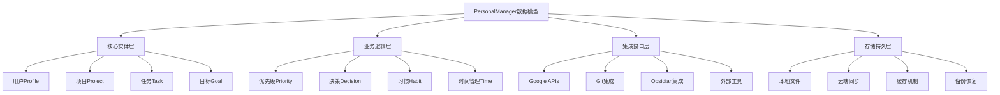
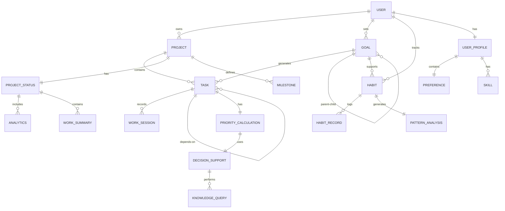
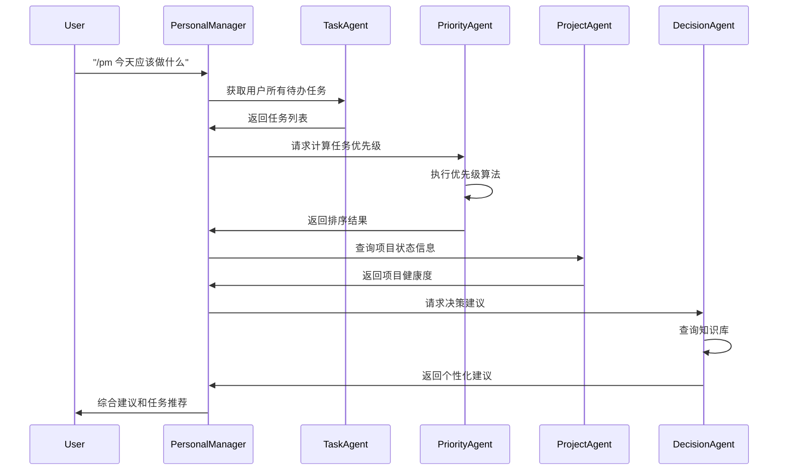

# PersonalManager数据模型设计

> **版本**: v1.0  
> **创建日期**: 2025-09-11  
> **数据格式标准**: JSON/YAML  
> **兼容性**: BMAD Framework v4.43.1+  

## 📋 目录

1. [数据模型概览](#数据模型概览)
2. [核心数据实体](#核心数据实体)
3. [项目数据模型](#项目数据模型)
4. [用户数据模型](#用户数据模型)
5. [集成数据模型](#集成数据模型)
6. [智能数据模型](#智能数据模型)
7. [Agent间通信数据格式](#agent间通信数据格式)
8. [数据验证规则](#数据验证规则)
9. [数据关系图](#数据关系图)
10. [实际数据示例](#实际数据示例)

---

## 🎯 数据模型概览

### 设计原则

PersonalManager数据模型基于以下核心原则设计：

- **标准化**: 所有数据采用JSON/YAML标准格式
- **可序列化**: 支持在BMAD框架内Agent间无损传递
- **扩展性**: 支持未来功能增加和数据结构演进
- **一致性**: 统一的数据类型、命名规范和验证规则
- **可追溯**: 所有数据变更都可记录和回溯

### 数据层次架构



---

## 🏗️ 核心数据实体

### 1. 基础数据类型定义

```yaml
# 基础数据类型规范
data_types:
  # 时间类型
  datetime_iso: "YYYY-MM-DDTHH:mm:ss.sssZ"  # ISO 8601标准
  date_iso: "YYYY-MM-DD"                    # ISO 8601日期
  time_iso: "HH:mm:ss"                      # ISO 8601时间
  
  # 标识符类型  
  uuid: "xxxxxxxx-xxxx-4xxx-yxxx-xxxxxxxxxxxx"  # UUID v4
  slug: "kebab-case-identifier"                  # URL友好标识符
  
  # 数值类型
  priority_score: 0.0-100.0                     # 优先级分数
  percentage: 0.0-100.0                         # 百分比
  rating: 1-10                                  # 评分
  
  # 状态枚举
  project_status: ["planning", "active", "paused", "completed", "archived"]
  task_status: ["todo", "in_progress", "blocked", "completed", "cancelled"]
  priority_level: ["critical", "high", "medium", "low"]
  goal_type: ["short_term", "medium_term", "long_term", "ongoing"]
```

### 2. 通用实体基类

```yaml
# 所有实体的基础结构
base_entity:
  id: string(uuid)                    # 唯一标识符
  created_at: string(datetime_iso)    # 创建时间
  updated_at: string(datetime_iso)    # 最后更新时间
  version: integer                    # 数据版本号
  metadata:                           # 元数据
    created_by: string                # 创建者
    source: string                    # 数据来源
    tags: array[string]               # 标签
    notes: string                     # 备注
```

---

## 📁 项目数据模型

### 1. 项目核心实体

```yaml
# 项目数据结构
project:
  # 基础信息
  extends: base_entity
  name: string(required)              # 项目名称
  slug: string(required, unique)      # URL友好标识符
  description: string                 # 项目描述
  
  # 状态信息
  status: enum(project_status)        # 项目状态
  health: enum                        # 健康状态
    - "excellent"     # 优秀
    - "good"         # 良好  
    - "attention"    # 需关注
    - "critical"     # 严重问题
  
  # 时间信息
  dates:
    started_at: string(date_iso)      # 开始日期
    deadline: string(date_iso)        # 截止日期
    completed_at: string(date_iso)    # 完成日期
    estimated_duration: integer       # 预计耗时(小时)
    actual_duration: integer          # 实际耗时(小时)
  
  # 进度信息
  progress:
    completion_percentage: number(percentage)  # 完成百分比
    milestones_completed: integer             # 已完成里程碑
    milestones_total: integer                 # 总里程碑数
    files_count: integer                      # 文件数量
    lines_of_code: integer                    # 代码行数(如适用)
  
  # 优先级信息
  priority:
    level: enum(priority_level)       # 优先级等级
    score: number(priority_score)     # 优先级分数
    factors:                          # 优先级影响因子
      urgency: number(1-10)           # 紧急程度
      importance: number(1-10)        # 重要程度
      effort: number(1-10)            # 工作量评估
      impact: number(1-10)            # 影响程度
      alignment: number(1-10)         # 目标一致性
  
  # 资源信息
  resources:
    budget_allocated: number          # 分配预算
    budget_used: number               # 已用预算
    team_members: array[string]       # 团队成员
    technologies: array[string]       # 使用技术
    dependencies: array[string(uuid)] # 依赖项目ID
  
  # 路径信息
  paths:
    project_root: string              # 项目根目录
    status_file: string               # 状态文件路径
    docs_folder: string               # 文档文件夹
    config_file: string               # 配置文件路径
```

### 2. 项目状态文件数据结构

```yaml
# PROJECT_STATUS.md 文件格式规范与数据结构
project_status_md:
  # 文件结构：YAML Front Matter + Markdown Content
  file_format: "yaml_frontmatter + markdown"
  encoding: "UTF-8"
  
  # YAML Front Matter 数据结构
  yaml_frontmatter:
    # 项目基本信息
    project_name: string(required)      # 项目名称
    project_type: enum(required)        # 项目类型
      - "code"                          # 编程开发项目
      - "design"                        # 设计创作项目
      - "video"                         # 视频制作项目
      - "research"                      # 研究学习项目
      - "art"                           # 艺术创作项目
      - "general"                       # 通用项目
    
    # 项目状态
    current_progress: number(0-100)     # 当前进度百分比
    health_status: enum(required)       # 项目健康状态
      - "excellent"                     # 优秀状态
      - "good"                          # 良好状态
      - "warning"                       # 需要关注
      - "critical"                      # 需要紧急处理
    
    # 时间信息
    start_date: string(date_iso)        # 项目开始日期
    target_completion: string(date_iso) # 目标完成日期
    last_updated: string(datetime_iso)  # 最后更新时间
    estimated_remaining_time: string    # 预估剩余时间 (如 "2 weeks", "3 days")
    
    # AI工具信息
    report_source: enum                 # 报告来源
      - "claude"                        # Claude Code生成
      - "gemini"                        # Gemini生成
      - "cortex"                        # Cortex生成
      - "chatgpt"                       # ChatGPT生成
      - "manual"                        # 手动编写
      - "hybrid"                        # 混合方式
    ai_tool_version: string             # AI工具版本
    generation_timestamp: string(datetime_iso) # 生成时间戳
    
    # 项目特有字段 (根据project_type动态调整)
    code_project_fields:              # 当project_type="code"时
      tech_stack: array[string]        # 技术栈
      repository_url: string(url)      # 代码仓库URL
      deployment_status: string        # 部署状态
      test_coverage: number(0-100)     # 测试覆盖率
    
    design_project_fields:            # 当project_type="design"时
      design_tools: array[string]      # 设计工具 (Figma, Sketch等)
      design_system: string            # 设计系统
      client_feedback_status: string   # 客户反馈状态
      revision_count: integer          # 修订次数
    
    video_project_fields:             # 当project_type="video"时
      video_length: string             # 视频时长
      editing_software: string         # 剪辑软件
      render_status: string            # 渲染状态
      upload_platforms: array[string]  # 上传平台
  
  # Markdown Content 数据结构
  markdown_content:
    # 标准化章节结构
    sections:
      project_overview:                # 项目概览 (必须)
        content: string(markdown)       # Markdown内容
        required: true
        
      work_completed:                  # 已完成工作 (必须)
        content: string(markdown)       # 已完成任务列表
        required: true
        extraction_patterns:            # 提取模式
          - "- [x] (.+)"               # 已完成任务复选框
          - "✅ (.+)"                   # 完成标记
          - "#{1,6}\\s*.*?已完成.*?\\n(.*?)(?=#{1,6}|$)" # 已完成章节
        
      work_in_progress:               # 进行中工作 (可选)
        content: string(markdown)       # 当前正在进行的工作
        required: false
        extraction_patterns:
          - "- \\[ \\] (.+)"           # 待办任务复选框
          - "⏳ (.+)"                   # 进行中标记
          - "#{1,6}\\s*.*?进行中.*?\\n(.*?)(?=#{1,6}|$)" # 进行中章节
        
      next_actions:                   # 下一步行动 (推荐)
        content: string(markdown)       # 下一步计划和行动项
        required: false
        extraction_patterns:
          - "🔥 (.+)"                   # 高优先级行动
          - "📋 (.+)"                   # 待办行动
          - "#{1,6}\\s*.*?下次.*?\\n(.*?)(?=#{1,6}|$)" # 下次工作章节
        
      issues_and_risks:              # 问题和风险 (可选)
        content: string(markdown)       # 当前问题、风险和阻塞
        required: false
        extraction_patterns:
          - "⚠️ (.+)"                   # 风险标记
          - "❌ (.+)"                   # 问题标记
          - "#{1,6}\\s*.*?问题.*?\\n(.*?)(?=#{1,6}|$)" # 问题章节
        
      time_planning:                  # 时间规划 (可选)
        content: string(markdown)       # 时间分配和计划
        required: false
        extraction_patterns:
          - "📅 (.+)"                   # 时间规划标记
          - "#{1,6}\\s*.*?时间.*?\\n(.*?)(?=#{1,6}|$)" # 时间规划章节
  
  # 数据验证规则
  validation_rules:
    file_existence: true              # 文件必须存在
    yaml_frontmatter_required: true  # YAML前置内容必须存在
    required_fields_present: true    # 必需字段必须存在
    progress_range_valid: true       # 进度必须在0-100范围内
    date_format_valid: true          # 日期格式必须有效
    health_status_valid: true        # 健康状态必须是预定义值之一
    markdown_sections_present: true  # 必需的Markdown章节必须存在
  
  # 文件示例模板结构
  template_structure: |
    ---
    project_name: "项目名称"
    project_type: "code"
    current_progress: 65
    health_status: "good"
    last_updated: "2025-09-11T10:00:00Z"
    start_date: "2025-09-01"
    target_completion: "2025-09-30"
    estimated_remaining_time: "2 weeks"
    report_source: "claude"
    ---
    
    # 📊 项目状态报告 - [项目名称]
    
    ## 🎯 项目概览
    项目的基本情况和当前状态描述...
    
    ## ✅ 已完成工作
    - [x] 完成的任务1
    - [x] 完成的任务2
    
    ## ⏳ 进行中工作  
    - [ ] 正在进行的任务1 (进度: 60%)
    - [ ] 正在进行的任务2 (进度: 30%)
    
    ## 📋 下一步行动
    ### 🔥 高优先级
    - [ ] 下一步必须完成的任务1
    - [ ] 下一步必须完成的任务2
    
    ## ⚠️ 问题和风险
    当前项目面临的问题和风险...
    
    ## 📅 时间规划
    时间分配和计划...
```

---

## 👤 用户数据模型

### 1. 用户Profile数据结构

```yaml
# 用户档案数据
user_profile:
  extends: base_entity
  
  # 基本信息
  personal_info:
    name: string(required)             # 用户姓名
    email: string(email)               # 邮箱地址
    timezone: string                   # 时区
    locale: string                     # 语言地区
    avatar_url: string(url)            # 头像URL
  
  # 工作偏好
  work_preferences:
    working_hours:
      start_time: string(time_iso)     # 开始工作时间
      end_time: string(time_iso)       # 结束工作时间
      break_duration: integer          # 休息时长(分钟)
      focused_hours: array             # 专注时段
        - start: string(time_iso)
          end: string(time_iso)
          efficiency: number(1-10)     # 效率评分
    
    productivity_style:
      work_rhythm: enum                # 工作节奏
        - "steady"                     # 稳定型
        - "burst"                      # 爆发型
        - "flexible"                   # 灵活型
      distraction_tolerance: number(1-10) # 干扰容忍度
      multitasking_preference: number(1-10) # 多任务偏好
      collaboration_preference: number(1-10) # 协作偏好
    
    notification_settings:
      channels: array                  # 通知渠道
        - type: enum                   # 通知类型
            - "email"
            - "slack" 
            - "desktop"
            - "mobile"
          enabled: boolean
          priority_threshold: enum(priority_level)
      quiet_hours:                     # 免打扰时间
        start: string(time_iso)
        end: string(time_iso)
        days: array[string]            # 生效日期
  
  # 技能和兴趣
  skills_interests:
    technical_skills: array            # 技术技能
      - skill: string                  # 技能名称
        proficiency: number(1-10)      # 熟练程度
        last_used: string(date_iso)    # 最后使用时间
        learning_priority: number(1-10) # 学习优先级
    
    interests: array                   # 兴趣爱好
      - interest: string               # 兴趣名称
        intensity: number(1-10)        # 兴趣强度
        time_allocation: number        # 时间分配百分比
  
  # 个人目标
  goals_overview:
    life_areas: array                  # 生活领域
      - area: string                   # 领域名称
        importance: number(1-10)       # 重要程度
        satisfaction: number(1-10)     # 满意度
        focus_percentage: number       # 关注度百分比
    
    core_values: array[string]         # 核心价值观
    vision_statement: string           # 愿景描述
```

### 2. 目标数据结构

```yaml
# 目标实体
goal:
  extends: base_entity
  
  # 基本信息
  title: string(required)              # 目标标题
  description: string                  # 详细描述
  type: enum(goal_type)                # 目标类型
  category: string                     # 目标分类
  
  # 时间框架
  timeframe:
    start_date: string(date_iso)       # 开始日期
    target_date: string(date_iso)      # 目标完成日期
    review_frequency: enum             # 复盘频率
      - "daily"                        # 每日
      - "weekly"                       # 每周
      - "monthly"                      # 每月
      - "quarterly"                    # 每季
    
    milestones: array                  # 里程碑
      - title: string                  # 里程碑标题
        target_date: string(date_iso)  # 目标日期
        completed: boolean             # 是否完成
        completion_date: string(date_iso) # 完成日期
  
  # 目标测量
  measurement:
    is_quantifiable: boolean           # 是否可量化
    metrics: array                     # 衡量指标
      - name: string                   # 指标名称
        unit: string                   # 单位
        target_value: number           # 目标值
        current_value: number          # 当前值
        measurement_method: string     # 测量方法
    
    success_criteria: array[string]    # 成功标准
    progress_tracking: enum            # 进度跟踪方式
      - "percentage"                   # 百分比
      - "milestone"                    # 里程碑
      - "metric"                       # 指标
      - "subjective"                   # 主观评估
  
  # 目标关联
  relationships:
    parent_goal_id: string(uuid)       # 父目标ID
    child_goals: array[string(uuid)]   # 子目标ID列表
    related_projects: array[string(uuid)] # 相关项目ID
    supporting_habits: array[string(uuid)] # 支持习惯ID
  
  # 目标状态
  current_status:
    status: enum                       # 当前状态
      - "draft"                        # 草案
      - "active"                       # 活跃
      - "paused"                       # 暂停
      - "completed"                    # 已完成
      - "cancelled"                    # 已取消
    
    completion_percentage: number(percentage) # 完成百分比
    energy_level: number(1-10)         # 精力投入度
    confidence_level: number(1-10)     # 完成信心
    
    last_review: object                # 最后复盘
      date: string(date_iso)           # 复盘日期
      progress_since_last: string      # 上次以来进展
      obstacles_encountered: array[string] # 遇到障碍
      adjustments_made: array[string]  # 做出调整
      next_actions: array[string]      # 下步行动
```

### 3. 任务数据结构

```yaml
# 任务实体
task:
  extends: base_entity
  
  # 基本信息
  title: string(required)              # 任务标题
  description: string                  # 任务描述
  status: enum(task_status)            # 任务状态
  
  # 分类和优先级
  classification:
    project_id: string(uuid)           # 所属项目ID
    goal_id: string(uuid)              # 关联目标ID
    category: string                   # 任务分类
    tags: array[string]                # 标签
    context: enum                      # 执行上下文
      - "deep_work"                    # 深度工作
      - "light_work"                   # 轻松工作
      - "meeting"                      # 会议
      - "communication"                # 沟通
      - "learning"                     # 学习
  
  priority:
    level: enum(priority_level)        # 优先级等级
    score: number(priority_score)      # 动态优先级分数
    deadline: string(datetime_iso)     # 截止时间
    importance: number(1-10)           # 重要程度
    urgency: number(1-10)              # 紧急程度
  
  # 工作量估算
  effort_estimation:
    estimated_duration: integer        # 预计耗时(分钟)
    actual_duration: integer           # 实际耗时(分钟)
    complexity: enum                   # 复杂程度
      - "trivial"                      # 简单
      - "easy"                         # 容易
      - "moderate"                     # 中等
      - "hard"                         # 困难
      - "expert"                       # 专家级
    
    energy_required: enum              # 所需精力
      - "low"                          # 低精力
      - "medium"                       # 中等精力
      - "high"                         # 高精力
      - "peak"                         # 峰值精力
  
  # 依赖关系
  dependencies:
    blocked_by: array[string(uuid)]    # 阻塞此任务的其他任务
    blocks: array[string(uuid)]        # 此任务阻塞的其他任务
    prerequisite_resources: array[string] # 前置资源要求
    required_skills: array[string]     # 所需技能
  
  # 时间管理
  time_management:
    scheduled_start: string(datetime_iso) # 计划开始时间
    scheduled_end: string(datetime_iso)   # 计划结束时间
    actual_start: string(datetime_iso)    # 实际开始时间
    actual_end: string(datetime_iso)      # 实际结束时间
    
    time_blocks: array                 # 时间块分配
      - date: string(date_iso)         # 日期
        start_time: string(time_iso)   # 开始时间
        end_time: string(time_iso)     # 结束时间
        focus_quality: number(1-10)    # 专注质量
  
  # 执行记录
  execution_log:
    work_sessions: array               # 工作会话
      - session_id: string(uuid)       # 会话ID
        start_time: string(datetime_iso) # 开始时间
        end_time: string(datetime_iso)   # 结束时间
        productivity_score: number(1-10) # 生产力评分
        interruptions: integer         # 中断次数
        notes: string                  # 会话笔记
    
    progress_updates: array            # 进度更新
      - timestamp: string(datetime_iso) # 更新时间
        progress_percentage: number    # 进度百分比
        status_change: string          # 状态变更
        notes: string                  # 更新说明
```

---

## 🔗 集成数据模型

### 1. Google APIs数据映射

```yaml
# Google Calendar 集成数据
google_calendar_integration:
  # 事件映射
  event_mapping:
    google_event:
      id: string                       # Google事件ID
      summary: string                  # 事件标题
      start: object                    # 开始时间
        dateTime: string(datetime_iso)
        timeZone: string
      end: object                      # 结束时间
        dateTime: string(datetime_iso)
        timeZone: string
      description: string              # 事件描述
      attendees: array                 # 参与者
      location: string                 # 地点
      
    personalmanager_task:
      id: string(uuid)                 # 内部任务ID
      google_event_id: string          # Google事件ID(外键)
      title: string                    # 任务标题(来自summary)
      scheduled_start: string(datetime_iso) # 计划开始
      scheduled_end: string(datetime_iso)   # 计划结束
      context: "meeting"               # 自动设为会议上下文
      participants: array[string]      # 参与者列表
      location: string                 # 会议地点
      
  # 同步规则
  sync_rules:
    bidirectional: boolean             # 双向同步
    auto_create_tasks: boolean         # 自动创建任务
    update_frequency: integer          # 同步频率(分钟)
    conflict_resolution: enum          # 冲突解决策略
      - "google_wins"                  # Google优先
      - "local_wins"                   # 本地优先
      - "manual_review"                # 手动审核
      - "merge"                        # 智能合并

# Google Tasks 集成数据
google_tasks_integration:
  # 任务映射
  task_mapping:
    google_task:
      id: string                       # Google任务ID
      title: string                    # 任务标题
      notes: string                    # 任务备注
      status: enum                     # 状态
        - "needsAction"                # 待处理
        - "completed"                  # 已完成
      due: string(date_iso)            # 截止日期
      completed: string(datetime_iso)  # 完成时间
      
    personalmanager_task:
      id: string(uuid)                 # 内部任务ID  
      google_task_id: string           # Google任务ID(外键)
      title: string                    # 任务标题
      description: string              # 任务描述(来自notes)
      status: enum                     # 状态映射
        needsAction: "todo"
        completed: "completed"
      deadline: string(datetime_iso)   # 截止时间
      completed_at: string(datetime_iso) # 完成时间

# Google Gmail 集成数据
google_gmail_integration:
  # 邮件跟踪
  email_tracking:
    important_emails: array            # 重要邮件
      - message_id: string             # 邮件ID
        thread_id: string              # 对话ID
        subject: string                # 邮件主题
        from: string                   # 发件人
        to: array[string]              # 收件人
        received_at: string(datetime_iso) # 接收时间
        priority: enum(priority_level) # 重要程度
        action_required: boolean       # 是否需要行动
        related_project_id: string(uuid) # 关联项目ID
        
    auto_task_creation:                # 自动任务创建规则
      keywords: array[string]          # 触发关键词
      sender_whitelist: array[string]  # 发件人白名单
      project_mapping: object          # 项目映射规则
        domain_patterns: array         # 域名模式
          - pattern: string            # 正则表达式
            project_id: string(uuid)   # 对应项目ID
```

### 2. Git集成数据结构

```yaml
# Git版本控制集成
git_integration:
  # 仓库信息
  repository_info:
    path: string                       # 仓库路径
    remote_url: string                 # 远程仓库URL
    branch: string                     # 当前分支
    last_sync: string(datetime_iso)    # 最后同步时间
    
  # 提交分析
  commit_analysis:
    recent_commits: array              # 近期提交
      - hash: string                   # 提交哈希
        message: string                # 提交信息
        author: string                 # 提交者
        timestamp: string(datetime_iso) # 提交时间
        files_changed: integer         # 变更文件数
        lines_added: integer           # 新增行数
        lines_removed: integer         # 删除行数
        extracted_tasks: array[string] # 提取的任务描述
        
  # 工作会话跟踪
  work_session_tracking:
    sessions: array                    # 工作会话
      - session_id: string(uuid)       # 会话ID
        start_commit: string           # 开始提交
        end_commit: string             # 结束提交
        duration: integer              # 会话时长(分钟)
        productivity_score: number(1-10) # 生产力评分
        commit_frequency: number       # 提交频率
        code_quality_score: number(1-10) # 代码质量评分

# Obsidian 集成数据
obsidian_integration:
  # 笔记映射
  note_mapping:
    project_notes: array               # 项目笔记
      - note_path: string              # 笔记路径
        project_id: string(uuid)       # 关联项目ID
        last_modified: string(datetime_iso) # 最后修改时间
        word_count: integer            # 字数
        backlinks_count: integer       # 反向链接数
        
    knowledge_graph:                   # 知识图谱
      nodes: array                     # 节点
        - id: string                   # 节点ID
          type: enum                   # 节点类型
            - "project"                # 项目
            - "task"                   # 任务
            - "goal"                   # 目标
            - "concept"                # 概念
            - "resource"               # 资源
          title: string                # 节点标题
          content: string              # 节点内容
          
      edges: array                     # 边关系
        - from_id: string              # 源节点ID
          to_id: string                # 目标节点ID
          relationship: string         # 关系类型
          strength: number(0-1)        # 关系强度
```

---

## 🧠 智能数据模型

### 1. 优先级计算数据结构

```yaml
# 优先级计算引擎数据
priority_calculation:
  # 计算参数
  calculation_params:
    user_id: string(uuid)              # 用户ID
    calculation_time: string(datetime_iso) # 计算时间
    algorithm_version: string          # 算法版本
    
    # 权重配置
    weights:
      urgency_weight: number(0-1)      # 紧急程度权重
      importance_weight: number(0-1)   # 重要程度权重
      effort_weight: number(0-1)       # 工作量权重  
      alignment_weight: number(0-1)    # 目标一致性权重
      momentum_weight: number(0-1)     # 动量权重
      energy_weight: number(0-1)       # 精力匹配权重
      context_weight: number(0-1)      # 上下文权重
      
    # 时间衰减参数
    time_decay:
      enabled: boolean                 # 是否启用时间衰减
      half_life_days: number           # 半衰期(天)
      min_priority_threshold: number   # 最小优先级阈值
  
  # 输入数据
  input_data:
    tasks: array[object]               # 待计算任务列表
      - task_id: string(uuid)          # 任务ID
        base_priority: number(1-10)    # 基础优先级
        deadline: string(datetime_iso) # 截止时间
        estimated_duration: integer    # 预计耗时
        required_energy: enum          # 所需精力
        goal_alignment: number(1-10)   # 目标一致性
        dependencies: array[string]    # 依赖关系
        
    context_factors:
      current_time: string(datetime_iso) # 当前时间
      available_energy: number(1-10)    # 可用精力
      available_time_slot: integer      # 可用时间槽(分钟)
      current_context: string           # 当前上下文
      recent_completions: array         # 近期完成任务
        - task_id: string(uuid)
          completion_time: string(datetime_iso)
          satisfaction_score: number(1-10)
  
  # 输出结果
  calculation_result:
    ranked_tasks: array                # 排序后的任务
      - task_id: string(uuid)          # 任务ID
        final_priority_score: number(priority_score) # 最终优先级分数
        rank: integer                  # 排名
        
        # 分解评分
        component_scores:
          urgency_score: number(0-100) # 紧急程度分数
          importance_score: number(0-100) # 重要程度分数
          effort_score: number(0-100)  # 工作量分数
          alignment_score: number(0-100) # 一致性分数
          momentum_score: number(0-100) # 动量分数
          energy_match_score: number(0-100) # 精力匹配分数
          context_match_score: number(0-100) # 上下文匹配分数
          
        # 推理说明
        reasoning:
          primary_factors: array[string] # 主要影响因子
          boost_factors: array[string]  # 提升因子
          penalty_factors: array[string] # 惩罚因子
          recommendation: string        # 推荐理由
    
    # 计算元数据
    metadata:
      total_tasks_evaluated: integer   # 评估任务总数
      calculation_duration: integer    # 计算耗时(毫秒)
      algorithm_confidence: number(0-1) # 算法置信度
      next_recalculation: string(datetime_iso) # 下次重算时间
```

### 2. 决策支持数据结构

```yaml
# 决策支持系统数据
decision_support:
  # 决策请求
  decision_request:
    request_id: string(uuid)           # 请求ID
    user_id: string(uuid)              # 用户ID
    timestamp: string(datetime_iso)    # 请求时间
    
    # 决策类型
    decision_type: enum
      - "task_prioritization"          # 任务优先级
      - "time_allocation"              # 时间分配
      - "goal_adjustment"              # 目标调整
      - "project_selection"            # 项目选择
      - "habit_formation"              # 习惯养成
      - "resource_allocation"          # 资源分配
    
    # 决策上下文
    context:
      available_time: integer          # 可用时间(分钟)
      energy_level: number(1-10)       # 当前精力
      current_mood: enum               # 当前情绪
        - "motivated"                  # 积极
        - "neutral"                    # 中性
        - "tired"                      # 疲惫
        - "stressed"                   # 压力
        - "excited"                    # 兴奋
      
      environmental_factors:
        location: string               # 当前位置
        noise_level: enum              # 噪音水平
          - "quiet"                    # 安静
          - "moderate"                 # 适中
          - "noisy"                    # 嘈杂
        distractions: array[string]    # 干扰因素
        available_tools: array[string] # 可用工具
  
  # 知识库查询
  knowledge_query:
    relevant_books: array              # 相关书籍
      - book_id: string                # 书籍ID
        title: string                  # 书名
        author: string                 # 作者
        relevance_score: number(0-1)   # 相关性评分
        applicable_concepts: array[string] # 适用概念
        
    applicable_principles: array       # 适用原则
      - principle: string              # 原则描述
        source: string                 # 来源
        confidence: number(0-1)        # 置信度
        conditions: array[string]      # 适用条件
        
    similar_situations: array          # 相似情况
      - situation_id: string(uuid)     # 情况ID
        description: string            # 情况描述
        similarity_score: number(0-1)  # 相似性评分
        previous_decision: string      # 之前决策
        outcome: string                # 结果
        lessons_learned: string        # 经验教训
  
  # 决策建议
  decision_recommendation:
    primary_recommendation: object     # 主要建议
      action: string                   # 建议行动
      confidence: number(0-1)          # 置信度
      expected_outcome: string         # 预期结果
      success_probability: number(0-1) # 成功概率
      
      # 支持理由
      supporting_reasons: array
        - reason: string               # 理由
          evidence_source: string      # 证据来源
          weight: number(0-1)          # 权重
          
    alternative_options: array         # 备选方案
      - option: string                 # 备选方案
        pros: array[string]            # 优点
        cons: array[string]            # 缺点
        risk_level: enum(priority_level) # 风险等级
        effort_required: number(1-10)  # 所需努力
        
    risk_assessment:
      potential_risks: array           # 潜在风险
        - risk: string                 # 风险描述
          probability: number(0-1)     # 发生概率
          impact: number(1-10)         # 影响程度
          mitigation: string           # 缓解措施
          
    success_factors:
      critical_factors: array[string]  # 关键成功因子
      monitoring_metrics: array        # 监控指标
        - metric: string               # 指标名称
          target_value: string         # 目标值
          measurement_frequency: string # 测量频率
```

### 3. 习惯跟踪数据结构

```yaml
# 习惯跟踪系统数据
habit_tracking:
  # 习惯定义
  habit_definition:
    extends: base_entity
    name: string(required)             # 习惯名称
    description: string                # 习惯描述
    category: string                   # 习惯分类
    
    # 习惯类型
    habit_type: enum
      - "daily"                        # 每日习惯
      - "weekly"                       # 每周习惯
      - "periodic"                     # 周期性习惯
      - "project_based"                # 项目基础习惯
      
    # 目标设定
    target_specification:
      frequency: object                # 频率设定
        type: enum
          - "daily"                    # 每天
          - "weekly"                   # 每周
          - "monthly"                  # 每月
          - "custom"                   # 自定义
        target_count: integer          # 目标次数
        minimum_duration: integer      # 最小持续时间(分钟)
        
      success_criteria:
        measurement_type: enum         # 测量类型
          - "binary"                   # 二元(完成/未完成)
          - "quantity"                 # 数量
          - "duration"                 # 时长
          - "quality"                  # 质量评分
        target_value: number           # 目标值
        unit: string                   # 单位
  
  # 执行记录
  execution_records:
    daily_records: array               # 每日记录
      - date: string(date_iso)         # 日期
        completed: boolean             # 是否完成
        actual_value: number           # 实际值
        duration: integer              # 持续时间(分钟)
        quality_score: number(1-10)    # 质量评分
        notes: string                  # 备注
        context: string                # 执行环境
        mood_before: number(1-10)      # 执行前情绪
        mood_after: number(1-10)       # 执行后情绪
        difficulty: number(1-10)       # 困难程度
        
    streak_tracking:
      current_streak: integer          # 当前连续天数
      longest_streak: integer          # 最长连续天数
      total_completions: integer       # 总完成次数
      success_rate: number(percentage) # 成功率
      
    pattern_analysis:
      best_time_of_day: string(time_iso) # 最佳执行时间
      best_day_of_week: string         # 最佳执行星期
      correlation_with_mood: number(-1,1) # 与心情的相关性
      environmental_factors: array     # 环境因子
        - factor: string               # 因子
          positive_correlation: number(-1,1) # 正向相关性
```

---

## 🔄 Agent间通信数据格式

### 1. Agent通信协议

```yaml
# Agent间消息格式
agent_message:
  # 消息头
  header:
    message_id: string(uuid)           # 消息ID
    sender_agent: string               # 发送Agent
    receiver_agent: string             # 接收Agent  
    message_type: enum                 # 消息类型
      - "request"                      # 请求
      - "response"                     # 响应
      - "notification"                 # 通知
      - "command"                      # 命令
      - "query"                        # 查询
      - "update"                       # 更新
    
    timestamp: string(datetime_iso)    # 发送时间
    priority: enum(priority_level)     # 消息优先级
    correlation_id: string(uuid)       # 关联ID(用于请求-响应配对)
    ttl: integer                       # 生存时间(秒)
  
  # 消息体
  payload:
    action: string                     # 动作类型
    data: object                       # 数据内容(结构根据action变化)
    context: object                    # 上下文信息
      user_id: string(uuid)            # 用户ID
      session_id: string(uuid)         # 会话ID
      current_time: string(datetime_iso) # 当前时间
      user_context: object             # 用户上下文
        location: string               # 位置
        device: string                 # 设备
        availability: string           # 可用性状态
  
  # 消息元数据
  metadata:
    format_version: string             # 格式版本
    encoding: string                   # 编码格式
    compression: string                # 压缩方式
    checksum: string                   # 校验和
```

### 2. 常用Agent通信示例

```yaml
# 优先级计算请求示例
priority_calculation_request:
  header:
    message_type: "request"
    sender_agent: "TaskAgent"
    receiver_agent: "PriorityAgent"
    action: "calculate_priorities"
    
  payload:
    action: "calculate_task_priorities"
    data:
      tasks: array[object]             # 任务列表
        - task_id: string(uuid)
          title: string
          deadline: string(datetime_iso)
          estimated_duration: integer
          importance: number(1-10)
          urgency: number(1-10)
          
      user_context:
        available_time: integer        # 可用时间
        energy_level: number(1-10)     # 精力水平
        current_goals: array[string(uuid)] # 当前目标
        
    context:
      calculation_purpose: string      # 计算目的
      time_horizon: string             # 时间范围
      constraints: array[string]       # 约束条件

# 项目状态更新通知示例  
project_status_notification:
  header:
    message_type: "notification"
    sender_agent: "ProjectAgent"
    receiver_agent: "ALL"
    action: "project_status_updated"
    
  payload:
    action: "project_status_updated"
    data:
      project_id: string(uuid)         # 项目ID
      old_status: string               # 之前状态
      new_status: string               # 新状态
      change_reason: string            # 变更原因
      impact_assessment: object        # 影响评估
        affected_tasks: array[string(uuid)] # 受影响任务
        priority_recalculation_needed: boolean # 是否需要重算优先级
        notification_recipients: array[string] # 通知对象
        
    context:
      change_trigger: string           # 变更触发器
      change_time: string(datetime_iso) # 变更时间
      change_source: string            # 变更来源
```

---

## ✅ 数据验证规则

### 1. 字段验证规则

```yaml
# 数据验证规则定义
validation_rules:
  # 基础类型验证
  field_validations:
    uuid:
      pattern: "^[0-9a-fA-F]{8}-[0-9a-fA-F]{4}-4[0-9a-fA-F]{3}-[89abAB][0-9a-fA-F]{3}-[0-9a-fA-F]{12}$"
      required: true
      
    datetime_iso:
      pattern: "^\\d{4}-\\d{2}-\\d{2}T\\d{2}:\\d{2}:\\d{2}(\\.\\d{3})?Z$"
      example: "2025-09-11T10:30:00.000Z"
      
    email:
      pattern: "^[a-zA-Z0-9._%+-]+@[a-zA-Z0-9.-]+\\.[a-zA-Z]{2,}$"
      max_length: 254
      
    priority_score:
      type: "number"
      minimum: 0.0
      maximum: 100.0
      precision: 2
      
    percentage:
      type: "number" 
      minimum: 0.0
      maximum: 100.0
      precision: 2
      
    rating:
      type: "integer"
      minimum: 1
      maximum: 10
  
  # 业务逻辑验证
  business_rules:
    project_validation:
      - rule: "项目开始日期不能晚于截止日期"
        condition: "dates.started_at <= dates.deadline"
        error_code: "PROJECT_INVALID_DATE_RANGE"
        
      - rule: "完成百分比与状态一致性"
        condition: "status == 'completed' ? progress.completion_percentage == 100 : true"
        error_code: "PROJECT_STATUS_PROGRESS_MISMATCH"
        
      - rule: "优先级分数与等级一致性"
        condition: |
          (priority.level == 'critical' && priority.score >= 80) ||
          (priority.level == 'high' && priority.score >= 60 && priority.score < 80) ||
          (priority.level == 'medium' && priority.score >= 30 && priority.score < 60) ||
          (priority.level == 'low' && priority.score < 30)
        error_code: "PRIORITY_LEVEL_SCORE_MISMATCH"
    
    task_validation:
      - rule: "任务计划时间必须合理"
        condition: "scheduled_start < scheduled_end"
        error_code: "TASK_INVALID_SCHEDULE"
        
      - rule: "阻塞依赖不能形成循环"
        condition: "!hasCyclicDependency(blocked_by, blocks)"
        error_code: "TASK_CYCLIC_DEPENDENCY"
        
      - rule: "预计时间应该为正数"
        condition: "effort_estimation.estimated_duration > 0"
        error_code: "TASK_INVALID_DURATION"
  
  # 数据关系验证
  referential_integrity:
    - rule: "任务必须关联存在的项目"
      foreign_key: "task.classification.project_id"
      references: "project.id"
      on_delete: "CASCADE"
      error_code: "TASK_INVALID_PROJECT_REFERENCE"
      
    - rule: "目标的父子关系必须有效"
      foreign_key: "goal.relationships.parent_goal_id"
      references: "goal.id"
      on_delete: "SET_NULL"
      error_code: "GOAL_INVALID_PARENT_REFERENCE"
```

### 2. 错误处理规范

```yaml
# 错误代码和处理规范
error_handling:
  # 错误代码分类
  error_codes:
    validation_errors:              # 验证错误 (1000-1999)
      INVALID_UUID: 1001
      INVALID_DATETIME: 1002  
      INVALID_EMAIL: 1003
      INVALID_PRIORITY_SCORE: 1004
      FIELD_REQUIRED: 1005
      FIELD_TOO_LONG: 1006
      
    business_logic_errors:          # 业务逻辑错误 (2000-2999)
      PROJECT_INVALID_DATE_RANGE: 2001
      PROJECT_STATUS_PROGRESS_MISMATCH: 2002
      PRIORITY_LEVEL_SCORE_MISMATCH: 2003
      TASK_INVALID_SCHEDULE: 2004
      TASK_CYCLIC_DEPENDENCY: 2005
      TASK_INVALID_DURATION: 2006
      
    reference_errors:               # 引用错误 (3000-3999)
      TASK_INVALID_PROJECT_REFERENCE: 3001
      GOAL_INVALID_PARENT_REFERENCE: 3002
      USER_NOT_FOUND: 3003
      
    system_errors:                  # 系统错误 (4000-4999)
      DATABASE_CONNECTION_ERROR: 4001
      AGENT_COMMUNICATION_ERROR: 4002
      EXTERNAL_API_ERROR: 4003
      FILE_SYSTEM_ERROR: 4004
  
  # 错误响应格式
  error_response:
    success: false                  # 成功标识
    error_code: integer             # 错误代码
    error_message: string           # 错误信息
    error_details: object           # 详细信息
      field: string                 # 出错字段
      value: any                    # 出错值
      constraint: string            # 违反的约束
      suggestion: string            # 修改建议
    
    timestamp: string(datetime_iso) # 错误时间
    request_id: string(uuid)        # 请求ID
    context: object                 # 上下文信息
      user_id: string(uuid)         # 用户ID
      agent: string                 # 处理Agent
      operation: string             # 执行操作
```

---

## 📊 数据关系图

### 1. 核心实体关系图



### 2. Agent通信流程图



---

## 📝 实际数据示例

### 示例1: 个人网站项目数据

```yaml
# 项目实体示例
project_example_1:
  id: "550e8400-e29b-41d4-a716-446655440001"
  created_at: "2025-09-01T09:00:00.000Z"
  updated_at: "2025-09-11T18:30:00.000Z"
  version: 15
  
  name: "个人网站重构"
  slug: "personal-website-rebuild"
  description: "重新设计和开发个人作品集网站，使用现代技术栈，提升用户体验和性能"
  
  status: "active"
  health: "good"
  
  dates:
    started_at: "2025-09-01"
    deadline: "2025-09-30"
    completed_at: null
    estimated_duration: 120  # 120小时
    actual_duration: 87      # 已花费87小时
  
  progress:
    completion_percentage: 72.5
    milestones_completed: 4
    milestones_total: 6
    files_count: 23
    lines_of_code: 3450
  
  priority:
    level: "high"
    score: 78.5
    factors:
      urgency: 8              # 有明确截止日期
      importance: 9           # 对职业发展重要
      effort: 6               # 中等工作量
      impact: 8               # 影响较大
      alignment: 9            # 与目标高度一致
  
  resources:
    budget_allocated: 0       # 个人项目，无预算
    budget_used: 0
    team_members: ["自己"]
    technologies: ["React", "TypeScript", "Tailwind CSS", "Next.js"]
    dependencies: []
  
  paths:
    project_root: "./Projects/personal-website"
    status_file: "./Projects/personal-website/PROJECT_STATUS.md"
    docs_folder: "./Projects/personal-website/docs"
    config_file: "./Projects/personal-website/pm-config.yaml"
  
  metadata:
    created_by: "PersonalManagerAgent"
    source: "manual_creation"
    tags: ["web-development", "portfolio", "react"]
    notes: "重点关注移动端适配和性能优化"
```

### 示例2: 高优先级任务数据

```yaml
# 任务实体示例
task_example_1:
  id: "550e8400-e29b-41d4-a716-446655440002"
  created_at: "2025-09-11T09:00:00.000Z"
  updated_at: "2025-09-11T16:45:00.000Z"
  version: 3
  
  title: "修复Safari浏览器动画卡顿问题"
  description: "个人网站在Safari浏览器下CSS动画出现明显卡顿，需要优化动画实现方式，确保60fps流畅体验"
  status: "in_progress"
  
  classification:
    project_id: "550e8400-e29b-41d4-a716-446655440001"
    goal_id: "550e8400-e29b-41d4-a716-446655440010"
    category: "bug-fix"
    tags: ["safari", "animation", "performance", "css"]
    context: "deep_work"
  
  priority:
    level: "critical"
    score: 89.2
    deadline: "2025-09-12T18:00:00.000Z"  # 明天下班前
    importance: 9    # 影响用户体验
    urgency: 10      # 阻塞项目发布
  
  effort_estimation:
    estimated_duration: 120    # 预计2小时
    actual_duration: 45        # 已花费45分钟
    complexity: "moderate"     # 中等复杂度
    energy_required: "high"    # 需要高精力专注
  
  dependencies:
    blocked_by: []             # 无阻塞依赖
    blocks: ["550e8400-e29b-41d4-a716-446655440003"]  # 阻塞发布任务
    prerequisite_resources: ["Safari浏览器", "开发者工具"]
    required_skills: ["CSS动画优化", "浏览器兼容性调试"]
  
  time_management:
    scheduled_start: "2025-09-11T14:00:00.000Z"
    scheduled_end: "2025-09-11T16:00:00.000Z"
    actual_start: "2025-09-11T14:15:00.000Z"
    actual_end: null
    
    time_blocks:
      - date: "2025-09-11"
        start_time: "14:15:00"
        end_time: "15:00:00"
        focus_quality: 8       # 专注质量不错
  
  execution_log:
    work_sessions:
      - session_id: "550e8400-e29b-41d4-a716-446655440100"
        start_time: "2025-09-11T14:15:00.000Z"
        end_time: "2025-09-11T15:00:00.000Z"
        productivity_score: 8
        interruptions: 1       # 有1次中断
        notes: "发现问题出在transform3d硬件加速上，Safari对某些3D变换处理有bug"
    
    progress_updates:
      - timestamp: "2025-09-11T15:00:00.000Z"
        progress_percentage: 40
        status_change: "todo -> in_progress"
        notes: "已定位问题根源，开始尝试解决方案"
      
      - timestamp: "2025-09-11T16:45:00.000Z"
        progress_percentage: 75
        status_change: null
        notes: "找到了替代方案，正在测试效果"
  
  metadata:
    created_by: "ProjectStatusAnalyzer"
    source: "auto_detected_from_commit"
    tags: ["urgent", "user-experience"]
    notes: "这个问题可能影响整个项目的发布时间，需要优先解决"
```

### 示例3: 用户目标数据

```yaml
# 目标实体示例
goal_example_1:
  id: "550e8400-e29b-41d4-a716-446655440010"
  created_at: "2025-09-01T08:00:00.000Z"
  updated_at: "2025-09-11T20:00:00.000Z"
  version: 8
  
  title: "在3个月内建立专业的在线个人品牌"
  description: "通过重构个人网站、创建高质量内容、建立社交媒体影响力，在技术社区中建立专业形象"
  type: "medium_term"
  category: "职业发展"
  
  timeframe:
    start_date: "2025-09-01"
    target_date: "2025-12-01"
    review_frequency: "weekly"
    
    milestones:
      - title: "个人网站重构完成"
        target_date: "2025-09-30"
        completed: false
        completion_date: null
        
      - title: "发布5篇技术博客"
        target_date: "2025-10-31"
        completed: false
        completion_date: null
        
      - title: "获得1000个Twitter关注者"
        target_date: "2025-11-30"
        completed: false
        completion_date: null
        
      - title: "在2个技术会议上分享"
        target_date: "2025-12-01"
        completed: false
        completion_date: null
  
  measurement:
    is_quantifiable: true
    metrics:
      - name: "网站月活跃访问者"
        unit: "人"
        target_value: 500
        current_value: 125
        measurement_method: "Google Analytics"
        
      - name: "技术文章发布数量"
        unit: "篇"
        target_value: 5
        current_value: 1
        measurement_method: "博客平台统计"
        
      - name: "社交媒体关注者增长"
        unit: "人"
        target_value: 1000
        current_value: 234
        measurement_method: "平台内置分析"
    
    success_criteria:
      - "个人网站SEO排名进入前10"
      - "至少收到3个工作机会邀请"
      - "技术文章平均阅读量超过1000"
      - "在技术社区中被认可为专家"
    
    progress_tracking: "percentage"
  
  relationships:
    parent_goal_id: null
    child_goals: ["550e8400-e29b-41d4-a716-446655440011"]
    related_projects: ["550e8400-e29b-41d4-a716-446655440001"]
    supporting_habits: ["550e8400-e29b-41d4-a716-446655440020"]
  
  current_status:
    status: "active"
    completion_percentage: 35.8
    energy_level: 8        # 投入精力较高
    confidence_level: 7    # 有信心完成
    
    last_review:
      date: "2025-09-08"
      progress_since_last: "个人网站重构取得良好进展，完成了72.5%"
      obstacles_encountered: 
        - "Safari浏览器兼容性问题"
        - "时间管理需要优化"
      adjustments_made:
        - "调整了项目时间线，增加了缓冲时间"
        - "决定先专注网站完成，再开始内容创作"
      next_actions:
        - "解决Safari动画问题"
        - "完成响应式布局适配"
        - "开始准备第一篇技术博客的大纲"
  
  metadata:
    created_by: "用户手动创建"
    source: "quarterly_planning"
    tags: ["career", "branding", "technology"]
    notes: "这个目标对职业发展非常重要，需要保持高优先级"
```

### 示例4: 优先级计算结果

```yaml
# 优先级计算结果示例
priority_calculation_example:
  calculation_params:
    user_id: "550e8400-e29b-41d4-a716-446655440000"
    calculation_time: "2025-09-11T18:00:00.000Z"
    algorithm_version: "v2.1.0"
    
    weights:
      urgency_weight: 0.25
      importance_weight: 0.25
      effort_weight: 0.15
      alignment_weight: 0.20
      momentum_weight: 0.10
      energy_weight: 0.05
      context_weight: 0.05
    
    time_decay:
      enabled: true
      half_life_days: 7
      min_priority_threshold: 10.0
  
  input_data:
    tasks:
      - task_id: "550e8400-e29b-41d4-a716-446655440002"
        base_priority: 9
        deadline: "2025-09-12T18:00:00.000Z"
        estimated_duration: 120
        required_energy: "high"
        goal_alignment: 10
        dependencies: []
        
    context_factors:
      current_time: "2025-09-11T18:00:00.000Z"
      available_energy: 7
      available_time_slot: 180  # 3小时可用
      current_context: "deep_work_evening"
      recent_completions:
        - task_id: "550e8400-e29b-41d4-a716-446655440001"
          completion_time: "2025-09-11T16:30:00.000Z"
          satisfaction_score: 8
  
  calculation_result:
    ranked_tasks:
      - task_id: "550e8400-e29b-41d4-a716-446655440002"
        final_priority_score: 89.2
        rank: 1
        
        component_scores:
          urgency_score: 95      # 明天截止，非常紧急
          importance_score: 90   # 阻塞项目发布
          effort_score: 75       # 中等工作量，不会太累
          alignment_score: 100   # 与目标完全一致
          momentum_score: 85     # 最近在这个项目上有进展
          energy_match_score: 70 # 需要高精力，但当前精力还可以
          context_match_score: 90 # 很适合当前深度工作环境
        
        reasoning:
          primary_factors:
            - "临近截止时间(24小时内)"
            - "阻塞其他重要任务"
            - "与核心目标高度一致"
          boost_factors:
            - "适合当前工作环境"
            - "最近在相关项目上有良好进展"
          penalty_factors:
            - "需要较高精力投入，但当前精力水平尚可接受"
          recommendation: "强烈建议立即开始，这个任务具有最高优先级，完成后将显著推进项目进展"
    
    metadata:
      total_tasks_evaluated: 12
      calculation_duration: 45  # 45毫秒
      algorithm_confidence: 0.92 # 92%置信度
      next_recalculation: "2025-09-11T19:00:00.000Z"  # 1小时后重新计算
```

### 示例5: Agent通信消息

```yaml
# Agent间通信示例
agent_communication_example:
  header:
    message_id: "550e8400-e29b-41d4-a716-446655440200"
    sender_agent: "PersonalManagerAgent"
    receiver_agent: "ProjectAgent"
    message_type: "request"
    timestamp: "2025-09-11T18:30:00.000Z"
    priority: "high"
    correlation_id: "550e8400-e29b-41d4-a716-446655440201"
    ttl: 300  # 5分钟TTL
  
  payload:
    action: "update_project_status"
    data:
      project_id: "550e8400-e29b-41d4-a716-446655440001"
      trigger_type: "git_commit"
      commit_info:
        hash: "abc123def456"
        message: "fix: 解决Safari浏览器下CSS动画卡顿问题"
        files_changed: 3
        lines_added: 15
        lines_removed: 8
      
      update_request:
        auto_analyze: true
        generate_work_summary: true
        update_completion_percentage: true
        recalculate_priorities: true
        
    context:
      user_id: "550e8400-e29b-41d4-a716-446655440000"
      session_id: "550e8400-e29b-41d4-a716-446655440300"
      current_time: "2025-09-11T18:30:00.000Z"
      user_context:
        location: "home_office"
        device: "macbook_pro"
        availability: "available"
  
  metadata:
    format_version: "1.2.0"
    encoding: "utf-8"
    compression: "gzip"
    checksum: "sha256:a1b2c3d4e5f6..."
```

---

## 🚀 数据模型版本管理

### 版本兼容性策略

```yaml
# 数据模型版本管理
version_management:
  current_version: "1.0.0"
  compatibility_policy: "backward_compatible"
  
  # 版本历史
  version_history:
    - version: "1.0.0"
      release_date: "2025-09-11"
      changes:
        - "初始数据模型定义"
        - "所有核心实体和字段"
        - "Agent间通信协议"
      breaking_changes: []
      migration_script: null
  
  # 向前兼容规则
  forward_compatibility:
    - "新增字段必须是可选的"
    - "不能删除现有字段"
    - "不能修改现有字段的数据类型"
    - "枚举类型只能增加新值"
  
  # 数据迁移策略
  migration_strategy:
    automatic_migration: true        # 自动迁移
    backup_before_migration: true    # 迁移前备份
    rollback_capability: true        # 支持回滚
    validation_after_migration: true # 迁移后验证
```

---

**📝 备注**: 本数据模型设计文档定义了PersonalManager系统中所有数据结构的标准格式，确保系统各组件间的数据一致性和可扩展性。所有Agent都应严格遵循此数据模型进行开发和集成。

**🔄 同步状态**: 已同步到PersonalManager系统架构 (2025-09-11 18:30)