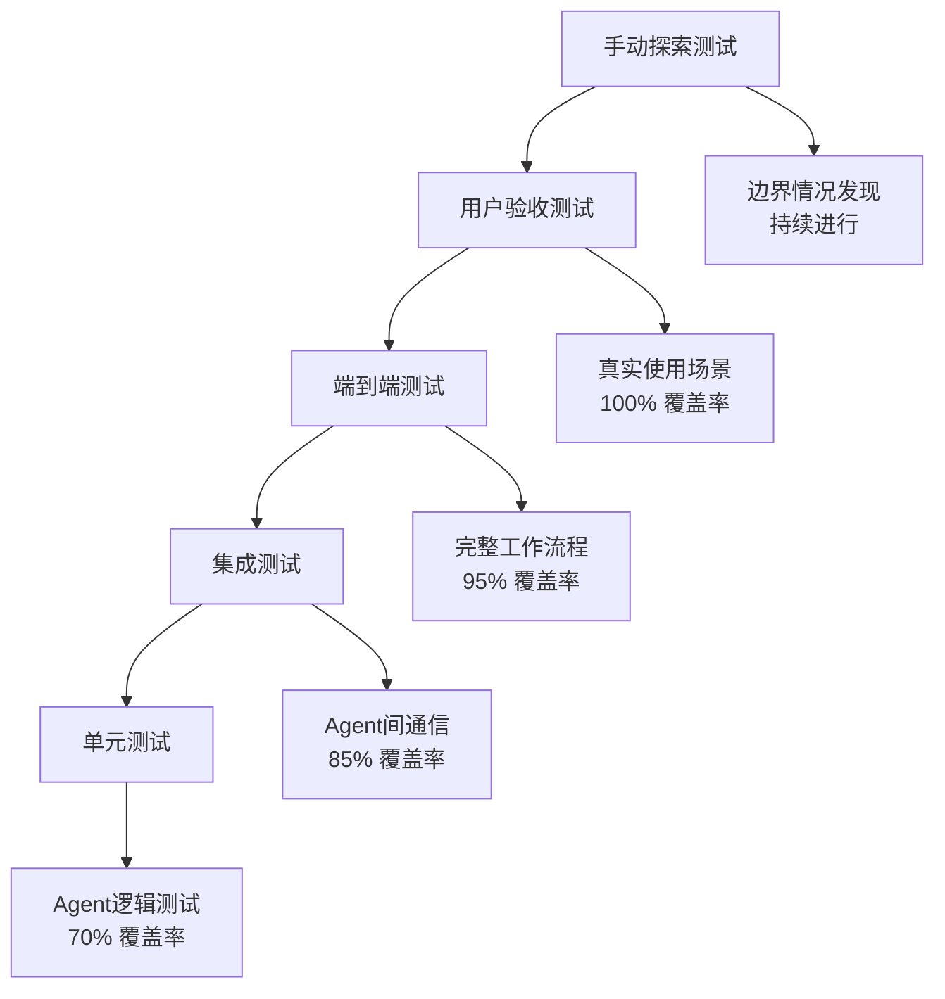

# PersonalManager测试策略与验证方案

> **版本**: v1.0  
> **创建日期**: 2025-09-11  
> **测试框架**: Jest + Python pytest + Bash bats  
> **覆盖率目标**: >90%  

## 📋 目录

1. [测试策略概览](#测试策略概览)
2. [单元测试方案](#单元测试方案)
3. [功能测试方案](#功能测试方案)
4. [集成测试方案](#集成测试方案)
5. [API集成测试](#api集成测试)
6. [用户验收测试](#用户验收测试)
7. [性能测试方案](#性能测试方案)
8. [CLI特殊测试](#cli特殊测试)
9. [自动化测试架构](#自动化测试架构)
10. [质量保障流程](#质量保障流程)

---

## 🎯 测试策略概览

### 测试金字塔架构



### 测试分层策略

| 测试层级 | 目标 | 覆盖率 | 执行频率 | 工具 |
|----------|------|--------|----------|------|
| **单元测试** | 验证单个函数/方法 | 70% | 每次提交 | Jest, pytest |
| **功能测试** | 验证单个功能模块 | 85% | 每次提交 | Jest, bats |
| **集成测试** | 验证Agent间协作 | 90% | 每日构建 | Python + Mock |
| **API测试** | 验证外部API集成 | 95% | 每日构建 | Python requests |
| **用户测试** | 验证用户体验 | 100% | 每周执行 | 手动+自动化 |
| **性能测试** | 验证性能指标 | 关键路径 | 每周执行 | Artillery, ab |

### 测试数据管理策略

```yaml
test_data_strategy:
  # 测试数据分类
  data_categories:
    minimal_dataset:         # 最小数据集
      projects: 3           # 3个项目
      tasks: 15            # 15个任务
      goals: 5             # 5个目标
      habits: 3            # 3个习惯
      duration: "1周历史数据"
      
    realistic_dataset:      # 真实数据集
      projects: 10          # 10个项目
      tasks: 50            # 50个任务
      goals: 15            # 15个目标
      habits: 8            # 8个习惯
      duration: "3个月历史数据"
      
    stress_dataset:        # 压力测试数据集
      projects: 100         # 100个项目
      tasks: 1000          # 1000个任务
      goals: 200           # 200个目标
      habits: 50           # 50个习惯
      duration: "1年历史数据"
  
  # 数据生成策略
  data_generation:
    synthetic_data: true    # 合成数据
    anonymized_real_data: false  # 匿名真实数据
    template_based: true    # 基于模板
    realistic_patterns: true # 真实使用模式
```

---

## 🔬 单元测试方案

### 1. Agent单元测试

```javascript
// PersonalManagerAgent 单元测试示例
describe('PersonalManagerAgent', () => {
  let agent;
  
  beforeEach(() => {
    agent = new PersonalManagerAgent();
    agent.initialize(mockConfig);
  });

  describe('任务解析功能', () => {
    test('应该正确解析用户意图', async () => {
      const userInput = "今天应该做什么";
      const result = await agent.parseUserIntent(userInput);
      
      expect(result.intent).toBe('get_task_recommendations');
      expect(result.confidence).toBeGreaterThan(0.8);
      expect(result.parameters).toEqual({
        timeframe: 'today',
        context: 'work_planning'
      });
    });
    
    test('应该处理模糊查询', async () => {
      const userInput = "帮我看看项目怎么样了";
      const result = await agent.parseUserIntent(userInput);
      
      expect(result.intent).toBe('get_project_status');
      expect(result.confidence).toBeGreaterThan(0.7);
    });
  });

  describe('Agent协调功能', () => {
    test('应该正确路由到TaskAgent', async () => {
      const mockTaskAgent = jest.fn();
      agent.registerAgent('TaskAgent', mockTaskAgent);
      
      await agent.processRequest({
        intent: 'get_task_recommendations',
        parameters: { timeframe: 'today' }
      });
      
      expect(mockTaskAgent).toHaveBeenCalledWith({
        action: 'get_recommendations',
        timeframe: 'today'
      });
    });
  });
});
```

```python
# PriorityAgent 单元测试示例
import pytest
from agents.priority_agent import PriorityAgent
from models.task import Task
from models.priority import PriorityCalculation

class TestPriorityAgent:
    def setup_method(self):
        self.agent = PriorityAgent()
        self.sample_tasks = [
            Task(
                id="task-1",
                title="紧急bug修复",
                deadline="2025-09-12T18:00:00Z",
                importance=9,
                urgency=10,
                estimated_duration=120
            ),
            Task(
                id="task-2", 
                title="功能优化",
                deadline="2025-09-20T18:00:00Z",
                importance=6,
                urgency=4,
                estimated_duration=240
            )
        ]
    
    def test_calculate_urgency_score(self):
        """测试紧急程度计算"""
        task = self.sample_tasks[0]
        score = self.agent.calculate_urgency_score(
            task, 
            current_time="2025-09-11T18:00:00Z"
        )
        
        # 24小时内截止，应该是高紧急度
        assert score >= 90
        assert score <= 100
    
    def test_priority_ranking(self):
        """测试优先级排序"""
        result = self.agent.calculate_priorities(
            self.sample_tasks,
            context={
                "current_time": "2025-09-11T18:00:00Z",
                "available_time": 180,
                "energy_level": 8
            }
        )
        
        # 紧急任务应该排在前面
        assert result.ranked_tasks[0].task_id == "task-1"
        assert result.ranked_tasks[0].final_priority_score > 80
    
    def test_algorithm_weights(self):
        """测试算法权重配置"""
        # 测试高紧急权重配置
        weights_urgent = {
            "urgency_weight": 0.5,
            "importance_weight": 0.2,
            "effort_weight": 0.3
        }
        
        result1 = self.agent.calculate_priorities(
            self.sample_tasks, 
            weights=weights_urgent
        )
        
        # 测试高重要性权重配置
        weights_important = {
            "urgency_weight": 0.2,
            "importance_weight": 0.5, 
            "effort_weight": 0.3
        }
        
        result2 = self.agent.calculate_priorities(
            self.sample_tasks,
            weights=weights_important
        )
        
        # 不同权重应该产生不同的排序结果
        assert result1.ranked_tasks[0].final_priority_score != \
               result2.ranked_tasks[0].final_priority_score
```

### 2. 数据模型测试

```javascript
// 数据验证测试
describe('数据模型验证', () => {
  describe('Project模型', () => {
    test('应该拒绝无效的UUID', () => {
      expect(() => {
        new Project({
          id: 'invalid-uuid',
          name: 'Test Project'
        });
      }).toThrow('Invalid UUID format');
    });
    
    test('应该验证日期范围', () => {
      expect(() => {
        new Project({
          id: generateUUID(),
          name: 'Test Project',
          dates: {
            started_at: '2025-09-30',
            deadline: '2025-09-01'  // 截止日期早于开始日期
          }
        });
      }).toThrow('Deadline cannot be before start date');
    });
    
    test('应该计算正确的完成百分比', () => {
      const project = new Project({
        id: generateUUID(),
        name: 'Test Project',
        progress: {
          milestones_completed: 3,
          milestones_total: 5
        }
      });
      
      expect(project.calculateCompletionPercentage()).toBe(60);
    });
  });
  
  describe('优先级计算验证', () => {
    test('优先级分数应该在有效范围内', () => {
      const calculation = new PriorityCalculation({
        urgency: 10,
        importance: 8,
        effort: 5,
        alignment: 9
      });
      
      const score = calculation.calculateFinalScore();
      expect(score).toBeGreaterThanOrEqual(0);
      expect(score).toBeLessThanOrEqual(100);
    });
  });
});
```

### 3. 工具函数测试

```bash
#!/usr/bin/env bats
# CLI工具函数测试

@test "时间解析函数应该正确解析各种格式" {
  source src/utils/time_parser.sh
  
  result=$(parse_relative_time "今天")
  [ "$result" = "$(date +%Y-%m-%d)" ]
  
  result=$(parse_relative_time "明天") 
  expected=$(date -d "tomorrow" +%Y-%m-%d)
  [ "$result" = "$expected" ]
  
  result=$(parse_relative_time "下周")
  [ -n "$result" ]  # 应该返回非空结果
}

@test "项目路径检测应该识别Git仓库" {
  source src/utils/project_detector.sh
  
  # 创建临时Git仓库
  tmpdir=$(mktemp -d)
  cd "$tmpdir"
  git init
  
  result=$(detect_project_type)
  [ "$result" = "git_repository" ]
  
  # 清理
  rm -rf "$tmpdir"
}

@test "配置文件验证应该检测格式错误" {
  source src/utils/config_validator.sh
  
  # 测试有效配置
  echo "user_id: test-123" > valid_config.yaml
  run validate_config_file valid_config.yaml
  [ "$status" -eq 0 ]
  
  # 测试无效配置
  echo "invalid yaml: [" > invalid_config.yaml  
  run validate_config_file invalid_config.yaml
  [ "$status" -ne 0 ]
  
  # 清理
  rm -f valid_config.yaml invalid_config.yaml
}
```

---

## ⚙️ 功能测试方案

### 1. 核心功能测试套件

```python
# 功能测试 - 任务管理
import pytest
from personal_manager import PersonalManager
from test_utils import create_test_environment, cleanup_test_environment

class TestTaskManagement:
    def setup_method(self):
        self.pm = PersonalManager()
        self.test_env = create_test_environment()
        
    def teardown_method(self):
        cleanup_test_environment(self.test_env)
    
    def test_create_task_workflow(self):
        """测试创建任务的完整工作流"""
        # 1. 创建项目
        project = self.pm.create_project({
            "name": "测试项目",
            "description": "功能测试用项目"
        })
        assert project.id is not None
        
        # 2. 创建任务
        task = self.pm.create_task({
            "title": "测试任务",
            "project_id": project.id,
            "priority": "high",
            "estimated_duration": 120
        })
        assert task.id is not None
        assert task.project_id == project.id
        
        # 3. 验证任务出现在项目中
        project_tasks = self.pm.get_project_tasks(project.id)
        assert len(project_tasks) == 1
        assert project_tasks[0].id == task.id
    
    def test_task_priority_calculation(self):
        """测试任务优先级自动计算"""
        # 创建紧急任务
        urgent_task = self.pm.create_task({
            "title": "紧急任务",
            "deadline": "2025-09-12T18:00:00Z",  # 明天截止
            "importance": 9,
            "urgency": 10
        })
        
        # 创建普通任务
        normal_task = self.pm.create_task({
            "title": "普通任务", 
            "deadline": "2025-09-20T18:00:00Z",  # 下周截止
            "importance": 6,
            "urgency": 5
        })
        
        # 获取推荐任务
        recommendations = self.pm.get_task_recommendations({
            "timeframe": "today",
            "max_tasks": 5
        })
        
        # 紧急任务应该排在前面
        assert recommendations[0].id == urgent_task.id
        assert recommendations[0].priority_score > recommendations[1].priority_score
    
    def test_task_status_transitions(self):
        """测试任务状态转换"""
        task = self.pm.create_task({
            "title": "状态测试任务",
            "status": "todo"
        })
        
        # 开始任务
        self.pm.start_task(task.id)
        updated_task = self.pm.get_task(task.id)
        assert updated_task.status == "in_progress"
        assert updated_task.actual_start is not None
        
        # 完成任务
        self.pm.complete_task(task.id)
        completed_task = self.pm.get_task(task.id)
        assert completed_task.status == "completed"
        assert completed_task.completed_at is not None
        assert completed_task.actual_duration > 0

class TestProjectManagement:
    def test_project_status_auto_update(self):
        """测试项目状态自动更新"""
        pm = PersonalManager()
        
        # 创建项目和任务
        project = pm.create_project({"name": "自动更新测试项目"})
        
        tasks = []
        for i in range(5):
            task = pm.create_task({
                "title": f"任务 {i+1}",
                "project_id": project.id
            })
            tasks.append(task)
        
        # 完成部分任务
        pm.complete_task(tasks[0].id)
        pm.complete_task(tasks[1].id)
        
        # 检查项目进度更新
        updated_project = pm.get_project(project.id)
        assert updated_project.progress.completion_percentage == 40  # 2/5 = 40%
        
        # 完成所有任务
        for task in tasks[2:]:
            pm.complete_task(task.id)
        
        # 检查项目状态
        final_project = pm.get_project(project.id)
        assert final_project.status == "completed"
        assert final_project.progress.completion_percentage == 100
```

### 2. 边界情况测试

```python
class TestBoundaryConditions:
    def test_empty_input_handling(self):
        """测试空输入处理"""
        pm = PersonalManager()
        
        # 空字符串输入
        result = pm.process_command("")
        assert result.success == False
        assert "empty" in result.error_message.lower()
        
        # 空白字符串输入
        result = pm.process_command("   \n\t   ")
        assert result.success == False
        
        # None输入
        result = pm.process_command(None)
        assert result.success == False
    
    def test_large_dataset_handling(self):
        """测试大数据集处理"""
        pm = PersonalManager()
        
        # 创建大量任务
        project = pm.create_project({"name": "压力测试项目"})
        
        task_ids = []
        for i in range(1000):
            task = pm.create_task({
                "title": f"批量任务 {i+1}",
                "project_id": project.id
            })
            task_ids.append(task.id)
        
        # 测试批量操作性能
        import time
        start_time = time.time()
        
        recommendations = pm.get_task_recommendations({
            "max_tasks": 10
        })
        
        end_time = time.time()
        processing_time = end_time - start_time
        
        # 应该在合理时间内完成（<2秒）
        assert processing_time < 2.0
        assert len(recommendations) == 10
    
    def test_invalid_data_rejection(self):
        """测试无效数据拒绝"""
        pm = PersonalManager()
        
        # 无效UUID
        with pytest.raises(ValueError, match="Invalid UUID"):
            pm.get_task("invalid-uuid")
        
        # 无效日期格式
        with pytest.raises(ValueError, match="Invalid date"):
            pm.create_task({
                "title": "测试任务",
                "deadline": "not-a-date"
            })
        
        # 超出范围的优先级
        with pytest.raises(ValueError, match="Priority.*range"):
            pm.create_task({
                "title": "测试任务",
                "priority_score": 150  # 超出0-100范围
            })
```

---

## 🔗 集成测试方案

### 1. Agent间通信测试

```python
# Agent集成测试
import pytest
from unittest.mock import MagicMock, patch
from agents.personal_manager_agent import PersonalManagerAgent
from agents.task_agent import TaskAgent
from agents.priority_agent import PriorityAgent
from agents.project_agent import ProjectAgent

class TestAgentIntegration:
    def setup_method(self):
        self.pm_agent = PersonalManagerAgent()
        self.task_agent = TaskAgent()
        self.priority_agent = PriorityAgent()
        self.project_agent = ProjectAgent()
        
        # 注册所有Agent
        self.pm_agent.register_agent("TaskAgent", self.task_agent)
        self.pm_agent.register_agent("PriorityAgent", self.priority_agent)
        self.pm_agent.register_agent("ProjectAgent", self.project_agent)
    
    def test_task_recommendation_workflow(self):
        """测试任务推荐的完整工作流"""
        # 模拟用户请求
        user_request = {
            "command": "今天应该做什么",
            "user_id": "test-user-123"
        }
        
        # 执行请求
        response = self.pm_agent.process_request(user_request)
        
        # 验证响应
        assert response.success == True
        assert "recommendations" in response.data
        assert len(response.data["recommendations"]) > 0
        
        # 验证Agent间通信
        assert self.task_agent.last_request is not None
        assert self.priority_agent.last_request is not None
    
    def test_project_status_update_chain(self):
        """测试项目状态更新链路"""
        # 模拟Git提交触发项目更新
        git_event = {
            "event_type": "git_commit",
            "project_path": "./test_project",
            "commit_hash": "abc123",
            "commit_message": "完成用户认证功能",
            "files_changed": 3
        }
        
        # 触发项目状态更新
        response = self.project_agent.handle_git_event(git_event)
        
        # 验证状态更新
        assert response.success == True
        assert "status_updated" in response.data
        
        # 验证后续触发的优先级重计算
        priority_requests = self.priority_agent.get_recent_requests()
        assert len(priority_requests) > 0
        assert priority_requests[0]["trigger"] == "project_status_change"
    
    def test_error_propagation(self):
        """测试错误传播机制"""
        # 模拟TaskAgent出错
        with patch.object(self.task_agent, 'get_tasks') as mock_get_tasks:
            mock_get_tasks.side_effect = Exception("Database connection failed")
            
            # 处理请求
            response = self.pm_agent.process_request({
                "command": "显示我的任务",
                "user_id": "test-user"
            })
            
            # 验证错误处理
            assert response.success == False
            assert "Database connection failed" in response.error_message
            assert response.error_code == "AGENT_COMMUNICATION_ERROR"
```

### 2. 数据流集成测试

```python
class TestDataFlowIntegration:
    def test_end_to_end_task_lifecycle(self):
        """测试任务生命周期的端到端数据流"""
        pm = PersonalManager()
        
        # 1. 创建项目 -> 数据应该在ProjectAgent中
        project_data = {
            "name": "集成测试项目",
            "description": "端到端测试用项目"
        }
        project = pm.create_project(project_data)
        
        # 验证ProjectAgent中的数据
        project_agent = pm.get_agent("ProjectAgent")
        stored_project = project_agent.get_project(project.id)
        assert stored_project.name == project_data["name"]
        
        # 2. 创建任务 -> 数据应该在TaskAgent中
        task_data = {
            "title": "集成测试任务",
            "project_id": project.id,
            "deadline": "2025-09-12T18:00:00Z"
        }
        task = pm.create_task(task_data)
        
        # 验证TaskAgent中的数据
        task_agent = pm.get_agent("TaskAgent")
        stored_task = task_agent.get_task(task.id)
        assert stored_task.project_id == project.id
        
        # 3. 计算优先级 -> 数据应该在PriorityAgent中  
        priority_result = pm.calculate_task_priorities([task.id])
        
        # 验证PriorityAgent中的数据
        priority_agent = pm.get_agent("PriorityAgent")
        calculation = priority_agent.get_latest_calculation()
        assert task.id in [t.task_id for t in calculation.ranked_tasks]
        
        # 4. 更新任务状态 -> 数据应该跨Agent同步
        pm.start_task(task.id)
        
        # 验证数据同步
        updated_task = task_agent.get_task(task.id)
        project_tasks = project_agent.get_project_tasks(project.id)
        
        assert updated_task.status == "in_progress"
        assert project_tasks[0].status == "in_progress"
    
    def test_data_consistency_across_agents(self):
        """测试跨Agent的数据一致性"""
        pm = PersonalManager()
        
        # 创建测试数据
        project = pm.create_project({"name": "一致性测试项目"})
        task1 = pm.create_task({"title": "任务1", "project_id": project.id})
        task2 = pm.create_task({"title": "任务2", "project_id": project.id})
        
        # 从不同Agent获取相同数据
        task_agent = pm.get_agent("TaskAgent")
        project_agent = pm.get_agent("ProjectAgent")
        
        task1_from_task_agent = task_agent.get_task(task1.id)
        project_tasks = project_agent.get_project_tasks(project.id)
        task1_from_project_agent = next(t for t in project_tasks if t.id == task1.id)
        
        # 验证数据一致性
        assert task1_from_task_agent.title == task1_from_project_agent.title
        assert task1_from_task_agent.status == task1_from_project_agent.status
        assert task1_from_task_agent.updated_at == task1_from_project_agent.updated_at
```

---

## 🌐 API集成测试

### 1. Google APIs集成测试

```python
# Google APIs集成测试
import pytest
from unittest.mock import patch, MagicMock
from integrations.google_calendar import GoogleCalendarIntegration
from integrations.google_tasks import GoogleTasksIntegration
from integrations.google_gmail import GoogleGmailIntegration

class TestGoogleAPIIntegration:
    def setup_method(self):
        self.calendar_integration = GoogleCalendarIntegration(
            credentials_file="test_credentials.json"
        )
        self.tasks_integration = GoogleTasksIntegration(
            credentials_file="test_credentials.json"
        )
    
    @patch('google.auth.default')
    @patch('googleapiclient.discovery.build')
    def test_calendar_event_sync(self, mock_build, mock_auth):
        """测试日历事件同步"""
        # Mock Google Calendar API响应
        mock_service = MagicMock()
        mock_build.return_value = mock_service
        
        mock_events = {
            'items': [{
                'id': 'event123',
                'summary': '项目会议',
                'start': {'dateTime': '2025-09-12T14:00:00Z'},
                'end': {'dateTime': '2025-09-12T15:00:00Z'},
                'attendees': [{'email': 'test@example.com'}]
            }]
        }
        
        mock_service.events().list().execute.return_value = mock_events
        
        # 执行同步
        sync_result = self.calendar_integration.sync_events(
            start_date='2025-09-12',
            end_date='2025-09-13'
        )
        
        # 验证同步结果
        assert sync_result.success == True
        assert len(sync_result.synced_events) == 1
        assert sync_result.synced_events[0]['summary'] == '项目会议'
    
    def test_api_error_handling(self):
        """测试API错误处理"""
        with patch('googleapiclient.discovery.build') as mock_build:
            # 模拟API错误
            mock_service = MagicMock()
            mock_build.return_value = mock_service
            mock_service.events().list().execute.side_effect = Exception("API Rate limit exceeded")
            
            # 执行同步，应该优雅处理错误
            sync_result = self.calendar_integration.sync_events(
                start_date='2025-09-12',
                end_date='2025-09-13'
            )
            
            # 验证错误处理
            assert sync_result.success == False
            assert "rate limit" in sync_result.error_message.lower()
            assert sync_result.error_code == "API_RATE_LIMIT"
    
    def test_data_transformation(self):
        """测试API数据转换"""
        # Google Calendar事件格式
        google_event = {
            'id': 'cal_event_123',
            'summary': '技术评审会议',
            'start': {'dateTime': '2025-09-12T10:00:00+08:00'},
            'end': {'dateTime': '2025-09-12T11:30:00+08:00'},
            'description': '讨论新功能技术方案',
            'location': '会议室A'
        }
        
        # 转换为PersonalManager任务格式
        pm_task = self.calendar_integration.transform_event_to_task(google_event)
        
        # 验证转换结果
        assert pm_task.title == '技术评审会议'
        assert pm_task.context == 'meeting'
        assert pm_task.scheduled_start == '2025-09-12T02:00:00.000Z'  # UTC时间
        assert pm_task.scheduled_end == '2025-09-12T03:30:00.000Z'
        assert pm_task.location == '会议室A'
        assert pm_task.google_event_id == 'cal_event_123'

class TestGmailIntegration:
    def test_important_email_detection(self):
        """测试重要邮件检测"""
        gmail = GoogleGmailIntegration()
        
        # 重要邮件示例
        important_email = {
            'id': 'email123',
            'subject': '[URGENT] 生产环境Bug需要立即修复',
            'from': 'boss@company.com',
            'body': '客户报告无法登录系统，需要马上修复',
            'received_at': '2025-09-11T18:00:00Z'
        }
        
        # 检测重要程度
        importance_score = gmail.analyze_email_importance(important_email)
        
        assert importance_score >= 8  # 高重要性
        
        # 检测是否需要创建任务
        should_create_task = gmail.should_create_task(important_email)
        assert should_create_task == True
        
        # 生成任务
        task = gmail.create_task_from_email(important_email)
        assert task.title == "处理邮件: [URGENT] 生产环境Bug需要立即修复"
        assert task.priority.level == "critical"
```

### 2. Git集成测试

```python
class TestGitIntegration:
    def test_commit_analysis(self):
        """测试Git提交分析"""
        from integrations.git_integration import GitIntegration
        
        git_integration = GitIntegration()
        
        # 模拟Git提交
        commit_data = {
            'hash': 'abc123def',
            'message': '完成用户认证模块\n\n- 实现登录功能\n- 添加密码加密\n- 修复会话管理bug',
            'author': 'developer@example.com',
            'timestamp': '2025-09-11T16:30:00Z',
            'files_changed': ['src/auth.js', 'src/session.js', 'tests/auth.test.js'],
            'lines_added': 125,
            'lines_removed': 18
        }
        
        # 分析提交
        analysis_result = git_integration.analyze_commit(commit_data)
        
        # 验证分析结果
        assert len(analysis_result.extracted_tasks) == 3
        assert "实现登录功能" in analysis_result.extracted_tasks
        assert "添加密码加密" in analysis_result.extracted_tasks
        assert "修复会话管理bug" in analysis_result.extracted_tasks
        
        assert analysis_result.work_type == "feature_development"
        assert analysis_result.productivity_score >= 8
    
    def test_project_status_auto_update(self):
        """测试项目状态自动更新"""
        git_integration = GitIntegration()
        
        # 模拟项目目录
        project_path = "./test_project"
        
        # 模拟提交触发更新
        update_result = git_integration.update_project_status(
            project_path=project_path,
            commit_hash="abc123def",
            trigger_type="post_commit"
        )
        
        # 验证更新结果
        assert update_result.success == True
        assert update_result.status_file_updated == True
        assert "PROJECT_STATUS.md" in update_result.updated_files
```

---

## 👥 用户验收测试

### 1. 用户场景测试

```yaml
# 用户验收测试用例
user_acceptance_tests:
  # 场景1: 每日工作规划
  scenario_daily_planning:
    name: "每日工作规划"
    description: "用户每天早上使用系统规划当天工作"
    preconditions:
      - "用户有5个活跃项目"
      - "有20个待处理任务"
      - "有明确的目标设置"
    
    test_steps:
      - step: "用户输入'/pm 今天应该做什么'"
        expected: "系统返回5-7个推荐任务"
        acceptance_criteria:
          - "任务按优先级排序"
          - "包含截止时间信息"
          - "总耗时不超过8小时"
          - "响应时间<2秒"
      
      - step: "用户查看第一个推荐任务详情"
        expected: "显示任务详细信息"
        acceptance_criteria:
          - "包含项目关联信息"
          - "显示预计耗时"
          - "显示优先级理由"
      
      - step: "用户开始执行第一个任务"
        expected: "任务状态更新为'进行中'"
        acceptance_criteria:
          - "记录开始时间"
          - "更新项目状态"
          - "其他任务优先级自动调整"
    
    success_criteria:
      - "用户能在5分钟内完成工作规划"
      - "推荐任务与用户实际需求匹配度>80%"
      - "系统响应流畅，无明显延迟"
  
  # 场景2: 项目进展跟踪
  scenario_project_tracking:
    name: "项目进展跟踪"
    description: "用户检查项目状态和进展"
    preconditions:
      - "用户正在进行2-3个项目"
      - "项目有Git仓库关联"
      - "有最近的提交记录"
    
    test_steps:
      - step: "用户输入'/pm 项目状态总览'"
        expected: "显示所有项目状态"
        acceptance_criteria:
          - "显示项目健康状态"
          - "显示完成百分比"
          - "显示最后更新时间"
          - "标识需要关注的项目"
      
      - step: "用户查看特定项目详情"
        expected: "显示项目详细状态"
        acceptance_criteria:
          - "显示最近工作总结"
          - "显示下一步计划"
          - "显示阻塞问题"
          - "显示Git活动分析"
      
      - step: "用户基于状态调整优先级"
        expected: "系统根据调整重新计算"
        acceptance_criteria:
          - "任务优先级实时更新"
          - "项目资源重新分配"
          - "更新工作建议"
    
    success_criteria:
      - "项目状态信息准确反映实际情况"
      - "用户能快速识别需要关注的问题"
      - "状态更新触发合理的后续建议"
```

### 2. 可用性测试脚本

```python
# 可用性测试自动化脚本
import pytest
from selenium import webdriver
from selenium.webdriver.common.by import By
from selenium.webdriver.support.ui import WebDriverWait
from selenium.webdriver.support import expected_conditions as EC
import time

class TestUsability:
    def setup_method(self):
        # 如果有Web界面，使用Selenium测试
        # 对于CLI工具，使用pexpect测试交互
        import pexpect
        self.cli_session = None
    
    def test_new_user_onboarding(self):
        """测试新用户上手流程"""
        import pexpect
        
        # 启动PersonalManager CLI
        cli = pexpect.spawn('pm --setup')
        cli.logfile_read = sys.stdout.buffer
        
        # 预期看到欢迎信息
        cli.expect('欢迎使用PersonalManager')
        
        # 输入用户信息
        cli.expect('请输入您的姓名:')
        cli.sendline('测试用户')
        
        cli.expect('请输入您的邮箱:')
        cli.sendline('test@example.com')
        
        cli.expect('请选择您的工作时间:')
        cli.sendline('09:00-18:00')
        
        # 验证设置完成
        cli.expect('设置完成')
        
        # 验证首次使用指导
        cli.sendline('pm help')
        cli.expect('常用命令:')
        
        # 测试创建第一个项目
        cli.sendline('pm create project "我的第一个项目"')
        cli.expect('项目创建成功')
        
        cli.close()
    
    def test_command_discoverability(self):
        """测试命令可发现性"""
        import subprocess
        
        # 测试help命令
        result = subprocess.run(['pm', 'help'], capture_output=True, text=True)
        assert result.returncode == 0
        assert '常用命令' in result.stdout
        assert 'pm today' in result.stdout
        assert 'pm projects' in result.stdout
        
        # 测试命令自动补全提示
        result = subprocess.run(['pm', 'proj'], capture_output=True, text=True)
        # 应该提示可能的命令
        assert '您是否想要执行:' in result.stdout
        assert 'pm projects' in result.stdout
    
    def test_error_message_clarity(self):
        """测试错误信息清晰度"""
        import subprocess
        
        # 测试无效命令
        result = subprocess.run(['pm', 'invalid_command'], capture_output=True, text=True)
        assert result.returncode != 0
        assert '未知命令' in result.stdout
        assert '使用 pm help' in result.stdout
        
        # 测试缺少参数
        result = subprocess.run(['pm', 'create'], capture_output=True, text=True)
        assert result.returncode != 0
        assert '缺少参数' in result.stdout
        assert '正确格式:' in result.stdout
        
        # 测试无效项目ID
        result = subprocess.run(['pm', 'show', 'invalid-id'], capture_output=True, text=True)
        assert result.returncode != 0
        assert '项目不存在' in result.stdout
        assert '使用 pm projects' in result.stdout
```

### 3. 用户反馈收集机制

```python
# 用户反馈测试
class TestUserFeedback:
    def test_satisfaction_measurement(self):
        """测试用户满意度测量"""
        pm = PersonalManager()
        
        # 模拟用户完成任务
        task = pm.create_task({"title": "测试任务"})
        pm.start_task(task.id)
        
        # 完成任务时收集反馈
        completion_result = pm.complete_task(
            task.id,
            satisfaction_rating=8,
            difficulty_rating=6,
            feedback="推荐的优先级很准确，但耗时估算偏少"
        )
        
        # 验证反馈存储
        assert completion_result.feedback_recorded == True
        
        # 验证反馈用于改进算法
        feedback_data = pm.get_feedback_analytics()
        assert len(feedback_data.recent_ratings) > 0
        assert feedback_data.avg_satisfaction >= 0
        assert feedback_data.common_issues is not None
    
    def test_usage_analytics(self):
        """测试使用分析"""
        pm = PersonalManager()
        
        # 模拟用户使用模式
        usage_data = pm.track_user_behavior({
            "commands_used": ["today", "projects", "status"],
            "session_duration": 1800,  # 30分钟
            "features_accessed": ["task_recommendations", "project_overview"],
            "errors_encountered": 0,
            "goals_achieved": ["完成每日规划", "查看项目进展"]
        })
        
        # 分析使用模式
        analytics = pm.analyze_usage_patterns()
        
        assert analytics.most_used_features is not None
        assert analytics.user_efficiency_score > 0
        assert analytics.feature_adoption_rate is not None
```

---

## ⚡ 性能测试方案

### 1. 响应时间测试

```python
# 性能测试
import pytest
import time
from concurrent.futures import ThreadPoolExecutor
import psutil
import statistics

class TestPerformance:
    def test_response_time_benchmarks(self):
        """测试响应时间基准"""
        pm = PersonalManager()
        
        # 基准响应时间要求
        benchmarks = {
            "get_task_recommendations": 2.0,    # 2秒
            "calculate_priorities": 1.5,        # 1.5秒 
            "get_project_status": 1.0,          # 1秒
            "create_task": 0.5,                 # 0.5秒
            "update_task": 0.3,                 # 0.3秒
        }
        
        for operation, max_time in benchmarks.items():
            # 预热
            for _ in range(3):
                getattr(pm, operation)()
            
            # 测试10次，取平均值
            times = []
            for _ in range(10):
                start_time = time.time()
                getattr(pm, operation)()
                end_time = time.time()
                times.append(end_time - start_time)
            
            avg_time = statistics.mean(times)
            p95_time = statistics.quantiles(times, n=20)[18]  # 95th percentile
            
            # 验证性能要求
            assert avg_time < max_time, f"{operation} 平均响应时间 {avg_time:.2f}s 超过限制 {max_time}s"
            assert p95_time < max_time * 1.5, f"{operation} P95响应时间过长"
    
    def test_concurrent_load(self):
        """测试并发负载"""
        pm = PersonalManager()
        
        def simulate_user_session():
            """模拟用户会话"""
            try:
                # 典型用户操作序列
                pm.get_task_recommendations()
                time.sleep(0.1)
                
                task = pm.create_task({"title": f"并发测试任务 {time.time()}"})
                time.sleep(0.1)
                
                pm.start_task(task.id)
                time.sleep(0.2)
                
                pm.get_project_status()
                return True
            except Exception as e:
                return False
        
        # 模拟10个并发用户
        with ThreadPoolExecutor(max_workers=10) as executor:
            start_time = time.time()
            
            futures = [executor.submit(simulate_user_session) for _ in range(50)]
            results = [future.result() for future in futures]
            
            end_time = time.time()
        
        # 验证并发性能
        success_rate = sum(results) / len(results)
        total_time = end_time - start_time
        
        assert success_rate >= 0.95, f"并发成功率 {success_rate:.2%} 低于要求"
        assert total_time < 30, f"并发测试耗时 {total_time:.1f}s 过长"
    
    def test_memory_usage(self):
        """测试内存使用"""
        import psutil
        import os
        
        process = psutil.Process(os.getpid())
        initial_memory = process.memory_info().rss / 1024 / 1024  # MB
        
        pm = PersonalManager()
        
        # 大量操作测试内存泄漏
        for i in range(1000):
            project = pm.create_project({"name": f"测试项目 {i}"})
            task = pm.create_task({
                "title": f"测试任务 {i}",
                "project_id": project.id
            })
            pm.calculate_task_priorities([task.id])
            
            # 每100次检查一次内存
            if i % 100 == 0:
                current_memory = process.memory_info().rss / 1024 / 1024
                memory_growth = current_memory - initial_memory
                
                # 内存增长不应该超过100MB
                assert memory_growth < 100, f"内存增长 {memory_growth:.1f}MB 过多"
    
    def test_large_dataset_performance(self):
        """测试大数据集性能"""
        pm = PersonalManager()
        
        # 创建大数据集
        print("创建大数据集...")
        projects = []
        tasks = []
        
        # 100个项目
        for i in range(100):
            project = pm.create_project({"name": f"大数据集项目 {i}"})
            projects.append(project)
        
        # 5000个任务
        for i in range(5000):
            project = projects[i % len(projects)]
            task = pm.create_task({
                "title": f"大数据集任务 {i}",
                "project_id": project.id,
                "deadline": f"2025-{9 + i % 3}-{(i % 28) + 1:02d}T18:00:00Z"
            })
            tasks.append(task)
        
        # 测试大数据集下的性能
        print("测试优先级计算性能...")
        start_time = time.time()
        
        recommendations = pm.get_task_recommendations({"max_tasks": 20})
        
        end_time = time.time()
        calculation_time = end_time - start_time
        
        # 大数据集下优先级计算应该在10秒内完成
        assert calculation_time < 10, f"大数据集优先级计算耗时 {calculation_time:.1f}s 过长"
        assert len(recommendations) == 20
```

### 2. 资源占用测试

```python
class TestResourceUsage:
    def test_cpu_utilization(self):
        """测试CPU利用率"""
        import psutil
        import threading
        
        cpu_samples = []
        stop_monitoring = threading.Event()
        
        def monitor_cpu():
            while not stop_monitoring.is_set():
                cpu_samples.append(psutil.cpu_percent(interval=0.1))
        
        # 启动CPU监控
        monitor_thread = threading.Thread(target=monitor_cpu)
        monitor_thread.start()
        
        # 执行高负载操作
        pm = PersonalManager()
        
        for i in range(100):
            # 创建复杂的优先级计算场景
            tasks = []
            for j in range(50):
                task = pm.create_task({
                    "title": f"CPU测试任务 {i}-{j}",
                    "deadline": f"2025-09-{12 + j % 18}T18:00:00Z",
                    "importance": (j % 10) + 1,
                    "urgency": ((j * 3) % 10) + 1
                })
                tasks.append(task.id)
            
            pm.calculate_task_priorities(tasks)
        
        # 停止监控
        stop_monitoring.set()
        monitor_thread.join()
        
        # 分析CPU使用率
        avg_cpu = statistics.mean(cpu_samples)
        max_cpu = max(cpu_samples)
        
        # CPU使用率不应该长期超过80%
        assert avg_cpu < 80, f"平均CPU使用率 {avg_cpu:.1f}% 过高"
        assert max_cpu < 95, f"峰值CPU使用率 {max_cpu:.1f}% 过高"
    
    def test_disk_io_performance(self):
        """测试磁盘IO性能"""
        pm = PersonalManager()
        
        # 测试大量数据写入
        start_time = time.time()
        
        for i in range(1000):
            project = pm.create_project({
                "name": f"IO测试项目 {i}",
                "description": "这是一个用于测试磁盘IO性能的项目" * 10  # 较长描述
            })
            
            # 创建项目状态文件
            pm.update_project_status(
                project.id,
                work_summary=f"完成了大量工作内容的描述和分析" * 20
            )
        
        end_time = time.time()
        io_time = end_time - start_time
        
        # 1000个项目的IO操作应该在30秒内完成
        assert io_time < 30, f"磁盘IO操作耗时 {io_time:.1f}s 过长"
```

---

## 💻 CLI特殊测试

### 1. 命令行交互测试

```bash
#!/usr/bin/env bats
# CLI交互测试

setup() {
    export PM_CONFIG_DIR=$(mktemp -d)
    export PM_TEST_MODE=true
}

teardown() {
    rm -rf "$PM_CONFIG_DIR"
}

@test "CLI应该显示版本信息" {
    run pm --version
    [ "$status" -eq 0 ]
    [[ "$output" =~ PersonalManager.*v[0-9]+\.[0-9]+\.[0-9]+ ]]
}

@test "CLI应该显示帮助信息" {
    run pm --help
    [ "$status" -eq 0 ]
    [[ "$output" =~ "Usage:" ]]
    [[ "$output" =~ "Commands:" ]]
    [[ "$output" =~ "pm today" ]]
}

@test "CLI应该处理中文输入" {
    run pm "今天应该做什么"
    [ "$status" -eq 0 ]
    [[ "$output" =~ "任务推荐" ]]
}

@test "CLI应该处理管道输入" {
    echo "显示项目状态" | pm
    [ "$status" -eq 0 ]
}

@test "CLI应该支持交互模式" {
    # 使用expect测试交互模式
    expect << 'EOF'
spawn pm --interactive
expect "PersonalManager>"
send "today\r"
expect "任务推荐"
send "exit\r"
expect eof
EOF
}

@test "CLI应该正确处理信号" {
    # 启动长时间运行的命令
    pm calculate-all-priorities &
    PID=$!
    
    # 发送中断信号
    sleep 1
    kill -INT $PID
    
    # 验证优雅退出
    wait $PID
    EXIT_CODE=$?
    [ $EXIT_CODE -eq 130 ]  # SIGINT退出码
}

@test "CLI应该支持自动补全" {
    # 测试bash补全脚本
    source <(pm completion bash)
    
    # 模拟Tab补全
    COMPREPLY=()
    _pm_completions "pm" "proj" "pm proj"
    
    # 应该包含projects命令
    [[ "${COMPREPLY[*]}" =~ "projects" ]]
}
```

### 2. CLI配置测试

```python
# CLI配置测试
import pytest
import tempfile
import os
from pathlib import Path
import yaml

class TestCLIConfiguration:
    def test_default_config_creation(self):
        """测试默认配置创建"""
        with tempfile.TemporaryDirectory() as temp_dir:
            os.environ['PM_CONFIG_DIR'] = temp_dir
            
            from cli.config import ConfigManager
            config_manager = ConfigManager()
            
            # 首次运行应该创建默认配置
            config = config_manager.load_config()
            
            # 验证配置文件存在
            config_file = Path(temp_dir) / "pm-config.yaml"
            assert config_file.exists()
            
            # 验证默认值
            assert config.user_id is not None
            assert config.working_hours.start_time == "09:00"
            assert config.working_hours.end_time == "18:00"
            assert config.priority_weights.urgency_weight == 0.25
    
    def test_config_validation(self):
        """测试配置验证"""
        from cli.config import ConfigManager
        
        config_manager = ConfigManager()
        
        # 测试有效配置
        valid_config = {
            "user_id": "test-user-123",
            "working_hours": {
                "start_time": "09:00",
                "end_time": "17:00"
            },
            "priority_weights": {
                "urgency_weight": 0.3,
                "importance_weight": 0.3,
                "effort_weight": 0.2,
                "alignment_weight": 0.2
            }
        }
        
        # 应该通过验证
        assert config_manager.validate_config(valid_config) == True
        
        # 测试无效配置 - 权重和不为1
        invalid_config = valid_config.copy()
        invalid_config["priority_weights"]["urgency_weight"] = 0.5
        
        assert config_manager.validate_config(invalid_config) == False
        
        # 测试无效时间格式
        invalid_time_config = valid_config.copy()
        invalid_time_config["working_hours"]["start_time"] = "25:00"
        
        assert config_manager.validate_config(invalid_time_config) == False
    
    def test_config_migration(self):
        """测试配置版本迁移"""
        with tempfile.TemporaryDirectory() as temp_dir:
            # 创建旧版本配置
            old_config_file = Path(temp_dir) / "pm-config.yaml"
            old_config = {
                "version": "0.9.0",
                "user_name": "Test User",  # 旧字段名
                "work_start": "09:00",     # 旧字段名
                "work_end": "17:00"        # 旧字段名
            }
            
            with open(old_config_file, 'w') as f:
                yaml.dump(old_config, f)
            
            os.environ['PM_CONFIG_DIR'] = temp_dir
            
            from cli.config import ConfigManager
            config_manager = ConfigManager()
            
            # 加载配置应该自动迁移
            config = config_manager.load_config()
            
            # 验证迁移结果
            assert config.version == "1.0.0"
            assert hasattr(config, 'user_id')
            assert hasattr(config.working_hours, 'start_time')
            assert config.working_hours.start_time == "09:00"
```

### 3. CLI输出格式测试

```python
class TestCLIOutput:
    def test_output_formatting(self):
        """测试输出格式"""
        from cli.formatter import OutputFormatter
        
        formatter = OutputFormatter()
        
        # 测试任务列表格式化
        tasks = [
            {
                "id": "task-1",
                "title": "完成用户认证功能",
                "priority_score": 85.5,
                "deadline": "2025-09-12T18:00:00Z",
                "project_name": "个人网站"
            },
            {
                "id": "task-2", 
                "title": "修复Safari兼容问题",
                "priority_score": 92.1,
                "deadline": "2025-09-11T20:00:00Z",
                "project_name": "个人网站"
            }
        ]
        
        # 测试表格格式
        table_output = formatter.format_task_list(tasks, format="table")
        
        assert "优先级" in table_output
        assert "项目" in table_output
        assert "截止时间" in table_output
        assert "92.1" in table_output  # 最高优先级任务
        
        # 测试JSON格式
        json_output = formatter.format_task_list(tasks, format="json")
        import json
        parsed_json = json.loads(json_output)
        
        assert len(parsed_json) == 2
        assert parsed_json[0]["priority_score"] == 92.1  # 应该按优先级排序
        
        # 测试简洁格式
        compact_output = formatter.format_task_list(tasks, format="compact")
        
        assert "1." in compact_output  # 编号格式
        assert "修复Safari兼容问题" in compact_output
        assert len(compact_output.split('\n')) <= 4  # 简洁格式行数限制
    
    def test_color_output(self):
        """测试彩色输出"""
        from cli.formatter import ColorFormatter
        
        formatter = ColorFormatter()
        
        # 测试优先级颜色
        high_priority_text = formatter.colorize_priority("高优先级", "critical")
        assert "\033[31m" in high_priority_text  # 红色
        
        medium_priority_text = formatter.colorize_priority("中优先级", "medium")  
        assert "\033[33m" in medium_priority_text  # 黄色
        
        # 测试状态颜色
        completed_text = formatter.colorize_status("已完成", "completed")
        assert "\033[32m" in completed_text  # 绿色
        
        in_progress_text = formatter.colorize_status("进行中", "in_progress")
        assert "\033[34m" in in_progress_text  # 蓝色
    
    def test_progress_indicators(self):
        """测试进度指示器"""
        from cli.progress import ProgressIndicator
        
        progress = ProgressIndicator()
        
        # 测试进度条
        progress_bar_50 = progress.create_progress_bar(50, 100)
        assert "█" in progress_bar_50
        assert "50%" in progress_bar_50
        
        # 测试旋转指示器
        spinner_frames = [progress.get_spinner_frame(i) for i in range(4)]
        assert len(set(spinner_frames)) > 1  # 应该有不同的帧
```

---

## 🤖 自动化测试架构

### 1. 持续集成测试流水线

```yaml
# .github/workflows/test.yml
name: PersonalManager Test Suite

on: [push, pull_request]

jobs:
  unit-tests:
    runs-on: ubuntu-latest
    strategy:
      matrix:
        python-version: [3.8, 3.9, '3.10', 3.11]
        node-version: [16, 18, 20]
    
    steps:
      - uses: actions/checkout@v3
      
      - name: Set up Python
        uses: actions/setup-python@v4
        with:
          python-version: ${{ matrix.python-version }}
      
      - name: Set up Node.js
        uses: actions/setup-node@v3
        with:
          node-version: ${{ matrix.node-version }}
      
      - name: Install Python dependencies
        run: |
          pip install -r requirements-dev.txt
          pip install -e .
      
      - name: Install Node.js dependencies
        run: npm ci
      
      - name: Run Python unit tests
        run: |
          pytest tests/unit/ -v --cov=src --cov-report=xml
          
      - name: Run JavaScript unit tests
        run: |
          npm test -- --coverage --watchAll=false
      
      - name: Run CLI tests
        run: |
          bats tests/cli/
      
      - name: Upload coverage reports
        uses: codecov/codecov-action@v3

  integration-tests:
    runs-on: ubuntu-latest
    needs: unit-tests
    
    services:
      redis:
        image: redis:6
        ports:
          - 6379:6379
    
    steps:
      - uses: actions/checkout@v3
      
      - name: Set up test environment
        run: |
          ./scripts/setup-test-env.sh
          
      - name: Run integration tests
        run: |
          pytest tests/integration/ -v --maxfail=3
          
      - name: Run API integration tests
        run: |
          pytest tests/api/ -v --mock-external-apis
          
      - name: Clean up test environment
        run: |
          ./scripts/cleanup-test-env.sh

  performance-tests:
    runs-on: ubuntu-latest
    needs: integration-tests
    if: github.event_name == 'push' && github.ref == 'refs/heads/main'
    
    steps:
      - uses: actions/checkout@v3
      
      - name: Set up performance test environment
        run: |
          ./scripts/setup-perf-env.sh
          
      - name: Run performance benchmark
        run: |
          python tests/performance/benchmark.py --output benchmark-results.json
          
      - name: Compare with baseline
        run: |
          python tests/performance/compare.py baseline.json benchmark-results.json
          
      - name: Upload performance results
        uses: actions/upload-artifact@v3
        with:
          name: performance-results
          path: benchmark-results.json

  user-acceptance-tests:
    runs-on: ubuntu-latest
    needs: integration-tests
    if: github.event_name == 'push' && contains(github.ref, 'release')
    
    steps:
      - uses: actions/checkout@v3
      
      - name: Set up UAT environment
        run: |
          ./scripts/setup-uat-env.sh
          
      - name: Run user acceptance tests
        run: |
          python tests/acceptance/run_scenarios.py --all
          
      - name: Generate test report
        run: |
          python tests/acceptance/generate_report.py
          
      - name: Upload test report
        uses: actions/upload-artifact@v3
        with:
          name: uat-report
          path: uat-report.html
```

### 2. 测试数据管理

```python
# 测试数据工厂
from dataclasses import dataclass
from typing import List, Dict, Any
import uuid
from datetime import datetime, timedelta
import random

class TestDataFactory:
    """测试数据工厂类"""
    
    @staticmethod
    def create_user(overrides: Dict[str, Any] = None) -> Dict[str, Any]:
        """创建测试用户数据"""
        default_user = {
            "id": str(uuid.uuid4()),
            "name": "测试用户",
            "email": "test@example.com",
            "timezone": "Asia/Shanghai",
            "created_at": datetime.now().isoformat(),
            "working_hours": {
                "start_time": "09:00",
                "end_time": "18:00"
            },
            "preferences": {
                "notification_enabled": True,
                "priority_algorithm": "default"
            }
        }
        
        if overrides:
            default_user.update(overrides)
            
        return default_user
    
    @staticmethod
    def create_project(overrides: Dict[str, Any] = None) -> Dict[str, Any]:
        """创建测试项目数据"""
        project_names = [
            "个人网站重构", "机器学习项目", "移动应用开发",
            "数据分析系统", "博客平台", "在线商店"
        ]
        
        default_project = {
            "id": str(uuid.uuid4()),
            "name": random.choice(project_names),
            "description": "这是一个测试项目的详细描述",
            "status": "active",
            "health": "good",
            "dates": {
                "started_at": (datetime.now() - timedelta(days=random.randint(1, 30))).strftime("%Y-%m-%d"),
                "deadline": (datetime.now() + timedelta(days=random.randint(7, 90))).strftime("%Y-%m-%d")
            },
            "progress": {
                "completion_percentage": random.randint(10, 90),
                "milestones_completed": random.randint(1, 5),
                "milestones_total": random.randint(3, 8)
            },
            "priority": {
                "level": random.choice(["high", "medium", "low"]),
                "score": random.randint(30, 95)
            }
        }
        
        if overrides:
            default_project.update(overrides)
            
        return default_project
    
    @staticmethod
    def create_task(project_id: str = None, overrides: Dict[str, Any] = None) -> Dict[str, Any]:
        """创建测试任务数据"""
        task_titles = [
            "完成用户认证功能", "修复Safari兼容问题", "优化数据库查询",
            "编写API文档", "实现搜索功能", "添加单元测试",
            "设计用户界面", "部署到生产环境", "性能优化"
        ]
        
        default_task = {
            "id": str(uuid.uuid4()),
            "title": random.choice(task_titles),
            "description": "这是一个详细的任务描述",
            "status": random.choice(["todo", "in_progress", "completed"]),
            "classification": {
                "project_id": project_id or str(uuid.uuid4()),
                "category": random.choice(["development", "testing", "documentation", "deployment"]),
                "tags": random.sample(["urgent", "feature", "bug", "enhancement"], k=2),
                "context": random.choice(["deep_work", "meeting", "communication"])
            },
            "priority": {
                "level": random.choice(["critical", "high", "medium", "low"]),
                "score": random.randint(20, 100),
                "deadline": (datetime.now() + timedelta(days=random.randint(1, 14))).isoformat(),
                "importance": random.randint(1, 10),
                "urgency": random.randint(1, 10)
            },
            "effort_estimation": {
                "estimated_duration": random.randint(30, 480),  # 30分钟到8小时
                "complexity": random.choice(["trivial", "easy", "moderate", "hard"]),
                "energy_required": random.choice(["low", "medium", "high"])
            }
        }
        
        if overrides:
            default_task.update(overrides)
            
        return default_task
    
    @staticmethod
    def create_realistic_dataset(
        users: int = 1,
        projects: int = 5,
        tasks_per_project: int = 10
    ) -> Dict[str, List[Dict[str, Any]]]:
        """创建真实的数据集"""
        
        dataset = {
            "users": [],
            "projects": [],
            "tasks": []
        }
        
        # 创建用户
        for i in range(users):
            user = TestDataFactory.create_user({
                "name": f"测试用户{i+1}",
                "email": f"user{i+1}@example.com"
            })
            dataset["users"].append(user)
        
        # 为每个用户创建项目
        user_id = dataset["users"][0]["id"] if dataset["users"] else str(uuid.uuid4())
        
        for i in range(projects):
            project = TestDataFactory.create_project({
                "user_id": user_id
            })
            dataset["projects"].append(project)
            
            # 为每个项目创建任务
            for j in range(tasks_per_project):
                task = TestDataFactory.create_task(
                    project_id=project["id"],
                    overrides={"user_id": user_id}
                )
                dataset["tasks"].append(task)
        
        return dataset
    
    @staticmethod
    def create_stress_test_dataset() -> Dict[str, List[Dict[str, Any]]]:
        """创建压力测试数据集"""
        return TestDataFactory.create_realistic_dataset(
            users=10,
            projects=100,
            tasks_per_project=20
        )

# 测试数据持久化管理
class TestDataManager:
    """测试数据管理器"""
    
    def __init__(self, storage_path: str = "/tmp/pm_test_data"):
        self.storage_path = Path(storage_path)
        self.storage_path.mkdir(exist_ok=True)
    
    def save_dataset(self, name: str, dataset: Dict[str, Any]):
        """保存数据集"""
        file_path = self.storage_path / f"{name}.json"
        with open(file_path, 'w') as f:
            json.dump(dataset, f, indent=2, ensure_ascii=False)
    
    def load_dataset(self, name: str) -> Dict[str, Any]:
        """加载数据集"""
        file_path = self.storage_path / f"{name}.json"
        if not file_path.exists():
            raise FileNotFoundError(f"Dataset {name} not found")
        
        with open(file_path, 'r') as f:
            return json.load(f)
    
    def cleanup_all(self):
        """清理所有测试数据"""
        import shutil
        if self.storage_path.exists():
            shutil.rmtree(self.storage_path)
```

### 3. 测试报告生成

```python
# 测试报告生成器
import json
from pathlib import Path
from datetime import datetime
from typing import Dict, List, Any
from jinja2 import Template

class TestReportGenerator:
    """测试报告生成器"""
    
    def __init__(self, output_dir: str = "./test-reports"):
        self.output_dir = Path(output_dir)
        self.output_dir.mkdir(exist_ok=True)
    
    def generate_comprehensive_report(self, test_results: Dict[str, Any]) -> str:
        """生成综合测试报告"""
        
        report_template = '''
<!DOCTYPE html>
<html>
<head>
    <title>PersonalManager 测试报告</title>
    <meta charset="utf-8">
    <style>
        body { font-family: Arial, sans-serif; margin: 40px; }
        .header { background: #f4f4f4; padding: 20px; border-radius: 5px; }
        .section { margin: 30px 0; }
        .test-pass { color: green; }
        .test-fail { color: red; }
        .test-skip { color: orange; }
        .metrics { display: grid; grid-template-columns: repeat(4, 1fr); gap: 20px; }
        .metric-card { background: #f9f9f9; padding: 15px; border-radius: 5px; text-align: center; }
        table { width: 100%; border-collapse: collapse; }
        th, td { border: 1px solid #ddd; padding: 8px; text-align: left; }
        th { background-color: #f2f2f2; }
        .coverage-bar { background: #ddd; height: 20px; border-radius: 10px; overflow: hidden; }
        .coverage-fill { height: 100%; background: linear-gradient(to right, #ff6b6b, #feca57, #48ca5c); }
    </style>
</head>
<body>
    <div class="header">
        <h1>PersonalManager 测试报告</h1>
        <p>生成时间: {{ timestamp }}</p>
        <p>测试环境: {{ environment }}</p>
        <p>版本: {{ version }}</p>
    </div>
    
    <div class="section">
        <h2>测试概览</h2>
        <div class="metrics">
            <div class="metric-card">
                <h3>{{ summary.total_tests }}</h3>
                <p>总测试数</p>
            </div>
            <div class="metric-card">
                <h3 class="test-pass">{{ summary.passed_tests }}</h3>
                <p>通过测试</p>
            </div>
            <div class="metric-card">
                <h3 class="test-fail">{{ summary.failed_tests }}</h3>
                <p>失败测试</p>
            </div>
            <div class="metric-card">
                <h3>{{ summary.success_rate }}%</h3>
                <p>成功率</p>
            </div>
        </div>
    </div>
    
    <div class="section">
        <h2>代码覆盖率</h2>
        
        <div style="margin: 10px 0;">
            <strong>{{ module }}</strong>
            <div class="coverage-bar">
                <div class="coverage-fill" style="width: {{ coverage.percentage }}%;"></div>
            </div>
            <span>{{ coverage.percentage }}% ({{ coverage.covered }}/{{ coverage.total }} 行)</span>
        </div>
        
    </div>
    
    <div class="section">
        <h2>性能指标</h2>
        <table>
            <tr>
                <th>测试项</th>
                <th>平均响应时间</th>
                <th>P95响应时间</th>
                <th>成功率</th>
                <th>状态</th>
            </tr>
            
            <tr>
                <td>{{ perf.name }}</td>
                <td>{{ perf.avg_response_time }}ms</td>
                <td>{{ perf.p95_response_time }}ms</td>
                <td>{{ perf.success_rate }}%</td>
                <td class="test-passtest-fail">
                    {{ perf.status }}
                </td>
            </tr>
            
        </table>
    </div>
    
    <div class="section">
        <h2>失败测试详情</h2>
        
        <div style="margin: 20px 0; padding: 15px; border-left: 4px solid #ff6b6b; background: #fff5f5;">
            <h4>{{ failure.test_name }}</h4>
            <p><strong>错误类型:</strong> {{ failure.error_type }}</p>
            <p><strong>错误信息:</strong> {{ failure.error_message }}</p>
            <pre style="background: #f4f4f4; padding: 10px; border-radius: 3px;">{{ failure.stack_trace }}</pre>
        </div>
        
    </div>
    
    <div class="section">
        <h2>测试执行时间分析</h2>
        <table>
            <tr>
                <th>测试套件</th>
                <th>测试数量</th>
                <th>执行时间</th>
                <th>平均时间/测试</th>
            </tr>
            
            <tr>
                <td>{{ suite.name }}</td>
                <td>{{ suite.test_count }}</td>
                <td>{{ suite.duration }}s</td>
                <td>{{ suite.avg_duration }}s</td>
            </tr>
            
        </table>
    </div>
</body>
</html>
        '''
        
        template = Template(report_template)
        
        # 准备模板数据
        template_data = {
            "timestamp": datetime.now().strftime("%Y-%m-%d %H:%M:%S"),
            "environment": test_results.get("environment", "unknown"),
            "version": test_results.get("version", "unknown"),
            "summary": test_results.get("summary", {}),
            "coverage_data": test_results.get("coverage", {}),
            "performance_tests": test_results.get("performance", []),
            "failed_tests": test_results.get("failures", []),
            "test_suites": test_results.get("suites", [])
        }
        
        # 生成报告
        html_content = template.render(**template_data)
        
        # 保存报告
        report_file = self.output_dir / f"test-report-{datetime.now().strftime('%Y%m%d-%H%M%S')}.html"
        with open(report_file, 'w', encoding='utf-8') as f:
            f.write(html_content)
        
        return str(report_file)
```

---

## 🎯 质量保障流程

### 1. 质量门禁标准

```yaml
# 质量门禁配置
quality_gates:
  code_quality:
    # 代码覆盖率要求
    coverage_threshold:
      unit_tests: 70%      # 单元测试覆盖率 >= 70%
      integration_tests: 85% # 集成测试覆盖率 >= 85%
      overall: 80%         # 总覆盖率 >= 80%
    
    # 代码质量要求
    code_metrics:
      complexity_max: 10   # 圈复杂度 <= 10
      duplication_max: 3%  # 重复代码 <= 3%
      maintainability_min: 70 # 可维护性指数 >= 70
    
    # 安全检查
    security_checks:
      vulnerability_scan: required
      dependency_check: required
      secret_detection: required
  
  test_quality:
    # 测试通过率要求
    success_rates:
      unit_tests: 100%     # 单元测试 100% 通过
      integration_tests: 95% # 集成测试 >= 95% 通过
      performance_tests: 90% # 性能测试 >= 90% 通过
      user_tests: 100%     # 用户测试 100% 通过
    
    # 性能基准要求
    performance_benchmarks:
      response_time_p95: 2000ms  # P95响应时间 <= 2秒
      memory_usage_max: 100MB    # 内存使用 <= 100MB
      cpu_usage_avg: 50%         # 平均CPU <= 50%
      error_rate_max: 1%         # 错误率 <= 1%
  
  deployment_readiness:
    # 部署就绪检查
    readiness_checks:
      all_tests_pass: required
      security_approval: required
      performance_approval: required
      documentation_complete: required
      migration_tested: required
```

### 2. 自动化质量检查脚本

```bash
#!/bin/bash
# 质量检查自动化脚本

set -e

echo "🚀 PersonalManager 质量检查开始..."

# 环境变量
export PM_TEST_MODE=true
export PM_CONFIG_DIR=$(mktemp -d)

# 清理函数
cleanup() {
    echo "🧹 清理测试环境..."
    rm -rf "$PM_CONFIG_DIR"
}
trap cleanup EXIT

# 1. 代码质量检查
echo "📊 代码质量检查..."

# 代码格式检查
echo "  - 检查代码格式..."
black --check src/ tests/
flake8 src/ tests/
eslint src/**/*.js

# 代码复杂度检查
echo "  - 检查代码复杂度..."
radon cc src/ --min=B --show-complexity
lizard src/ -l python -l javascript -w

# 安全检查
echo "  - 安全扫描..."
bandit -r src/
npm audit --audit-level high
safety check

# 2. 单元测试执行
echo "🧪 单元测试执行..."

# Python单元测试
echo "  - Python单元测试..."
coverage run -m pytest tests/unit/ -v --maxfail=5
python_coverage=$(coverage report | grep TOTAL | awk '{print $4}' | sed 's/%//')

# JavaScript单元测试
echo "  - JavaScript单元测试..."
npm test -- --coverage --watchAll=false --passWithNoTests
js_coverage=$(cat coverage/lcov-report/index.html | grep -oP '(?<=<span class="strong">)[0-9.]+(?=%</span>)' | head -1)

# CLI测试
echo "  - CLI功能测试..."
bats tests/cli/

# 3. 集成测试执行
echo "🔗 集成测试执行..."
pytest tests/integration/ -v --maxfail=3

# 4. 性能测试执行
echo "⚡ 性能测试执行..."
python tests/performance/benchmark.py --quick

# 5. 质量门禁检查
echo "🚪 质量门禁检查..."

check_quality_gate() {
    local metric_name=$1
    local actual_value=$2
    local threshold=$3
    local comparison=$4  # "ge" for >=, "le" for <=
    
    if [ "$comparison" = "ge" ]; then
        if (( $(echo "$actual_value >= $threshold" | bc -l) )); then
            echo "  ✅ $metric_name: $actual_value (>= $threshold)"
            return 0
        else
            echo "  ❌ $metric_name: $actual_value (需要 >= $threshold)"
            return 1
        fi
    elif [ "$comparison" = "le" ]; then
        if (( $(echo "$actual_value <= $threshold" | bc -l) )); then
            echo "  ✅ $metric_name: $actual_value (<= $threshold)"
            return 0
        else
            echo "  ❌ $metric_name: $actual_value (需要 <= $threshold)"
            return 1
        fi
    fi
}

# 质量门禁标准检查
quality_gate_passed=true

# 代码覆盖率检查
if ! check_quality_gate "Python代码覆盖率" "$python_coverage" "70" "ge"; then
    quality_gate_passed=false
fi

if ! check_quality_gate "JavaScript代码覆盖率" "$js_coverage" "70" "ge"; then
    quality_gate_passed=false
fi

# 测试通过率检查 (从测试输出解析)
unit_test_success_rate=$(pytest tests/unit/ --tb=no -q | grep -oP '\d+(?=% passed)' || echo "100")
if ! check_quality_gate "单元测试通过率" "$unit_test_success_rate" "100" "ge"; then
    quality_gate_passed=false
fi

# 性能基准检查
response_time_p95=$(python -c "
import json
with open('benchmark-results.json') as f:
    data = json.load(f)
    print(data.get('response_time_p95', 0))
")

if ! check_quality_gate "P95响应时间" "$response_time_p95" "2000" "le"; then
    quality_gate_passed=false
fi

# 6. 生成质量报告
echo "📋 生成质量报告..."

cat > quality-report.json << EOF
{
    "timestamp": "$(date -Iseconds)",
    "quality_gate_passed": $quality_gate_passed,
    "metrics": {
        "python_coverage": $python_coverage,
        "js_coverage": $js_coverage,
        "unit_test_success_rate": $unit_test_success_rate,
        "response_time_p95": $response_time_p95
    },
    "test_results": {
        "unit_tests": "$(cat pytest-unit.xml | grep -c 'testcase')",
        "integration_tests": "$(cat pytest-integration.xml | grep -c 'testcase')",
        "cli_tests": "$(find tests/cli -name '*.bats' | wc -l)"
    }
}
EOF

# 7. 结果总结
echo "📈 质量检查总结..."

if [ "$quality_gate_passed" = true ]; then
    echo "🎉 质量检查通过！可以进行部署。"
    exit 0
else
    echo "❌ 质量检查失败！请修复问题后重新提交。"
    exit 1
fi
```

---

**📝 备注**: 本测试策略与验证方案为PersonalManager提供了全面的质量保障体系，涵盖从单元测试到用户验收的各个层面，确保系统的可靠性、性能和用户体验。

**🔄 同步状态**: 已同步到PersonalManager开发流程 (2025-09-11 18:30)