# 📈 扩展性和版本管理

## 系统扩展架构

```mermaid
graph LR
    subgraph "当前核心系统 v1.0"
        CORE_AGENTS[核心 Agents]
        BASIC_INTEGRATIONS[基础集成]
        LOCAL_DATA[本地数据]
    end
    
    subgraph "扩展模块 v1.x"
        ADVANCED_AGENTS[高级 Agents]
        MORE_INTEGRATIONS[更多集成]
        CLOUD_SYNC[云端同步]
    end
    
    subgraph "未来扩展 v2.x"
        AI_AGENTS[AI增强 Agents]
        TEAM_FEATURES[团队协作]
        MOBILE_APP[移动应用]
    end
    
    CORE_AGENTS --> ADVANCED_AGENTS
    BASIC_INTEGRATIONS --> MORE_INTEGRATIONS
    LOCAL_DATA --> CLOUD_SYNC
    
    ADVANCED_AGENTS --> AI_AGENTS
    MORE_INTEGRATIONS --> TEAM_FEATURES
    CLOUD_SYNC --> MOBILE_APP
```



## 版本管理策略

### 1. 语义化版本控制

```yaml
version_management:
  scheme: semantic_versioning
  format: MAJOR.MINOR.PATCH
  
  version_increments:
    major: breaking_changes, architecture_overhaul
    minor: new_features, new_agents, new_integrations
    patch: bug_fixes, performance_improvements, minor_updates
    
  compatibility_matrix:
    config_files: backward_compatible_3_versions
    data_formats: migration_scripts_provided
    agent_interfaces: deprecated_before_removal
    
  release_schedule:
    major_releases: yearly
    minor_releases: quarterly
    patch_releases: as_needed
```

### 2. 模块化扩展机制

```yaml
extension_system:
  plugin_architecture:
    plugin_types:
      - agents: new_agent_implementations
      - integrations: external_system_connectors
      - algorithms: priority_calculation_methods
      - ui_components: dashboard_widgets
      
    plugin_interface:
      registration: declarative_yaml_config
      lifecycle: standard_hooks
      dependencies: explicit_declarations
      permissions: capability_based
      
  configuration_extensions:
    custom_commands: user_defined_shortcuts
    workflow_templates: reusable_process_patterns
    notification_rules: personalized_alerts
    dashboard_layouts: customizable_views
    
  data_extensions:
    custom_fields: user_defined_properties
    computed_metrics: derived_data_calculations
    export_formats: additional_output_options
    import_sources: new_data_connectors
```

### 3. 向后兼容性保证

```yaml
compatibility_guarantees:
  configuration_files:
    auto_migration: supported
    version_detection: automatic
    rollback_capability: one_version_back
    
  user_data:
    format_stability: guaranteed_within_major_version
    migration_tools: provided_for_major_upgrades
    backup_requirement: before_major_upgrades
    
  api_interfaces:
    deprecation_policy: 2_version_notice
    removal_timeline: major_version_boundaries
    alternative_guidance: provided_with_deprecation
    
  user_experience:
    workflow_preservation: core_workflows_stable
    command_compatibility: aliases_for_changed_commands
    ui_consistency: gradual_evolution_only
```

---
