# 🛠️ 故障处理和监控

## 系统监控架构

```mermaid
graph TB
    subgraph "监控层"
        HEALTH_MONITOR[健康监控器]
        PERFORMANCE_MONITOR[性能监控器]
        ERROR_TRACKER[错误追踪器]
        USAGE_ANALYTICS[使用分析器]
    end
    
    subgraph "Agent层监控"
        AGENT_STATUS[Agent状态监控]
        MESSAGE_MONITOR[消息流监控]
        RESOURCE_MONITOR[资源使用监控]
    end
    
    subgraph "外部系统监控"
        API_MONITOR[API可用性监控]
        SYNC_MONITOR[数据同步监控]
        FILE_MONITOR[文件系统监控]
    end
    
    subgraph "告警系统"
        ALERT_ENGINE[告警引擎]
        NOTIFICATION_MGR[通知管理器]
        ESCALATION[升级处理]
    end
    
    HEALTH_MONITOR --> AGENT_STATUS
    PERFORMANCE_MONITOR --> MESSAGE_MONITOR
    ERROR_TRACKER --> RESOURCE_MONITOR
    
    AGENT_STATUS --> ALERT_ENGINE
    API_MONITOR --> ALERT_ENGINE
    SYNC_MONITOR --> ALERT_ENGINE
    
    ALERT_ENGINE --> NOTIFICATION_MGR
    NOTIFICATION_MGR --> ESCALATION
```



## 故障处理策略

### 1. Agent 故障处理

```yaml
agent_fault_tolerance:
  failure_detection:
    health_check_interval: 30s
    response_timeout: 10s
    max_consecutive_failures: 3
    
  recovery_strategies:
    agent_restart:
      trigger: consecutive_failures > threshold
      strategy: graceful_restart
      data_preservation: true
      
    fallback_mode:
      trigger: critical_agent_failure
      behavior: use_backup_logic
      user_notification: true
      
    circuit_breaker:
      failure_threshold: 5
      timeout_duration: 60s
      recovery_test_interval: 30s
      
  data_protection:
    transaction_rollback: automatic
    state_backup: before_risky_operations
    consistency_check: after_recovery
```

### 2. 外部系统故障处理

```yaml
external_system_resilience:
  api_failure_handling:
    google_apis:
      timeout: 15s
      retry_attempts: 3
      backoff_strategy: exponential
      fallback: offline_mode
      
    git_integration:
      connection_timeout: 10s
      operation_timeout: 30s
      failure_action: queue_for_retry
      
  offline_mode:
    trigger_conditions:
      - network_unavailable
      - api_rate_limited
      - authentication_failed
      
    offline_capabilities:
      - local_data_processing
      - queued_operations
      - cached_responses
      
    sync_recovery:
      - detect_connectivity_restoration
      - process_queued_operations
      - resolve_data_conflicts
```

### 3. 数据一致性保护

```yaml
data_consistency:
  transaction_management:
    isolation_level: read_committed
    lock_timeout: 5s
    deadlock_detection: true
    
  backup_strategy:
    frequency: daily
    retention: 30_days
    compression: true
    encryption: true
    
  corruption_detection:
    checksum_validation: on_read
    structure_validation: on_startup
    repair_attempts: automatic
    
  recovery_procedures:
    data_corruption:
      - stop_affected_agents
      - restore_from_backup
      - validate_integrity
      - restart_services
      
    partial_data_loss:
      - identify_missing_data
      - attempt_reconstruction
      - notify_user_of_gaps
      - continue_with_warnings
```

---
