# 🗄️ 数据架构设计

## 数据流架构图

```mermaid
flowchart LR
    subgraph "数据输入源"
        USER_INPUT[用户输入]
        GIT_DATA[Git数据]
        CALENDAR_DATA[日历数据]
        EMAIL_DATA[邮件数据]
        FILE_CHANGES[文件变化]
    end
    
    subgraph "数据处理层"
        NORMALIZE[数据标准化]
        VALIDATE[数据验证]
        ENRICH[数据增强]
    end
    
    subgraph "核心数据存储"
        PROJECT_DATA[(项目数据)]
        TASK_DATA[(任务数据)]
        GOAL_DATA[(目标数据)]
        USER_PROFILE[(用户画像)]
        HISTORICAL_DATA[(历史数据)]
    end
    
    subgraph "算法引擎"
        PRIORITY_CALC[优先级计算]
        PATTERN_DETECT[模式识别]
        PREDICTION[预测分析]
        RECOMMENDATION[推荐生成]
    end
    
    subgraph "数据输出"
        STATUS_REPORTS[状态报告]
        RECOMMENDATIONS[智能建议]
        DASHBOARDS[可视化面板]
        AUTOMATIONS[自动化动作]
    end
    
    USER_INPUT --> NORMALIZE
    GIT_DATA --> NORMALIZE
    CALENDAR_DATA --> NORMALIZE
    EMAIL_DATA --> NORMALIZE
    FILE_CHANGES --> NORMALIZE
    
    NORMALIZE --> VALIDATE --> ENRICH
    
    ENRICH --> PROJECT_DATA
    ENRICH --> TASK_DATA
    ENRICH --> GOAL_DATA
    ENRICH --> USER_PROFILE
    ENRICH --> HISTORICAL_DATA
    
    PROJECT_DATA --> PRIORITY_CALC
    TASK_DATA --> PRIORITY_CALC
    GOAL_DATA --> PATTERN_DETECT
    USER_PROFILE --> PREDICTION
    HISTORICAL_DATA --> RECOMMENDATION
    
    PRIORITY_CALC --> STATUS_REPORTS
    PATTERN_DETECT --> RECOMMENDATIONS
    PREDICTION --> DASHBOARDS
    RECOMMENDATION --> AUTOMATIONS
```



## 核心数据模型

### 1. 项目数据模型 (Project Data Model)

```yaml
project:
  id: string (uuid)
  name: string
  description: string
  status: enum [planning, active, paused, completed, archived]
  priority: float (0.0-1.0)
  
  timeline:
    created_at: datetime
    started_at: datetime
    deadline: datetime
    completed_at: datetime
    estimated_duration: duration
    
  progress:
    completion_percentage: float (0.0-100.0)
    milestones: array<milestone>
    current_phase: string
    
  health_metrics:
    commit_frequency: float
    file_completion_rate: float
    risk_level: enum [low, medium, high]
    blocked_items: array<string>
    
  resources:
    assigned_time_slots: array<time_slot>
    required_skills: array<string>
    dependencies: array<project_id>
    
  metadata:
    tags: array<string>
    category: string
    source_path: string
    git_repository: string
```

### 2. 任务数据模型 (Task Data Model)

```yaml
task:
  id: string (uuid)
  project_id: string
  title: string
  description: string
  status: enum [todo, in_progress, blocked, completed]
  
  priority_data:
    base_priority: float (0.0-1.0)
    computed_priority: float (0.0-1.0)
    urgency: float (0.0-1.0)
    importance: float (0.0-1.0)
    
  time_data:
    estimated_duration: duration
    actual_duration: duration
    deadline: datetime
    created_at: datetime
    started_at: datetime
    completed_at: datetime
    
  context:
    energy_level_required: enum [low, medium, high]
    focus_type: enum [creative, analytical, routine]
    dependencies: array<task_id>
    subtasks: array<task>
    
  tracking:
    completion_percentage: float (0.0-100.0)
    time_spent: duration
    interruptions: array<interruption>
    notes: array<note>
```

### 3. 目标数据模型 (Goal Data Model)

```yaml
goal:
  id: string (uuid)
  title: string
  description: string
  type: enum [project, skill, habit, health, financial]
  
  smart_criteria:
    specific: string
    measurable: object
    achievable: boolean
    relevant: string
    time_bound: datetime
    
  tracking:
    current_value: float
    target_value: float
    unit: string
    progress_percentage: float (0.0-100.0)
    
  timeline:
    created_at: datetime
    target_date: datetime
    last_updated: datetime
    milestones: array<milestone>
    
  support_data:
    related_projects: array<project_id>
    related_tasks: array<task_id>
    success_criteria: array<criteria>
    obstacles: array<obstacle>
    strategies: array<strategy>
```

### 4. 用户画像模型 (User Profile Model)

```yaml
user_profile:
  id: string
  
  preferences:
    work_hours: time_range
    energy_peaks: array<time_range>
    focus_duration: duration
    break_intervals: duration
    
  patterns:
    completion_rates: object
    procrastination_triggers: array<string>
    high_productivity_contexts: array<context>
    stress_indicators: array<indicator>
    
  skills:
    technical_skills: object<skill_level>
    domain_expertise: array<domain>
    learning_preferences: object
    
  goals_history:
    achievement_rate: float (0.0-1.0)
    common_failures: array<failure_pattern>
    success_factors: array<success_factor>
    
  behavioral_data:
    decision_making_style: enum
    risk_tolerance: enum
    planning_horizon: enum
    communication_preferences: object
```

---
