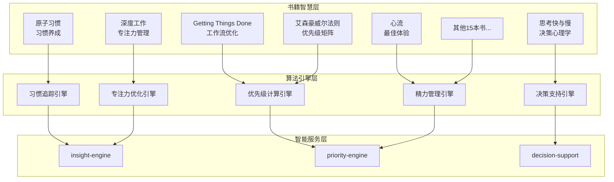

# 🧠 智能算法架构

## 19本书籍洞见整合架构



## 核心算法设计

### 1. 动态优先级计算算法

```python
class DynamicPriorityCalculator:
    def __init__(self):
        self.algorithms = {
            'eisenhower': EisenhowerMatrixAlgorithm(),
            'gtd': GettingThingsDoneAlgorithm(),
            'energy': EnergyLevelAlgorithm(),
            'deadline': DeadlinePressureAlgorithm(),
            'impact': ImpactAssessmentAlgorithm()
        }
        
    def calculate_priority(self, task, context):
        """
        综合多种算法计算任务优先级
        """
        scores = {}
        
        # 艾森豪威尔矩阵 (重要性 x 紧急性)
        scores['eisenhower'] = self.algorithms['eisenhower'].calculate(
            importance=task.importance,
            urgency=task.urgency
        )
        
        # GTD 工作流评估
        scores['gtd'] = self.algorithms['gtd'].calculate(
            context_availability=context.available_contexts,
            energy_required=task.energy_level,
            time_available=context.time_available
        )
        
        # 个人能量水平匹配
        scores['energy'] = self.algorithms['energy'].calculate(
            current_energy=context.current_energy,
            task_energy_requirement=task.energy_requirement,
            optimal_time=task.optimal_time_of_day
        )
        
        # 截止日期压力
        scores['deadline'] = self.algorithms['deadline'].calculate(
            days_until_deadline=task.days_until_deadline,
            task_complexity=task.complexity_score
        )
        
        # 影响评估 (基于《高效能人士的七个习惯》)
        scores['impact'] = self.algorithms['impact'].calculate(
            goal_alignment=task.goal_alignment,
            long_term_benefit=task.long_term_benefit,
            stakeholder_impact=task.stakeholder_impact
        )
        
        # 加权合成最终优先级
        weights = self.get_user_preference_weights()
        final_score = sum(scores[algo] * weights[algo] for algo in scores)
        
        return {
            'final_priority': final_score,
            'component_scores': scores,
            'reasoning': self.generate_reasoning(scores, weights),
            'recommended_action': self.recommend_action(final_score, context)
        }
```

### 2. 习惯养成跟踪算法

```python
class HabitTrackingAlgorithm:
    """
    基于《原子习惯》的习惯养成跟踪算法
    """
    
    def __init__(self):
        self.habit_curve_params = {
            'initial_resistance': 0.8,
            'momentum_threshold': 21,  # 21天法则
            'automation_point': 66,    # 习惯自动化点
            'decay_rate': 0.05        # 中断后的衰减率
        }
    
    def calculate_habit_strength(self, habit_data):
        """
        计算习惯强度和稳定性
        """
        streak = habit_data.current_streak
        total_completions = habit_data.total_completions
        missed_days = habit_data.missed_days_last_30
        
        # 连续性得分 (基于当前连续天数)
        consistency_score = min(streak / self.habit_curve_params['automation_point'], 1.0)
        
        # 稳定性得分 (基于最近30天的完成率)
        stability_score = max(0, 1 - (missed_days / 30) * 2)
        
        # 动量得分 (基于总完成次数)
        momentum_score = min(total_completions / 100, 1.0)
        
        # 综合习惯强度
        habit_strength = (
            consistency_score * 0.4 +
            stability_score * 0.4 +
            momentum_score * 0.2
        )
        
        return {
            'habit_strength': habit_strength,
            'phase': self.identify_habit_phase(streak),
            'risk_level': self.assess_disruption_risk(habit_data),
            'next_milestone': self.calculate_next_milestone(streak),
            'suggestions': self.generate_habit_suggestions(habit_data)
        }
    
    def identify_habit_phase(self, streak):
        """识别习惯养成阶段"""
        if streak < 7:
            return 'initiation'  # 启动期
        elif streak < 21:
            return 'development'  # 发展期
        elif streak < 66:
            return 'stabilization'  # 稳定期
        else:
            return 'automatic'  # 自动化期
```

### 3. 决策支持算法

```python
class DecisionSupportAlgorithm:
    """
    基于《思考，快与慢》和《选择的艺术》的决策支持算法
    """
    
    def analyze_decision(self, decision_context):
        """
        分析决策情境并提供建议
        """
        # 认知偏见检测
        biases = self.detect_cognitive_biases(decision_context)
        
        # 系统1/系统2思维分析
        thinking_mode = self.analyze_thinking_mode(decision_context)
        
        # 决策复杂度评估
        complexity = self.assess_decision_complexity(decision_context)
        
        # 风险评估
        risks = self.assess_risks(decision_context)
        
        return {
            'decision_type': self.classify_decision_type(decision_context),
            'cognitive_biases': biases,
            'recommended_approach': self.recommend_approach(complexity, thinking_mode),
            'key_factors': self.identify_key_factors(decision_context),
            'potential_risks': risks,
            'decision_framework': self.suggest_framework(decision_context)
        }
    
    def detect_cognitive_biases(self, context):
        """检测可能的认知偏见"""
        biases = []
        
        # 确认偏见检测
        if context.has_preferred_option:
            biases.append({
                'type': 'confirmation_bias',
                'description': '可能存在确认偏见，倾向于寻找支持既定想法的信息',
                'mitigation': '主动寻找反对意见，考虑替代方案'
            })
        
        # 可得性启发式
        if context.recent_similar_experience:
            biases.append({
                'type': 'availability_heuristic',
                'description': '可能被最近的经验过度影响判断',
                'mitigation': '寻找更多样本，考虑基准率'
            })
        
        # 锚定效应
        if context.has_initial_estimate:
            biases.append({
                'type': 'anchoring_bias',
                'description': '可能被初始信息锚定，影响后续判断',
                'mitigation': '从不同角度重新评估，寻找独立基准'
            })
        
        return biases
```

### 4. 专注力优化算法

```python
class FocusOptimizationAlgorithm:
    """
    基于《深度工作》和《心流》的专注力优化算法
    """
    
    def optimize_work_session(self, user_context, task_requirements):
        """
        优化工作会话，提升专注力和心流体验
        """
        # 分析当前状态
        current_state = self.analyze_current_state(user_context)
        
        # 计算心流潜力
        flow_potential = self.calculate_flow_potential(
            user_skills=current_state.skill_level,
            task_challenge=task_requirements.challenge_level
        )
        
        # 设计专注力方案
        focus_plan = self.design_focus_session(
            flow_potential=flow_potential,
            available_time=user_context.available_time,
            energy_level=current_state.energy_level
        )
        
        return {
            'session_plan': focus_plan,
            'expected_flow_state': flow_potential,
            'optimization_suggestions': self.generate_optimization_tips(current_state),
            'environment_setup': self.recommend_environment(task_requirements),
            'break_strategy': self.plan_breaks(focus_plan.duration)
        }
    
    def calculate_flow_potential(self, user_skills, task_challenge):
        """
        计算进入心流状态的潜力
        基于技能与挑战的匹配度
        """
        skill_challenge_ratio = user_skills / max(task_challenge, 0.1)
        
        if 0.8 <= skill_challenge_ratio <= 1.2:
            # 技能与挑战匹配，心流潜力高
            flow_potential = 0.9
            zone = 'flow_channel'
        elif skill_challenge_ratio > 1.2:
            # 技能超出挑战，可能无聊
            flow_potential = 0.3
            zone = 'boredom'
        else:
            # 挑战超出技能，可能焦虑
            flow_potential = 0.4
            zone = 'anxiety'
        
        return {
            'potential_score': flow_potential,
            'zone': zone,
            'skill_level': user_skills,
            'challenge_level': task_challenge,
            'recommendations': self.get_flow_recommendations(zone)
        }
```

---
