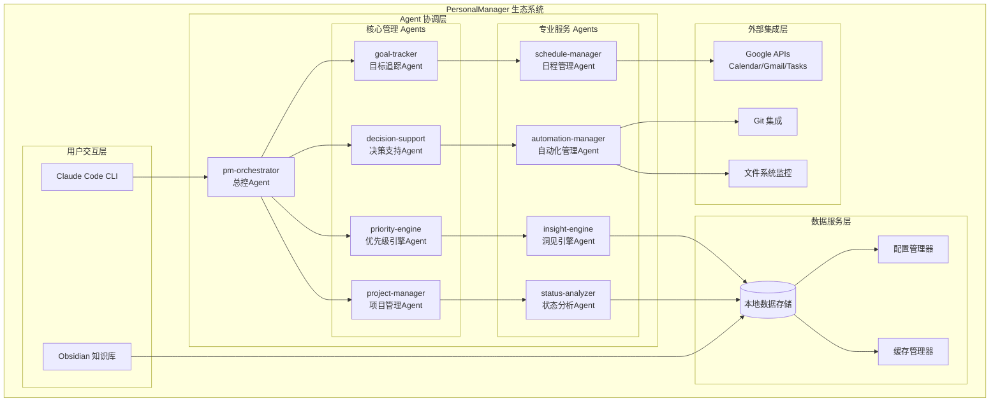

# 🏗️ 架构概览

## 系统整体架构图

> **注意**: 以下Mermaid图仍反映旧的CLI交互模式。未来需要更新以体现“对话式AI作为主要交互界面，并调用`PersonalManager`内部功能”的新架构。

## 核心设计原则

1. **AI优先/工具化设计**: `PersonalManager`的核心功能将作为AI可调用的工具集，通过自然语言交互。
2. **模块化松耦合**: 每个Agent专注单一职责，通过标准化接口通信。
3. **数据驱动**: 所有决策基于结构化数据和智能算法。
4. **配置优先**: 最大化利用BMAD框架的配置能力，减少硬编码。
5. **智能增强**: 19本书的洞见作为决策支持的核心算法。
6. **故障容错**: 每个模块都有独立的错误处理和恢复机制。

---

## 核心设计原则

1. **AI优先/工具化设计**: `PersonalManager`的核心功能将作为AI可调用的工具集，通过自然语言交互。
2. **模块化松耦合**: 每个Agent专注单一职责，通过标准化接口通信。
3. **数据驱动**: 所有决策基于结构化数据和智能算法。
4. **配置优先**: 最大化利用BMAD框架的配置能力，减少硬编码。
5. **智能增强**: 19本书的洞见作为决策支持的核心算法。
6. **故障容错**: 每个模块都有独立的错误处理和恢复机制。

---
