# 🔄 消息流和通信机制

## Agent 间通信架构

```mermaid
sequenceDiagram
    participant User
    participant Orchestrator
    participant PriorityEngine
    participant ProjectManager
    participant StatusAnalyzer
    participant DataStore
    
    User->>Orchestrator: /pm "今天做什么"
    Orchestrator->>DataStore: 获取当前项目状态
    DataStore-->>Orchestrator: 项目数据
    
    Orchestrator->>StatusAnalyzer: 分析项目健康度
    StatusAnalyzer->>DataStore: 查询Git/文件数据
    DataStore-->>StatusAnalyzer: 活动数据
    StatusAnalyzer-->>Orchestrator: 项目状态报告
    
    Orchestrator->>PriorityEngine: 计算任务优先级
    PriorityEngine->>DataStore: 获取任务和目标数据
    DataStore-->>PriorityEngine: 任务列表
    PriorityEngine-->>Orchestrator: 优先级排序
    
    Orchestrator->>ProjectManager: 获取项目建议
    ProjectManager-->>Orchestrator: 项目管理建议
    
    Orchestrator-->>User: 今日工作建议
```



## 消息协议设计

```yaml
message_protocol:
  version: "1.0"
  
  message_types:
    request:
      id: string (uuid)
      timestamp: datetime
      sender: string (agent_id)
      receiver: string (agent_id)
      type: enum [query, command, notification]
      payload: object
      priority: enum [low, normal, high, critical]
      
    response:
      id: string (uuid)
      request_id: string (reference_to_request)
      timestamp: datetime
      sender: string (agent_id)
      receiver: string (agent_id)
      status: enum [success, error, partial]
      payload: object
      error_details: object (if status=error)
      
    event:
      id: string (uuid)
      timestamp: datetime
      source: string (agent_id)
      event_type: string
      data: object
      propagation: enum [broadcast, targeted]
      
  routing_rules:
    priority_based: true
    load_balancing: false
    circuit_breaker: true
    retry_policy:
      max_retries: 3
      backoff_strategy: exponential
      timeout: 30s
```

## 数据同步机制

```yaml
data_sync:
  strategy: event_driven
  
  sync_triggers:
    - user_action: immediate_sync
    - scheduled_task: batch_sync
    - external_change: triggered_sync
    - system_startup: full_sync
    
  conflict_resolution:
    local_vs_remote:
      strategy: last_write_wins
      exceptions:
        - user_manual_edits: preserve_manual
        - critical_data: manual_resolution
        
  sync_queues:
    high_priority: user_actions, critical_updates
    normal_priority: scheduled_updates, status_changes
    low_priority: historical_data, analytics
    
  data_consistency:
    level: eventual_consistency
    conflict_detection: timestamp_based
    resolution_timeout: 5_minutes
    rollback_capability: true
```

---
