# 🔌 集成架构设计

## 外部系统集成架构

```mermaid
graph TB
    subgraph "PersonalManager Core"
        SCHEDULE_MGR[schedule-manager]
        AUTOMATION_MGR[automation-manager]
        STATUS_ANALYZER[status-analyzer]
    end
    
    subgraph "Google Workspace"
        GCALENDAR[Google Calendar]
        GMAIL[Gmail]
        GTASKS[Google Tasks]
        GDRIVE[Google Drive]
    end
    
    subgraph "Development Tools"
        GIT[Git Repository]
        GITHUB[GitHub/GitLab]
        IDE[IDE/Editor]
        CI_CD[CI/CD Pipeline]
    end
    
    subgraph "Knowledge Management"
        OBSIDIAN[Obsidian Vault]
        MARKDOWN[Markdown Files]
        DOCUMENTS[Project Documents]
        NOTES[Personal Notes]
    end
    
    subgraph "File System"
        PROJECT_DIRS[Project Directories]
        CONFIG_FILES[Configuration Files]
        LOGS[Log Files]
        TEMP_FILES[Temporary Files]
    end
    
    SCHEDULE_MGR <--> GCALENDAR
    SCHEDULE_MGR <--> GMAIL
    SCHEDULE_MGR <--> GTASKS
    
    AUTOMATION_MGR <--> GIT
    AUTOMATION_MGR <--> GITHUB
    AUTOMATION_MGR <--> CI_CD
    
    STATUS_ANALYZER <--> PROJECT_DIRS
    STATUS_ANALYZER <--> CONFIG_FILES
    STATUS_ANALYZER <--> LOGS
    
    SCHEDULE_MGR <--> OBSIDIAN
    STATUS_ANALYZER <--> MARKDOWN
    AUTOMATION_MGR <--> DOCUMENTS
```



## 1. Google APIs 集成设计

### Google Calendar 集成

```yaml
google_calendar_integration:
  authentication:
    method: OAuth 2.0
    scopes: 
      - calendar.readonly
      - calendar.events
    credentials_storage: encrypted_local_file
    
  data_sync:
    sync_frequency: every_15_minutes
    sync_direction: bidirectional
    conflict_resolution: user_preference
    
  mappings:
    calendar_events -> tasks:
      - meeting -> focus_time_block
      - deadline -> task_deadline
      - reminder -> task_notification
      
    tasks -> calendar_events:
      - high_priority_task -> calendar_block
      - project_milestone -> calendar_event
      - goal_deadline -> calendar_reminder
      
  automation_rules:
    - create_focus_blocks_for_high_priority_tasks
    - block_meeting_free_time_for_deep_work
    - auto_reschedule_when_overcommitted
```

### Gmail 集成

```yaml
gmail_integration:
  authentication:
    method: OAuth 2.0
    scopes:
      - gmail.readonly
      - gmail.labels
    
  data_extraction:
    email_parsing:
      - action_items: extract_todo_items
      - deadlines: extract_date_mentions
      - project_updates: categorize_by_subject
      - meeting_requests: extract_calendar_items
      
    filters:
      - important_senders: array<email_pattern>
      - project_keywords: array<keyword>
      - action_verbs: array<verb_pattern>
      
  automation:
    - convert_action_emails_to_tasks
    - create_calendar_events_from_meeting_requests
    - track_project_email_threads
    - notify_on_important_deadline_emails
```

### Google Tasks 集成

```yaml
google_tasks_integration:
  sync_strategy: master_slave
  master: PersonalManager
  slave: Google_Tasks
  
  sync_mapping:
    pm_task -> gtask:
      - title: direct_mapping
      - description: truncated_if_long
      - due_date: direct_mapping
      - status: enum_conversion
      
  sync_rules:
    - sync_only_actionable_tasks
    - exclude_project_management_tasks
    - include_personal_todos
    - respect_gtask_completion_updates
```

## 2. Git 集成设计

```yaml
git_integration:
  monitoring:
    hooks:
      - post-commit: trigger_status_update
      - pre-push: generate_progress_report
      - post-merge: analyze_collaboration_metrics
      
    file_tracking:
      - modified_files: track_completion_progress
      - added_files: detect_new_features
      - deleted_files: identify_scope_reduction
      
  analysis:
    commit_analysis:
      - frequency: productivity_indicator
      - message_sentiment: progress_mood_tracking
      - file_impact: scope_and_complexity_metrics
      
    branch_analysis:
      - feature_branches: track_feature_progress
      - merge_patterns: collaboration_effectiveness
      - conflict_frequency: team_coordination_health
      
  automation:
    - auto_generate_project_status_reports
    - create_progress_summaries_on_milestones
    - notify_on_significant_achievements
    - warn_on_productivity_drops
```

## 3. Obsidian 集成设计

```yaml
obsidian_integration:
  vault_structure:
    projects/
      - {project_name}/
        - PROJECT_STATUS.md
        - notes/
        - resources/
        - meetings/
    goals/
      - annual_goals.md
      - quarterly_reviews/
      - monthly_tracking/
    inbox/
      - quick_captures.md
      - ideas.md
    
  file_monitoring:
    watched_patterns:
      - "projects/*/PROJECT_STATUS.md"
      - "goals/*.md" 
      - "inbox/*.md"
      
  sync_behavior:
    auto_update_project_status: true
    preserve_manual_edits: true
    conflict_resolution: merge_strategy
    backup_before_auto_update: true
    
  template_management:
    project_template: auto_generate_from_config
    goal_template: smart_goal_structure
    status_template: progress_tracking_format
```

---
