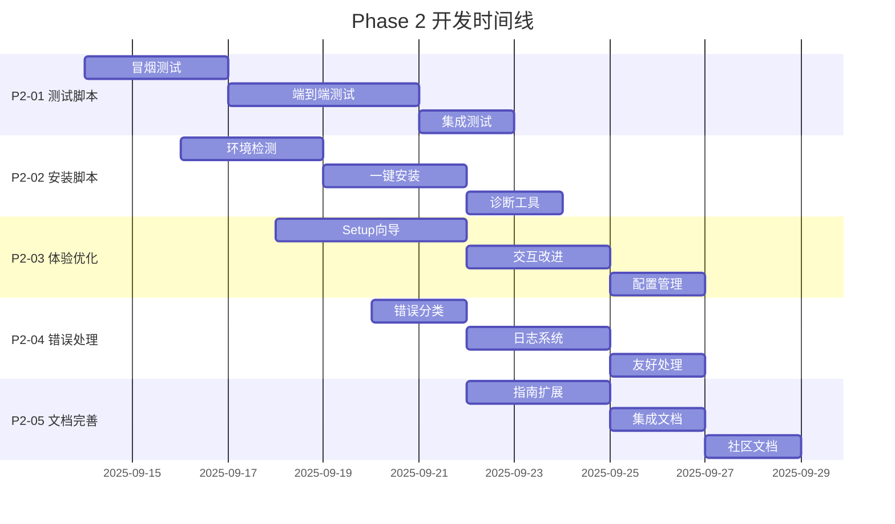

# Phase 2 计划 — 上手与测试（Test & Onboarding）

> **目标**: 让新用户与 Agent 在10分钟内跑通主路径；建立可重复、可验证、可诊断的体验；提供一行式安装（npx 引导器）
> **版本**: v1.1.0
> **Last Updated**: 2025-09-13

## 总体目标

Phase 2 专注于用户体验优化和系统稳定性验证，确保 PersonalManager 具备生产就绪的质量标准。通过自动化测试、友好的上手流程和完善的错误处理，为用户提供流畅且可靠的使用体验。

### 核心目标
1. **10分钟上手体验**: 新用户能够在10分钟内完成安装、配置和基础功能演练
2. **端到端可靠性**: 主要工作流程稳定可复现，错误处理完善
3. **Agent 集成就绪**: 支持多平台 AI Agent 无缝接入和调试
4. **一行式安装体验**: 提供 `npx` 引导器，降低远程环境部署门槛

## 详细任务规划

### P2-01: CLI 冒烟与端到端脚本

**目标**: 建立自动化测试体系，确保核心功能稳定性

#### 子任务
- **P2-01-A**: 核心命令冒烟测试
  - 实现 `pm test smoke` 命令
  - 覆盖所有主要 CLI 命令的基础功能
  - 包括成功路径和常见失败场景

- **P2-01-B**: 端到端工作流测试
  - 项目管理工作流：概览 → 状态 → 推荐
  - 任务管理工作流：捕获 → 理清 → 推荐 → 解释
  - 时间管理工作流：深度工作 → 习惯 → 回顾

- **P2-01-C**: 集成测试脚本
  - Obsidian 集成测试（模拟环境）
  - 外部服务降级测试
  - 数据一致性验证

#### 技术实现
```bash
# 冒烟测试命令结构
poetry run pm test smoke --quick          # 快速测试（2分钟）
poetry run pm test smoke --full           # 完整测试（5分钟）
poetry run pm test e2e --workflow=project # 端到端项目流程
poetry run pm test e2e --workflow=task    # 端到端任务流程
```

#### 验收标准
- [ ] 冒烟测试覆盖率 > 80%
- [ ] 端到端测试通过率 100%
- [ ] 测试执行时间 < 5分钟
- [ ] 所有测试可在 CI/CD 环境运行

### P2-02: 安装与环境自检脚本

**目标**: 简化安装流程，提供智能环境检测和问题诊断

#### 子任务
- **P2-02-A**: 环境检测脚本
  - Python 版本检测（3.11+）
  - Poetry 版本检测（1.6+）
  - 系统依赖检测（Git, 权限等）
  - 磁盘空间检查

- **P2-02-B**: 一键安装脚本
  - 跨平台支持（macOS, Linux, Windows WSL）
  - 依赖自动安装建议
  - 配置文件模板生成

- **P2-02-C**: 诊断工具
  - `pm doctor` 命令实现
  - 常见问题自动检测和修复建议
  - 系统信息收集（用于支持）

#### 技术实现
```bash
# 安装脚本
curl -sSL https://raw.githubusercontent.com/.../install.sh | bash

# 环境检测
poetry run pm doctor --check-all
poetry run pm doctor --fix-permissions
poetry run pm doctor --system-info
```

#### 验收标准
- [ ] 支持 3 个主要平台的自动安装
- [ ] 环境问题检测准确率 > 90%
- [ ] 安装成功率 > 95%（在支持环境中）
- [ ] 诊断工具能识别和修复 80% 的常见问题

### P2-03: Setup 与交互体验优化

**目标**: 优化初始化流程，提供引导式配置体验

#### 子任务
- **P2-03-A**: 智能 Setup 向导
  - 分步骤引导式配置
  - 配置项智能默认值
  - 可选配置和必需配置区分
  - 配置验证和实时反馈

- **P2-03-B**: 交互体验改进
  - 友好的命令行界面（使用 Rich/Textual）
  - 进度指示和状态反馈
  - 多语言支持准备（中英文）

- **P2-03-C**: 配置管理优化
  - 配置文件模板和示例
  - 配置迁移和升级机制
  - 敏感信息安全存储

#### 技术实现
```bash
# 新手向导
poetry run pm setup --guided              # 分步引导
poetry run pm setup --quick               # 快速配置
poetry run pm setup --advanced            # 高级选项

# 配置管理
poetry run pm config init --template=basic
poetry run pm config validate
poetry run pm config migrate --from-version=1.0
```

#### 验收标准
- [ ] Setup 成功率 > 95%
- [ ] 平均完成时间 < 3 分钟
- [ ] 用户满意度评分 > 4.5/5
- [ ] 零技术背景用户可独立完成

### P2-04: 错误与日志规范化

**目标**: 建立统一的错误处理和日志系统，提升问题诊断效率

#### 子任务
- **P2-04-A**: 错误分类与编码
  - 建立错误代码体系（E1000-E9999）
  - 错误级别分类（致命、警告、信息）
  - 多语言错误消息支持

- **P2-04-B**: 日志系统优化
  - 结构化日志格式
  - 日志级别动态调整
  - 敏感信息过滤
  - 日志轮转和清理

- **P2-04-C**: 用户友好的错误处理
  - 错误消息本地化
  - 解决方案建议系统
  - 自动错误报告（可选）

#### 技术实现
```python
# 错误代码示例
E1001: "系统未初始化，请运行 'pm setup'"
E2001: "配置文件损坏，请运行 'pm config repair'"
E3001: "Google 服务未配置，查看文档进行配置或使用离线模式"
```

#### 验收标准
- [ ] 100% 错误情况有明确错误码
- [ ] 90% 错误有解决方案建议
- [ ] 日志性能开销 < 5%
- [ ] 错误消息可读性评分 > 4.0/5

### P2-05: 用户指南扩展与文档完善

**目标**: 提供完整、准确、易懂的用户文档和指南

#### 子任务
- **P2-05-A**: 用户指南增强
  - 从 0 到 1 完整演练（已完成）
  - 命令参考手册
  - 最佳实践指南
  - 故障排查指南

- **P2-05-B**: Agent 集成文档
  - 多平台 Agent 配置指南
  - System Prompt 模板库（已完成）
  - 调试和测试方法

- **P2-05-C**: 社区文档
  - 贡献指南
  - 问题反馈模板
  - 发布说明模板

#### 技术实现
```bash
# 内置帮助系统
poetry run pm help --command=capture     # 命令帮助
poetry run pm help --workflow=project    # 工作流帮助
poetry run pm help --troubleshoot        # 故障排查
```

#### 验收标准
- [ ] 文档覆盖率 100%（所有功能）
- [ ] 文档准确性 > 95%
- [ ] 用户反馈文档质量 > 4.0/5
- [ ] 搜索友好度（SEO 优化）

### P2-06: npx 安装引导器（npm 包）

**目标**: 通过 `npx @personal-manager/pm-bootstrap` 一行式安装 PersonalManager（优先使用 pipx），安装完成后可直接运行 `pm --version` 与 `pm setup`。

**范围**
- 新建 npm 包 `@personal-manager/pm-bootstrap`（或 `personal-manager-bootstrap`），提供 bin 可执行 `pm-bootstrap`。
- 自动检测 Python 与 pipx；优先通过 pipx 安装 GitHub Release 资产（wheel），失败回退 git+tag 安装；Windows 提供自动/半自动步骤。
- 支持参数：`--version`（默认 v0.1.0 或 latest）、`--source release|git`。

**实施要点**
- 验证安装成功（`pm --version`）；若 PATH 未生效，提示使用 `pipx run pm --version` 或提供绝对路径。
- 对缺少 Python/pipx、网络受限、权限问题提供可复制的修复命令与回退方案（离线 wheel、venv）。

**交付物**
- 代码：`npm/pm-bootstrap/`（`package.json`、`bin/pm-bootstrap.js`、`README.md`）。
- 文档片段：用户指南的“npx 安装”小节（由文档负责人合并）。
- （可选）CI：`.github/workflows/release.yml`（打 tag 触发 npm publish；需 NPM_TOKEN）。

**验收标准**
- [ ] 在至少一个 Unix 平台执行 `npx @personal-manager/pm-bootstrap@latest` 成功安装并输出 `pm --version`（v0.1.0）。
- [ ] Windows 平台提供清晰可执行/半自动步骤，能够完成安装或给出一键命令。
- [ ] 缺少 Python/pipx 的机器，输出的指引可完成安装。
- [ ] 文档片段清晰、可直接合入用户指南。

## 质量保证体系

### 自动化测试策略
```bash
# 测试类型覆盖
- 单元测试：核心业务逻辑
- 集成测试：外部服务集成
- 端到端测试：完整用户流程
- 性能测试：响应时间和资源使用
- 兼容性测试：多平台和 Python 版本
```

### 用户验收测试（UAT）
- **场景 1**: 技术用户快速上手
- **场景 2**: 非技术用户引导式配置
- **场景 3**: Agent 集成和调试
- **场景 4**: 错误恢复和故障排查

### 性能基准
- 命令响应时间：< 500ms（90%ile）
- 系统启动时间：< 2s
- 内存占用：< 100MB
- 存储空间：< 50MB（基础配置）

## 风险管理

### 技术风险
1. **多平台兼容性风险**
   - 影响：中等
   - 缓解：优先支持主流平台，建立测试矩阵

2. **依赖版本冲突风险**
   - 影响：低
   - 缓解：依赖版本锁定，虚拟环境隔离

3. **用户数据迁移风险**
   - 影响：高
   - 缓解：向后兼容性保证，数据备份机制

### 用户体验风险
1. **学习曲线过陡风险**
   - 影响：高
   - 缓解：分层次文档，交互式教程

2. **错误处理不友好风险**
   - 影响：中等
   - 缓解：用户测试，错误消息优化

## 成功指标

### 定量指标
- **安装成功率**: > 95%
- **10分钟上手完成率**: > 80%
- **端到端测试通过率**: 100%
- **错误解决率**: > 90%
- **文档满意度**: > 4.0/5

### 定性指标
- 用户反馈积极性
- 社区贡献活跃度
- Agent 集成成功案例数量

## 里程碑时间线



## 验收与交付

### 最终验收标准
- [ ] 所有 P2 任务完成并通过验收（P2-01 到 P2-06）
- [ ] 端到端测试套件建立并通过
- [ ] 用户文档完整且准确
- [ ] 多平台安装成功验证
- [ ] 性能基准达标
- [ ] npx 引导器交付并在多平台验证通过

### 交付物清单
1. **自动化测试套件** - 完整的测试脚本和 CI/CD 配置
2. **安装和诊断工具** - 一键安装脚本和 `pm doctor` 命令
3. **优化的用户体验** - 改进的 Setup 流程和错误处理
4. **完善的文档体系** - 用户指南、API 文档、故障排查指南
5. **Agent 集成套件** - System Prompt 模板和集成指南

### 退出条件
- 连续 3 次端到端测试全部通过
- 至少 5 个不同环境的安装验证成功
- 用户验收测试全部通过
- 技术负责人完成最终验收和文档确认

---

**Phase 2 愿景**: 通过系统化的测试和优化，让 PersonalManager 成为一个真正可靠、易用的生产级工具，为 Phase 3 的智能化功能打下坚实基础。
