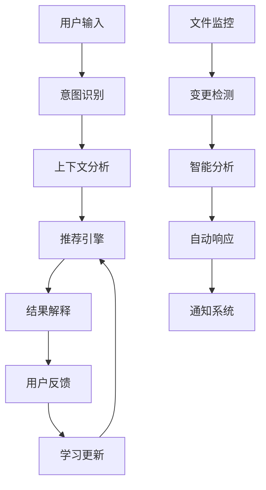
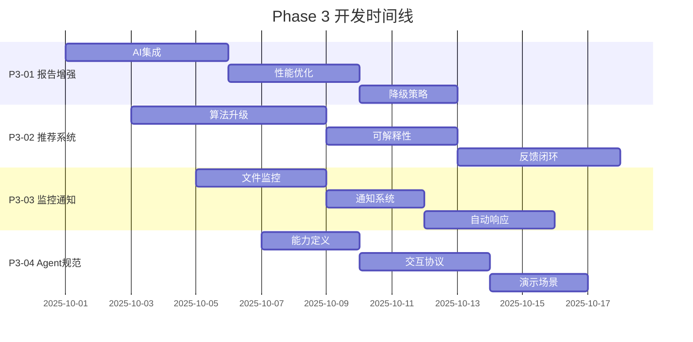

# Phase 3 计划 — 智能与主动（Intelligence & Proactivity）

> **目标**: 强化 AI 驱动能力与可解释性；打造"报告驱动 + 推荐驱动"的闭环
> **版本**: v1.1.0
> **Last Updated**: 2025-09-13

## 总体目标

Phase 3 将 PersonalManager 从一个基础工具提升为智能个人助手，通过 AI 驱动的分析、推荐和自动化能力，实现真正的主动式个人管理。核心是建立可解释、可信赖的 AI 交互体验。

### 核心目标
1. **智能推荐系统**: 基于用户行为和项目状态的个性化推荐
2. **可解释AI**: 用户能理解和信任AI的决策过程
3. **主动监控**: 系统能主动发现问题并提出解决方案
4. **学习反馈闭环**: 系统根据用户反馈持续优化推荐质量

## 详细任务规划

### P3-01: 报告更新增强与降级路径

**目标**: 建立强大且可靠的AI驱动报告生成系统，支持多种降级策略

#### 子任务
- **P3-01-A**: 智能报告生成增强
  - `pm report update` 命令核心逻辑优化
  - 支持多种AI模型（OpenAI, Anthropic, Google, 本地模型）
  - 报告模板系统和自定义选项
  - 增量更新和差异检测

- **P3-01-B**: 性能与可靠性优化
  - 请求缓存机制（Redis/本地文件）
  - API 速率限制和重试策略
  - 请求队列和批处理
  - 成本控制和用量监控

- **P3-01-C**: 降级与容错策略
  - API 不可用时的离线模式
  - 模板驱动的静态报告生成
  - 用户手动输入支持
  - 历史数据回退机制

#### 技术实现
```bash
# 报告生成命令
poetry run pm report update --auto          # 自动检测变更
poetry run pm report update --force         # 强制全量更新
poetry run pm report update --template=weekly # 使用特定模板
poetry run pm report update --offline       # 离线模式

# 配置和监控
poetry run pm report config --model=gpt-4   # 设置AI模型
poetry run pm report usage --month=current  # 查看用量统计
poetry run pm report cache --clear          # 清理缓存
```

#### 验收标准
- [ ] 支持至少3种AI模型服务
- [ ] API 调用成功率 > 98%
- [ ] 缓存命中率 > 60%
- [ ] 离线模式功能完整性 > 80%
- [ ] 成本控制精确度 > 95%

### P3-02: 推荐可解释性与反馈闭环

**目标**: 构建可信赖的AI推荐系统，让用户理解并参与优化推荐质量

#### 子任务
- **P3-02-A**: 推荐引擎架构升级
  - 多因素推荐算法（时间、优先级、依赖关系、用户偏好）
  - 推荐结果排序和过滤
  - A/B 测试框架
  - 推荐多样性控制

- **P3-02-B**: 可解释性系统
  - `pm explain` 命令结构化输出
  - 推荐原因分类（紧急性、重要性、依赖关系等）
  - 可视化决策树（命令行友好）
  - 替代方案建议

- **P3-02-C**: 反馈学习闭环
  - 用户反馈收集（喜欢/不喜欢、完成/延迟）
  - 偏好模型训练和更新
  - 推荐质量指标跟踪
  - 个性化参数调整

#### 技术实现
```bash
# 推荐和解释
poetry run pm recommend --explain           # 带解释的推荐
poetry run pm explain <task-id> --detailed  # 详细解释
poetry run pm explain <task-id> --visual    # 可视化解释

# 反馈系统
poetry run pm feedback like <task-id>       # 正面反馈
poetry run pm feedback dislike <task-id>    # 负面反馈
poetry run pm feedback complete <task-id>   # 完成反馈
poetry run pm feedback delay <task-id>      # 延迟反馈

# 学习和优化
poetry run pm learn update                  # 更新推荐模型
poetry run pm learn stats                   # 学习统计信息
poetry run pm learn reset                   # 重置学习数据
```

#### 验收标准
- [ ] 推荐准确率 > 75%
- [ ] 用户满意度 > 4.0/5
- [ ] 解释可理解性 > 4.0/5
- [ ] 反馈响应时间 < 200ms
- [ ] 学习效果可测量

### P3-03: 文件监控稳健化与通知

**目标**: 建立主动监控系统，及时发现项目变化并智能响应

#### 子任务
- **P3-03-A**: 文件系统监控
  - PROJECT_STATUS.md 变化检测
  - Obsidian 笔记变更监控
  - Git 仓库状态监控
  - 配置文件变更检测

- **P3-03-B**: 智能通知系统
  - 通知规则引擎
  - 多渠道通知支持（终端、系统通知、邮件）
  - 通知优先级和频率控制
  - 批量通知和摘要

- **P3-03-C**: 自动化响应
  - 自动报告更新触发
  - 智能任务建议生成
  - 风险检测和预警
  - 数据备份和恢复

#### 技术实现
```bash
# 监控控制
poetry run pm monitor start                 # 启动后台监控
poetry run pm monitor stop                  # 停止监控
poetry run pm monitor status                # 监控状态
poetry run pm monitor logs                  # 查看监控日志

# 通知设置
poetry run pm notify config --email=user@example.com
poetry run pm notify config --frequency=daily
poetry run pm notify test                   # 测试通知
poetry run pm notify history               # 通知历史

# 自动化规则
poetry run pm automation list              # 列出自动化规则
poetry run pm automation add --trigger=file_change --action=update_report
poetry run pm automation disable <rule-id> # 禁用规则
```

#### 验收标准
- [ ] 文件变化检测延迟 < 5s
- [ ] 通知送达率 > 95%
- [ ] 误报率 < 5%
- [ ] 自动化执行成功率 > 90%
- [ ] 系统资源占用 < 50MB

### P3-04: Agent 工具注册规范 v2

**目标**: 完善Agent集成规范，支持高级AI功能和复杂工作流

#### 子任务
- **P3-04-A**: 高级Agent能力定义
  - 上下文感知对话能力
  - 多步骤任务规划
  - 错误恢复和重试机制
  - 用户偏好记忆

- **P3-04-B**: 智能交互协议
  - 结构化输入输出格式（JSON Schema）
  - 渐进式信息收集
  - 确认和澄清机制
  - 批量操作支持

- **P3-04-C**: 高级演示场景
  - 智能项目规划：从需求到任务分解
  - 自适应时间管理：根据习惯调整推荐
  - 知识管理集成：Obsidian深度集成
  - 多人协作支持：团队任务分配

#### 技术实现
```yaml
# Agent 能力描述文件
agent_capabilities:
  context_awareness:
    memory_span: "30_days"
    project_tracking: true
    preference_learning: true

  complex_workflows:
    max_steps: 20
    error_recovery: true
    rollback_support: true

  integrations:
    obsidian: "full"
    google_workspace: "optional"
    github: "basic"
```

#### 验收标准
- [ ] Agent集成成功率 > 95%
- [ ] 复杂工作流完成率 > 85%
- [ ] 用户交互满意度 > 4.2/5
- [ ] 文档完整性和准确性 > 95%

## 智能算法与架构

### 推荐算法架构
```python
class RecommendationEngine:
    def __init__(self):
        self.factors = [
            TimeBasedFactor(),      # 时间相关性
            PriorityFactor(),       # 优先级权重
            DependencyFactor(),     # 任务依赖
            UserPreferenceFactor(), # 用户偏好
            ContextFactor(),        # 上下文信息
            EnergyLevelFactor(),    # 用户精力模型
        ]

    def recommend(self, context: Context) -> List[Recommendation]:
        # 多因素加权推荐算法
        pass
```

### AI 模型集成架构
```python
class AIModelManager:
    def __init__(self):
        self.models = {
            'openai': OpenAIAdapter(),
            'anthropic': AnthropicAdapter(),
            'google': GoogleAdapter(),
            'local': LocalModelAdapter(),
        }

    def generate_report(self, data: ProjectData) -> str:
        # 智能模型选择和故障转移
        pass
```

## 数据流与架构设计

### 智能数据处理管道


### 缓存与存储策略
```yaml
cache_layers:
  l1_memory:
    size: "100MB"
    ttl: "1h"
    type: "LRU"

  l2_disk:
    size: "1GB"
    ttl: "24h"
    type: "persistent"

  l3_remote:
    provider: "redis"
    ttl: "7d"
    compression: true
```

## 质量保证与测试

### AI 功能测试策略
- **准确性测试**: 推荐质量基准测试
- **可解释性测试**: 解释合理性验证
- **性能测试**: AI 调用延迟和吞吐量
- **鲁棒性测试**: 异常输入和边界情况
- **成本测试**: API 调用成本控制

### 用户体验测试
- **可用性测试**: AI 交互自然度
- **信任度测试**: 用户对推荐的信任程度
- **学习效果测试**: 个性化改进效果
- **错误恢复测试**: 失败场景处理

## 隐私与安全

### 数据隐私保护
- **本地优先**: 敏感数据不上传
- **匿名化**: 上传数据去身份化
- **用户控制**: 数据使用透明化
- **合规性**: GDPR 和相关法规遵循

### AI 安全考虑
- **输入验证**: 防止提示注入攻击
- **输出过滤**: 有害内容检测
- **访问控制**: API 密钥安全存储
- **审计日志**: AI 决策可追溯性

## 性能与成本优化

### 性能指标目标
- AI 推荐响应时间: < 2s
- 报告生成时间: < 30s
- 系统内存占用: < 200MB
- 缓存命中率: > 70%

### 成本控制策略
- API 调用预算管理
- 智能缓存减少重复请求
- 本地模型降级选项
- 用量监控和告警

## 风险管理

### 技术风险
1. **AI 模型依赖风险**
   - 影响: 高
   - 缓解: 多模型支持，离线降级

2. **数据质量风险**
   - 影响: 中等
   - 缓解: 数据验证，用户反馈纠错

3. **成本超控风险**
   - 影响: 中等
   - 缓解: 预算控制，成本监控

### 用户体验风险
1. **AI 推荐不准确**
   - 影响: 高
   - 缓解: 学习反馈，A/B 测试

2. **隐私担忧**
   - 影响: 高
   - 缓解: 本地优先，透明化

## 成功指标

### 定量指标
- **推荐准确率**: > 75%
- **用户满意度**: > 4.2/5
- **AI 功能使用率**: > 60%
- **反馈参与率**: > 40%
- **系统可用性**: > 99.5%

### 定性指标
- 用户依赖程度提升
- 工作效率改善反馈
- AI 交互自然度
- 功能发现和使用深度

## 里程碑时间线



## 验收与交付

### 最终验收标准
- [ ] 所有 P3 任务完成并通过验收
- [ ] AI 功能端到端测试通过
- [ ] 推荐系统质量达标
- [ ] 监控和通知系统稳定运行
- [ ] Agent 集成规范完善

### 交付物清单
1. **智能推荐引擎** - 多因素推荐算法和可解释性系统
2. **AI 驱动报告系统** - 支持多模型的报告生成能力
3. **主动监控系统** - 文件监控、智能通知和自动响应
4. **学习反馈机制** - 用户偏好学习和推荐优化
5. **高级 Agent 规范** - 支持复杂工作流的集成指南

### 退出条件
- AI 推荐准确率达到 75% 以上
- 用户满意度调研结果 > 4.2/5
- 所有智能功能稳定运行 30 天以上
- 技术负责人完成最终验收和性能评估

---

**Phase 3 愿景**: 将 PersonalManager 打造成真正智能的个人助手，通过 AI 驱动的推荐、解释和自动化，帮助用户实现更高效、更智能的个人管理体验。

